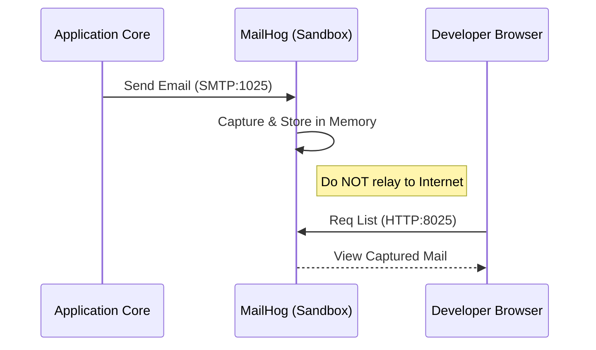

<!-- Target: docs/04.specs/10-communication/spec.md -->

# Communication Tier Technical Specification

## Technical Specification

## Overview (KR)

이 문서는 `10-communication` 계층의 기술 사양을 정의한다. SMTP 트래핑 아키텍처, 메일 서버 구성 요소, 데이터 지속성 프로토콜 및 보안 통제 사항을 포함한다.

## Components

### 1. MailHog (Development Sandbox)

- **SMTP Server**: 1025 포트에서 메일을 수신하며 외부로 전달하지 않음.
- **Web UI**: 소모성 서버(Stateless)로 작동하며 8025 포트에서 캡처된 메일 전시.
- **Storage**: In-memory (기본 설정).

### 2. Stalwart (Production Backend)

- **SMTP/Submit**: 메일 발송 및 수신용 서비스 (25, 465, 587 포트).
- **IMAP/JMAP**: 메일 클라이언트 접근 프로토콜 (993, 8080 포트).
- **Admin UI**: 웹 기반 서버 관리 및 도메인 설정 도구.
- **Dependency**: PostgreSQL (Optional metadata), Local Persistent Volumes (Encrypted).

## Interface Definition

### Network Ports

| Service | Internal Port | External Port | Protocol | Auth Required |
| :--- | :--- | :--- | :--- | :--- |
| MailHog SMTP | 1025 | 1025 | SMTP | No (Whitelist) |
| MailHog HTTP | 8025 | 18025 | HTTP | SSO (Traefik) |
| Stalwart SMTP | 25 | 25 | SMTP | Opportunistic TLS |
| Stalwart Secure | 465 / 587 | 465 / 587 | SMTPS | Mandatory Auth |
| Stalwart IMAP | 993 | 993 | IMAPS | Mandatory Auth |

### Common Variables

- `DEFAULT_MAIL_DOMAIN`: 시스템 대표 메일 도메인.
- `MAIL_SENDER_NAME`: 기본 발신자 명칭.

## Sequence Diagrams

### Development Mail Trapping Flow

## Security & Compliance

- **Authentication**: Stalwart는 Keycloak LDAP/OIDC를 통해 시스템 사용자 계정과 통합 가능.
- **Encryption**: `secrets/certs` 내의 인증서를 사용하여 STARTTLS 및 SSL/TLS 암호화 강제.
- **Deliverability**: Stalwart 내에서 SPF, DKIM, DMARC 서명을 자동 처리하여 스팸 필터링 방지.

## Constraints

- **Connectivity**: 운영 서버(Stalwart)는 ISP로부터 25번 포트 차단 해제 및 정적 IP 할당이 필요함.
- **Resources**: Stalwart는 메일 보관량에 따라 디스크 공간 확장이 용이해야 함.

## Related Documents

- **PRD**: [2026-03-26-10-communication.md](../../01.prd/2026-03-26-10-communication.md)
- **ARD**: [0010-communication-architecture.md](../../02.ard/0010-communication-architecture.md)
- **ADR**: [0010-communication-services.md](../../03.adr/0010-communication-services.md)
