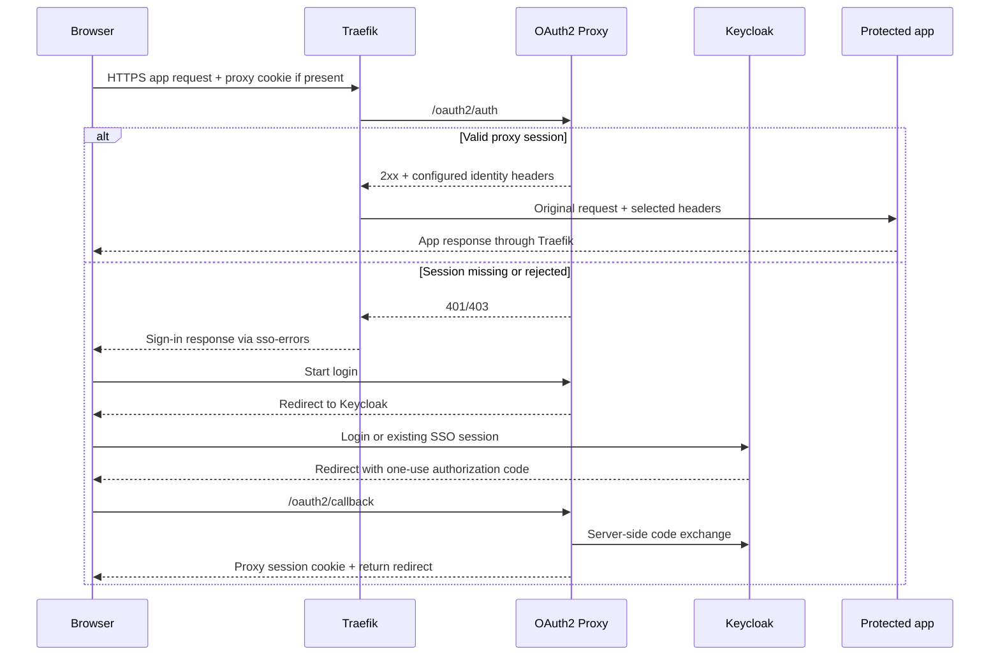
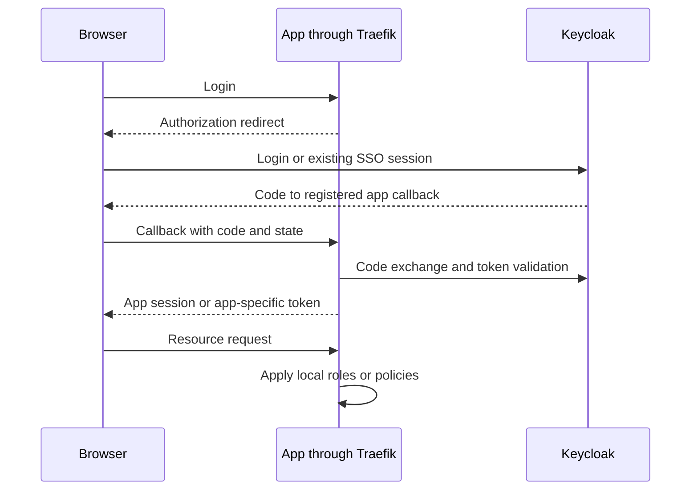

# Application Authentication Integration Guide

## Usage

### Overview

Keycloak, OAuth2 Proxy, Traefik, Kafbat UI, Airflow를 중복 인증 없이 연결하고
서비스별 authorization model을 유지하는 방법을 설명한다.

### Usage Type

`system-guide | how-to | integration-reference`

### Target Audience

- Infra/DevOps Engineers
- Operators
- Platform Developers
- AI Agents

### Purpose

- ForwardAuth와 Native OIDC의 책임 경계를 명확히 한다.
- Keycloak application client 설정을 일관되게 유지한다.
- Kafbat/Airflow RBAC와 OpenBao policy를 gateway auth와 충돌시키지 않는다.

### 용어와 책임

| 용어 | 의미 | 이 저장소에서의 역할 |
| --- | --- | --- |
| OAuth 2.0 | 클라이언트가 API 접근 권한을 위임받는 체계 | Access Token의 대상·범위와 수명 관리 |
| OIDC | OAuth 2.0 위에서 사용자 인증 정보를 전달하는 프로토콜 | `openid` 요청과 ID Token으로 로그인 결과 확인 |
| Keycloak | OIDC Provider이자 사용자·클라이언트 관리 서버 | `hy-home.realm`의 사용자, 그룹, 세션, 토큰 발급 |
| OAuth2 Proxy | OIDC 클라이언트인 인증 프록시 | Keycloak 로그인 후 자체 세션으로 ForwardAuth 응답 |
| Traefik | 요청 라우터와 TLS 진입점 | 서비스에 적용된 middleware에 따라 인증 검사 호출 |
| 애플리케이션 | OIDC 클라이언트 또는 보호 대상 | 자체 정책으로 데이터·기능 접근 권한 판단 |

OIDC는 제품명이 아니다. Keycloak은 OIDC를 구현하는 서버이고, OAuth2 Proxy와
OpenBao는 이 서버를 이용하는 서로 다른 클라이언트다. 로그인 성공이 모든 서비스의
관리자 권한을 뜻하지 않는다. 프로토콜 정의는
[OIDC Core](https://openid.net/specs/openid-connect-core-1_0.html),
Keycloak의 endpoint 역할은 [공식 OIDC 안내](https://www.keycloak.org/securing-apps/oidc-layers)를 따른다.

### Authentication Pattern

#### Gateway ForwardAuth



실제 앱 요청은 Traefik이 전달한다. `static://200`인 OAuth2 Proxy가 모든 앱의
본문을 대신 프록시하는 구성이 아니다. 현재 `sso-auth`는 내부
`/oauth2/auth`를 호출하고, `sso-errors`는 401/403을 sign-in으로 연결한다.
따라서 권한 거부도 재로그인처럼 보일 수 있다. 설정 근거는
[Traefik middleware](../../../../../infra/01-gateway/traefik/dynamic/middleware.yml)이며,
2xx일 때 원래 요청을 진행하는 동작은 [공식 ForwardAuth 문서](https://doc.traefik.io/traefik/reference/routing-configuration/http/middlewares/forwardauth/)에서 확인했다.

#### Application-native OIDC



Airflow, Kafbat UI, OpenBao가 이 경로를 사용한다. 현재 세 router는
`gateway-standard-chain@file`을 사용하며 `sso-auth@file`을 적용하지 않는다.
Keycloak에 이미 로그인했다면 비밀번호 입력이 생략될 수 있지만, 애플리케이션별
callback 처리와 세션·권한 생성은 여전히 필요하다. OpenBao의 OIDC 로그인은
게이트웨이 쿠키나 AppRole 토큰으로 대체되지 않는다.

### Keycloak Client Matrix

Realm은 `hy-home.realm`, issuer는
`https://keycloak.${DEFAULT_URL}/realms/hy-home.realm`이다.

| Application | Client ID | Callback | 권한 소유자·근거 |
| --- | --- | --- | --- |
| OAuth2 Proxy | 공개 예제 `home-proxy-client`; 실제 주입은 `OAUTH2_PROXY_CLIENT_ID` | `https://auth.${DEFAULT_URL}/oauth2/callback` | Proxy의 허용 조건 + 앱 자체 권한; [설정](../../../../../infra/02-auth/oauth2-proxy/docker-compose.yml) |
| Kafbat UI | `home-kafbat` | `https://kafbat-ui.${DEFAULT_URL}/login/oauth2/code/keycloak` | Kafbat 그룹 기반 RBAC; [선언](../../../../../infra/05-messaging/kafka/docker-compose.yml) |
| Airflow | `home-airflow` | `/auth/login_callback` at the Airflow origin | Keycloak Auth Manager와 Authorization Services; [운영 안내](../../07-workflow/0050-airflow/guide.md) |
| OpenBao | `home-openbao` | `https://openbao.${DEFAULT_URL}/ui/vault/auth/oidc/oidc/callback` | `home-admin` → `hy-home-operator`; [검증된 로그인 절차](../../03-security/0085-openbao/guide.md) |

OpenBao CLI callback은 `http://localhost:8250/oidc/callback`이다. 이는 브라우저
루프백 수신점이며 서버의 공개 HTTP 주소가 아니다. 현재 OpenBao 그룹은
`/openbao-admins`이고 Kafbat의 `/admins`·`/users`와 별개다. 이 표는 새 client를
자동 생성하지 않는다. OpenBao의 실제 로그인은 확인됐고, 다른 앱은 이 조사에서
선언을 검토했으며 전체 재로그인·권한 검증을 다시 수행하지 않았다.

### Authorization Code와 검증 경계

1. 클라이언트가 discovery의 issuer·authorization endpoint·token endpoint·JWKS를 확인한다.
2. 브라우저는 등록된 client와 callback으로 인증을 시작한다.
3. callback의 `state`를 시작한 브라우저 세션과 대조하고 code를 서버에서 교환한다.
4. 클라이언트는 서명·issuer·대상 audience·만료와 요청한 nonce를 검증한다.
5. 그룹·역할 claim을 앱 정책으로 변환한 뒤 앱 세션을 발급한다.

PKCE의 S256은 code와 최초 요청을 연결하며 client secret이나 TLS 검증을 대신하지
않는다. 현재 Proxy와 OpenBao는 S256을 설정했다. 다른 앱까지 검증 없이 같은
상태로 표시하지 않는다. 새 연동은 정확한 callback 등록과 Authorization Code +
PKCE를 기준으로 설계하고, password grant나 implicit flow를 편의상 추가하지 않는다.
보안 근거는 [RFC 9700](https://www.rfc-editor.org/rfc/rfc9700.html)이다.

### 토큰·쿠키·권한의 구분

| 항목 | 소비자 | 주의할 점 |
| --- | --- | --- |
| ID Token | 로그인한 OIDC 클라이언트 | 사용자 인증 결과이며 범용 API 자격 증명이 아님 |
| Access Token | 해당 audience의 resource server | 다른 앱의 토큰과 임의 교환 불가 |
| Refresh Token | 발급받은 클라이언트 | 재발급용 비밀; 브라우저 URL·로그에 넣지 않음 |
| Keycloak SSO 세션 | Keycloak | 앱 자체 세션과 수명이 다름 |
| Proxy 쿠키/Valkey 세션 | OAuth2 Proxy | ForwardAuth 판단용이며 OpenBao 정책 권한을 부여하지 않음 |
| OpenBao 토큰 | OpenBao API | OIDC 결과로 발급되고 Bao 정책·TTL에 따름 |
| Airflow 내부 JWT | Airflow API | Keycloak Access Token과 별개 |

`groups`는 이 연동이 사용하는 claim이며 OIDC 표준이 자동 생성하는 그룹 권한이
아니다. mapper, scope, claim이 실리는 token 종류와 앱의 매핑을 함께 확인한다.
`openid`나 `groups` scope를 요청했다는 사실만으로 관리 권한이 생기지 않는다.

### OAuth2 Proxy의 현재 경계

현재 [설정](../../../../../infra/02-auth/oauth2-proxy/config/oauth2-proxy.cfg)은
`keycloak-oidc`, S256, Redis 프로토콜의 Valkey 세션을 사용한다. 그룹 allowlist는
주석 상태이고 `email_domains=["*"]`이므로 문서에서 관리자 그룹만 허용한다고
가정하면 안 된다. `trusted_ips`도 선언되어 있어 내부망과 요청 IP 신뢰 처리는
별도의 보안 검토 대상이다. 이 조사에서는 인증 설정을 변경하지 않았다.

표준 `sso-auth`는 `Authorization`과 access-token 관련 응답 헤더도 선택한다.
단, 실제 전달되는 헤더는 Proxy가 내보낸 것과 Traefik의 선택 목록 교집합이다.
앱이 자체 Bearer 인증을 한다면 충돌을 확인한다. Open WebUI 전용 middleware는
사용자·이메일만 선택한다. `trustForwardHeader: false`여도 백엔드가 인터넷에서
직접 접근 가능하면 신뢰 헤더 방식의 보호가 성립한다고 볼 수 없다.

### 로그아웃과 권한 회수

앱 로그아웃, Proxy 쿠키 삭제, Keycloak SSO 종료, 이미 발급된 API 토큰 폐기는
각각 확인해야 한다. 하나의 쿠키 삭제가 모든 앱의 로그아웃을 증명하지 않는다.
Keycloak 세션 종료 후에도 앱 로컬 세션이나 이미 발급된 토큰이 유효할 수 있으므로
앱의 만료·재검증·폐기 동작을 점검한다. RP-initiated logout의 endpoint와 허용된
복귀 URI는 [공식 Logout 규격](https://openid.net/specs/openid-connect-rpinitiated-1_0.html)을 따른다.
Proxy의 구체적 절차는 [Proxy runbook](../0015-oauth2-proxy/runbook.md)이 소유한다.

### 신규 앱 연동 순서와 완료 기준

- 먼저 native OIDC/RBAC 지원 여부로 인증 경로를 선택한다.
- client, 정확한 callback, Web Origin, 최소 scope, claim mapper를 등록한다.
- secret은 승인된 비밀 저장소로 전달하고 DNS·CA·issuer를 검증한다.
- 정상 사용자 성공, 비허용 사용자 거부, 만료 후 재로그인, 로그아웃 범위를 확인한다.
- API는 브라우저 쿠키와 별도 방식인지 확인하고, 오류 시 헤더·토큰 원문을 남기지 않는다.

등록만으로 완료하지 않는다. 브라우저 성공과 최소 권한 거부 사례가 해당 서비스의
Task에 기록되어야 실제 수용 검증으로 취급한다.

### Kafbat UI

현재 구현:

- [kafbat/kafka-ui image declaration](../../../../../infra/05-messaging/kafka/docker-compose.yml)
- `auth.type: OAUTH2`
- direct Keycloak issuer
- `roles-field: groups`
- gateway-only Traefik route

Keycloak client:

- Client ID: `home-kafbat`
- Client Authentication: ON
- Standard Flow: ON
- Redirect: `https://kafbat-ui.${DEFAULT_URL}/login/oauth2/code/keycloak`
- Web Origin: `https://kafbat-ui.${DEFAULT_URL}`

RBAC:

- `/admins` -> admin
- `/users` -> readonly

`rbac.roles[*].clusters`는 `KAFKA_CLUSTERS_0_NAME`과 일치해야 한다.

#### Local CA Trust

```text
JDK default cacerts
  -> copy
  -> import mkcert rootCA.pem
  -> use copied truststore
```

local root CA만 담긴 새 truststore로 JDK public CA roots를 대체하지 않는다.

### Airflow

현재 구현:

- Airflow: [build declaration](../../../../../infra/07-workflow/airflow/Dockerfile)
- Keycloak provider: [build declaration](../../../../../infra/07-workflow/airflow/Dockerfile)
- `KeycloakAuthManager`
- `home-airflow`
- fixed Airflow API JWT secret
- certifi + local root CA bundle
- `--proxy-headers`
- gateway-only Airflow router

#### Token model

Keycloak tokens:

- OIDC login
- Authorization Services evaluation

Airflow internal JWT:

- Airflow browser/API session
- `AIRFLOW__API_AUTH__JWT_SECRET`으로 서명

두 token은 서로 대체하지 않는다.

#### Keycloak prerequisites

Realm roles:

```text
Viewer
User
Op
Admin
SuperAdmin
```

Client:

- Client Authentication ON
- Authorization ON
- Standard Flow ON
- Redirect: `https://airflow.${DEFAULT_URL}/*`
- Web Origin: `https://airflow.${DEFAULT_URL}`

#### Authorization bootstrap

```bash
docker compose exec airflow-apiserver   airflow keycloak-auth-manager create-all     --username keycloak_admin     --user-realm master     --password
```

생성 대상:

- scopes: `GET`, `POST`, `PUT`, `DELETE`, `MENU`, `LIST`
- resources: `Dag`, `Asset`, `Pool`, `View`, ...
- role policies
- permissions

0.9.0 upgrade 후 기존 non-team permission repair:

```bash
docker compose exec airflow-apiserver   airflow keycloak-auth-manager create-permissions     --username keycloak_admin     --user-realm master     --password
```

provider update만으로 기존 Keycloak permissions는 자동 갱신되지 않는다.

### Airflow 장애 패턴

#### Config PermissionError

`airflow-init` root-created file과 runtime UID mismatch를 확인한다.

#### DB migration

```bash
docker compose exec airflow-apiserver airflow db migrate
docker compose exec airflow-apiserver airflow db check
```

#### JWT algorithm/format error

OAuth2 Proxy Bearer token이 Airflow application JWT 경계로 유입된 경우를 의심한다.
Airflow router는 gateway-only + Native Keycloak Auth Manager를 사용한다.

#### `invalid_scope`

Keycloak Authorization Services bootstrap 미완료.

#### role 404

`Viewer`, `User`, `Op`, `Admin`, `SuperAdmin` realm role을 먼저 생성한다.

#### provider 0.8.2 Admin 403

`Admin` permission에 alternative role policies가 `UNANIMOUS`로 묶일 수 있다.
0.9.0으로 upgrade하고 `create-permissions`를 다시 실행한다.

#### `/auth/login_callback` 403

query `state`와 `_oauth_state` cookie mismatch.
old callback URL을 재사용하지 않고 `/auth/login`에서 새 flow를 시작한다.

#### 일부 resource만 403

`/ui/auth/me` 등은 200인데 Pool/DAG/Asset만 403이면 authentication이 아니라
Keycloak resource authorization 문제다.

### 서비스별 정적 검증

```bash
HYHOME_COMPOSE_PROFILES=auth bash scripts/validation/validate-docker-compose.sh
HYHOME_COMPOSE_PROFILES=messaging bash scripts/validation/validate-docker-compose.sh
HYHOME_COMPOSE_PROFILES=security bash scripts/validation/validate-docker-compose.sh
HYHOME_COMPOSE_PROFILES='workflow dev' bash scripts/validation/validate-docker-compose.sh

bash scripts/hardening/check-all-hardening.sh 02-auth
bash scripts/hardening/check-all-hardening.sh 03-security
bash scripts/hardening/check-all-hardening.sh 05-messaging
bash scripts/hardening/check-all-hardening.sh 07-workflow
```

Airflow:

```bash
docker compose exec -T airflow-apiserver airflow providers list | grep -i keycloak
docker compose exec -T airflow-apiserver airflow db check
docker compose exec -T airflow-apiserver airflow dags list
```

## Runbook Handoff

- [Keycloak Runbook](../0014-keycloak/runbook.md)
- [OAuth2 Proxy Runbook](../0015-oauth2-proxy/runbook.md)
- [Kafka/Kafbat Runbook](../../05-messaging/0036-kafka/runbook.md)
- [Airflow Runbook](../../07-workflow/0050-airflow/runbook.md)

## Common Checks

Verify each application uses its documented ForwardAuth or native OIDC path, the client ID matches provisioned Keycloak metadata, and unauthorized access is rejected. Do not print client secrets or tokens. Container health alone does not prove role authorization.

## Traceability

- Parent: [POL-0079](policy.md)
- Decision: [ADR-0038](../../../../02.architecture/decisions/0038-selective-native-oidc-for-native-auth-apps.md)
- Architecture: [AD-0002](../../../../02.architecture/descriptions/0002-auth-architecture.md)

## Related Documents

- Runtime pins: Compose/Dockerfile declarations are authoritative; the [curated version projection](../../../../../infra/tech-stack.versions.json) provides drift verification.

- [Keycloak Guide](../0014-keycloak/guide.md)
- [OAuth2 Proxy Guide](../0015-oauth2-proxy/guide.md)
- [Kafka/Kafbat Guide](../../05-messaging/0036-kafka/guide.md)
- [Airflow Guide](../../07-workflow/0050-airflow/guide.md)
- [OpenBao Guide](../../03-security/0085-openbao/guide.md)
- Official references reviewed: 2026-09-19; runtime pins remain in implementation sources.
