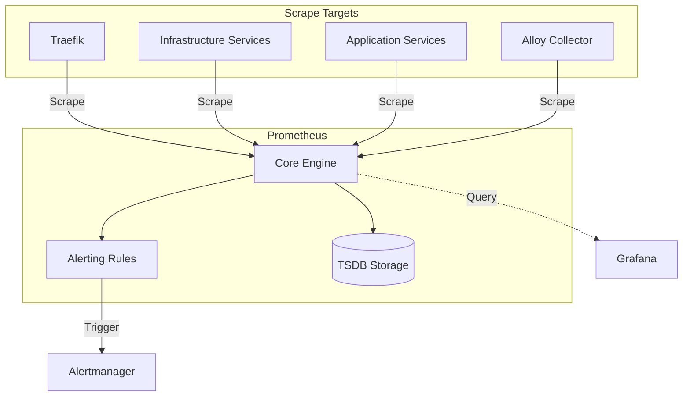

# Prometheus Usage Guide

관련 구성요소의 현재 선언은 [버전 레지스트리](../../../infra/tech-stack.versions.json)가 가리키는 Compose 원본에서 확인합니다.

## Usage

`node-exporter` collects host metrics for Prometheus. Its host mounts and namespace grants are defined by Compose and require review before changing scope.

### Overview

이 가이드는 `06-observability` 계층의 Prometheus 사용 맥락과 설정 확인 방법을 설명한다. Prometheus는 `infra/06-observability/prometheus/config/prometheus.yml`의 scrape job을 기준으로 metrics를 수집하고, `config/alert_rules/`의 rule files를 평가하며, `prometheus-data` TSDB volume에 데이터를 저장한다.

### Usage Type

`system-guide`

### Target Audience

- Operator
- SRE
- Developer
- AI Agent

### Purpose

- Prometheus compose service, scrape config, alert rule, and TSDB boundary를 빠르게 파악한다.
- 새 scrape target 또는 alert rule을 검토할 때 확인해야 할 파일과 검증 명령을 찾는다.
- 반복 실행, reload, restart, TSDB symptom triage는 연결된 runbook으로 넘긴다.

### Prerequisites

- Repository checkout 접근 권한.
- `infra/06-observability/docker-compose.yml` and `infra/06-observability/prometheus/config/prometheus.yml` 확인 권한.
- 필요 시 `obs` Docker Compose profile과 `infra-prometheus` container에 대한 read-only inspection 권한.
- Docker Secret values는 열람하지 않는다. 문서에는 secret ID와 file reference만 기록한다.

### Step-by-step Instructions

1. Compose service boundary를 확인한다.

   ```bash
   rg -n 'service: template-stateful-high|image: prom/prometheus:|container_name: infra-prometheus|--web.enable-lifecycle|prometheus-data|prometheus.middlewares' infra/06-observability/docker-compose.yml
   ```

2. Scrape job과 rule file boundary를 확인한다.

   ```bash
   rg -n '^  - job_name:' infra/06-observability/prometheus/config/prometheus.yml
   rg --files infra/06-observability/prometheus/config/alert_rules
   ```

   현재 repository 기준 scrape job은 34개, alert/recording rule file은 12개다.

3. Config or rule 변경 전후로 Prometheus 내장 검증 도구를 사용한다.

   ```bash
   docker exec infra-prometheus promtool check config /etc/prometheus/prometheus.yml
   docker exec infra-prometheus /bin/sh -c 'promtool check rules /etc/prometheus/alert_rules/*.yml'
   ```

   Rule glob expansion must occur in the container. An unquoted host-side path
   under `/etc/prometheus` does not exist on the host, and `promtool check
   rules` accepts existing file arguments rather than expanding a literal
   wildcard. The config check also verifies referenced credential files; while
   the staged `openbao_token` is unprovisioned it can stop at that prerequisite,
   so use the container-side rule check for independent rule syntax evidence.

4. Target 상태는 Prometheus UI `Targets` page 또는 Prometheus API로 확인한다. Route는 `https://prometheus.${DEFAULT_URL}`이며, container 내부 health endpoint는 `http://localhost:9090/-/healthy`다.

5. Reload, restart, scrape 장애 대응, TSDB symptom triage가 필요하면 runbook으로 이동한다.

### Common Pitfalls

- Prometheus restart 명령에서 profile과 compose file을 생략하면 다른 project context에서 실행될 수 있다. 운영 절차는 runbook의 profile 포함 명령을 따른다.
- 현재 compose command에는 explicit `--storage.tsdb.retention.*` flag가 없다. retention 동작을 문서화할 때는 policy와 compose 근거를 함께 확인한다.
- High-cardinality label을 추가하면 TSDB memory와 query cost가 커진다. label 추가는 policy의 cardinality review 대상이다.
- Rule file 변경 후 `promtool`을 실행하지 않으면 reload 시점에 rule evaluation failure로 이어질 수 있다.
- 복구 절차, WAL/TSDB 조치, rollback 판단을 guide에 직접 넣지 않는다. 해당 내용은 runbook에서 evidence와 escalation 기준으로 처리한다.

### Architecture



### Key Components

#### 1. Scrape Configurations

`prometheus.yml`은 Prometheus가 수집하는 scrape job의 source of truth다.

- **Internal monitoring**: Prometheus self-scrape, Alertmanager, Alloy, gateway and observability services.
- **Infrastructure tier**: PostgreSQL 17/18 family services, Valkey, Kafka, Qdrant, OpenSearch, etcd.
- **Applications**: Keycloak, n8n, Airflow, OpenBao, Ollama exporter.

#### GPU metrics (DCGM Exporter, opt-in `obs-gpu`)

`dcgm-exporter` is selected only by `obs-gpu`; neither the eight-profile
operating command nor HOME starts it. It reserves every NVIDIA GPU through the
Compose device reservation, runs without extra capabilities (the `SYS_ADMIN`
grant for DCP profiling fields was removed because the host GPU cannot provide
them) and exposes `9400` on `obs_net` only. Both `prometheus.yml` and
`prometheus.dev.yml` always scrape `dcgm-exporter:9400` with label
`domain="gpu"`, so the target is simply down while the profile is off; no
per-target down alert exists for it.

The Grafana dashboard `Infrastructure/dcgm-exporter.json` and the
`alert_rules.local.gpu.yml` rules (temperature, XID, framebuffer) read DCGM
metrics only. A present dashboard or a silent rule is not evidence of
collection. The 2026-09-21 read-only host check found one GeForce GTX 1060 6 GB,
an installed NVIDIA driver, the `nvidia` Docker runtime and the NVIDIA Container
Toolkit (exact versions are Task evidence, not a pin). DCGM targets data-center GPUs; on this consumer card some fields may be
missing, so collection is **unverified** until an approved run shows
`up{job="dcgm-exporter"} == 1` and non-empty `DCGM_FI_DEV_GPU_TEMP` and
`DCGM_FI_DEV_FB_USED` series with the expected `gpu`/`modelName` labels.

#### 2. Alerting Rule System

Rules are partitioned into domain-specific files in `config/alert_rules/`.

- Local domain files use the `alert_rules.local.*.yml` naming pattern.
- Kubernetes, Keycloak, the secret service (`alert_rules.vault.yml`, named after the `vault_` metric prefix OpenBao keeps) and recording rules are loaded as explicit files in `prometheus.yml`.
- Rule changes must be validated before reload.

#### 3. Storage (TSDB)

- Prometheus data is persisted in the `prometheus-data` volume.
- Current compose does not declare explicit retention flags.
- Recording rules are used to pre-calculate expensive PromQL expressions.

### Integration Patterns

#### Grafana DataSource

Prometheus is the primary metrics datasource for Grafana dashboards.

#### Alertmanager Integration

Prometheus evaluates rules on the configured `evaluation_interval` and dispatches active alerts to Alertmanager for deduplication and notification routing.

#### HTTP API for hy-home.k8s

Machine clients that cannot pass SSO, such as the hy-home.k8s cluster, use the
Prometheus HTTP API through Traefik at `https://prometheus.${DEFAULT_URL}/api/v1/`:
Alloy remote write to `/api/v1/write` and Kiali queries to
`/api/v1/query*`. The `prometheus-api` router admits only `/api/v1/`, and
`prometheus-api-auth` checks Basic Auth against `INFRA-007`, which
`gen-secrets.sh` derives from `PROMETHEUS_API_USERNAME` (`OBS-012`) and
`secrets/observability/prometheus_api_password.txt` (`OBS-013`). The client
needs that username and password, the Prometheus host name resolved to the
Traefik bind address, and trust in the gateway certificate. Give cluster series
a distinguishing external label such as `cluster`. The UI stays behind SSO, and
no Prometheus host port is published. hy-home.k8s reads the credential from
OpenBao `secret/platform/prometheus-api` through External Secrets, so a
password rotation also updates that entry; the
[integration runbook](../runbooks/0096-k8s-integration.md#rotating-the-prometheus-api-credential)
covers all three places.

#### Keycloak Observation

Prometheus scrapes `keycloak:9000` with `domain: "auth"` label in the current config.

### Source-backed operating contract

- **Purpose/classification/source**: `prometheus` is a `HOME` metrics/rules service and its mapped `node-exporter` is also `HOME`; `obs`/`obs-core`/`dev` plus narrower alerting/batch profiles select it. [Compose](../../../infra/06-observability/docker-compose.yml), scrape config, and rule files are authoritative.
- **Flow/state**: Prometheus scrapes exporters/services, evaluates rules, sends alerts to Alertmanager, accepts explicitly configured remote-write, and stores local TSDB blocks/WAL in `prometheus-data:/prometheus`. No external long-term metrics store is declared.
- **Secrets/dependencies/security**: `opensearch_exporter_password`, the Qdrant read-only key `qdrant_read_only_api_key` (AI-009), and staged `openbao_token` are scrape secrets. The tracked token/policy contract does not prove the running target loaded it. Exporters, Alertmanager, gateway auth, root CA, storage, and `obs_net` are dependencies; never expose secret-bearing rendered config.
- **Resources/normal use**: source retention/resource flags are configuration, not headroom. Render from root, run `promtool` config/rules checks, verify readiness, targets, rule health, and a bounded query before changes.
- **Lifecycle**: `--web.enable-lifecycle` and remote-write receiver are enabled, but `--web.enable-admin-api` is not. Therefore do not prescribe the online snapshot endpoint. Use an approved stopped consistent copy/storage snapshot, or separately approve and validate an admin-API design. Upgrade with TSDB compatibility review and verify WAL replay, queries, rules, alerts, and remote-write.
- **Upstream/license**: follow official [Prometheus storage and backup](https://prometheus.io/docs/prometheus/latest/storage/). Prometheus is Apache-2.0 licensed.

## Common Checks

- `rg -n '^  - job_name:' infra/06-observability/prometheus/config/prometheus.yml`
- `rg --files infra/06-observability/prometheus/config/alert_rules`
- `docker exec infra-prometheus promtool check config /etc/prometheus/prometheus.yml`
- `docker exec infra-prometheus /bin/sh -c 'promtool check rules /etc/prometheus/alert_rules/*.yml'`

## Runbook Handoff

반복 실행 절차, 장애 대응, rollback 또는 escalation 기준은 [recovery runbook](../runbooks/0045-prometheus.md)을 따른다.

## Traceability

- Declared parent: [Prometheus Operations Policy](../policies/0045-prometheus.md) (`POL-0045`)
- Governing authority: [Observability Architecture Description](../../02.architecture/descriptions/0006-observability-architecture.md) (`AD-0006`)
- Subject peers: [Policy](../policies/0045-prometheus.md) (`POL-0045`), [Runbook](../runbooks/0045-prometheus.md) (`RUN-0045`)

## Related Documents

- [Runtime image declarations](../../../infra/06-observability/docker-compose.yml)
- [Operations index](../README.md)
- [Operations policy](../policies/0045-prometheus.md)
- [Recovery runbook](../runbooks/0045-prometheus.md)
