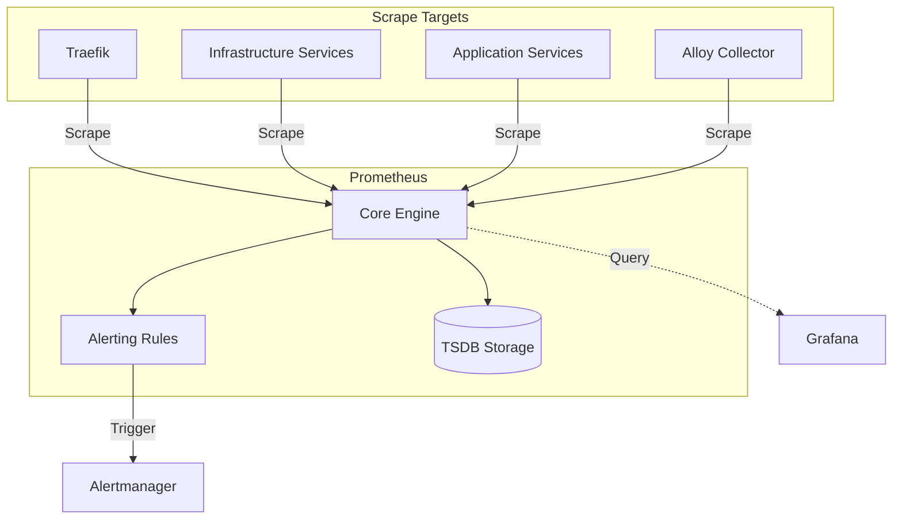

# Prometheus Usage Guide

관련 구성요소의 현재 선언은 [버전 레지스트리](../../../infra/tech-stack.versions.json)가 가리키는 Compose 원본에서 확인한다.

## Usage

`node-exporter`는 Prometheus를 위해 host metrics를 수집한다. Host mount와 namespace grant는 Compose에 정의되어 있고 scope를 바꾸기 전에 검토해야 한다.

### Overview

이 가이드는 `06-observability` 계층의 Prometheus 사용 맥락과 설정 확인 방법을 설명한다. Prometheus는 `infra/06-observability/prometheus/config/prometheus.yml`의 scrape job을 기준으로 metrics를 수집하고, `config/alert_rules/`의 rule files를 평가하며, `prometheus-data` TSDB volume에 데이터를 저장한다.

### Usage Type

`system-guide`

### Target Audience

- Operator
- SRE
- Developer
- AI Agent

### Purpose

- Prometheus compose service, scrape config, alert rule, and TSDB boundary를 빠르게 파악한다.
- 새 scrape target 또는 alert rule을 검토할 때 확인해야 할 파일과 검증 명령을 찾는다.
- 반복 실행, reload, restart, TSDB symptom triage는 연결된 runbook으로 넘긴다.

### Prerequisites

- Repository checkout 접근 권한.
- `infra/06-observability/docker-compose.yml` and `infra/06-observability/prometheus/config/prometheus.yml` 확인 권한.
- 필요 시 `obs` Docker Compose profile과 `infra-prometheus` container에 대한 read-only inspection 권한.
- Docker Secret values는 열람하지 않는다. 문서에는 secret ID와 file reference만 기록한다.

### Step-by-step Instructions

1. Compose service boundary를 확인한다.

   ```bash
   rg -n 'service: template-stateful-high|image: prom/prometheus:|container_name: infra-prometheus|--web.enable-lifecycle|prometheus-data|prometheus.middlewares' infra/06-observability/docker-compose.yml
   ```

2. Scrape job과 rule file boundary를 확인한다.

   ```bash
   rg -n '^  - job_name:' infra/06-observability/prometheus/config/prometheus.yml
   rg --files infra/06-observability/prometheus/config/alert_rules
   ```

   현재 repository 기준 scrape job은 34개, alert/recording rule file은 12개다.

3. Config or rule 변경 전후로 Prometheus 내장 검증 도구를 사용한다.

   ```bash
   docker exec infra-prometheus promtool check config /etc/prometheus/prometheus.yml
   docker exec infra-prometheus /bin/sh -c 'promtool check rules /etc/prometheus/alert_rules/*.yml'
   ```

   Rule glob expansion은 container 내부에서 일어나야 한다. `/etc/prometheus` 아래
   unquoted host-side path는 host에 존재하지 않으며, `promtool check
   rules`는 literal wildcard를 확장하는 대신 존재하는 file argument만 받는다. Config
   check은 참조된 credential file도 검증하는데 staged `openbao_token`이
   unprovisioned 상태면 이 prerequisite에서 멈출 수 있다. 그래서 독립적인 rule syntax
   evidence를 위해 container-side rule check을 사용한다.

4. Target 상태는 Prometheus UI `Targets` page 또는 Prometheus API로 확인한다. Route는 `https://prometheus.${DEFAULT_URL}`이며, container 내부 health endpoint는 `http://localhost:9090/-/healthy`다.

5. Reload, restart, scrape 장애 대응, TSDB symptom triage가 필요하면 runbook으로 이동한다.

### Common Pitfalls

- Prometheus restart 명령에서 profile과 compose file을 생략하면 다른 project context에서 실행될 수 있다. 운영 절차는 runbook의 profile 포함 명령을 따른다.
- 현재 compose command에는 explicit `--storage.tsdb.retention.*` flag가 없다. retention 동작을 문서화할 때는 policy와 compose 근거를 함께 확인한다.
- High-cardinality label을 추가하면 TSDB memory와 query cost가 커진다. label 추가는 policy의 cardinality review 대상이다.
- Rule file 변경 후 `promtool`을 실행하지 않으면 reload 시점에 rule evaluation failure로 이어질 수 있다.
- 복구 절차, WAL/TSDB 조치, rollback 판단을 guide에 직접 넣지 않는다. 해당 내용은 runbook에서 evidence와 escalation 기준으로 처리한다.

### Architecture


```mermaid
graph TD
    subgraph "Scrape Targets"
        A[Traefik]
        B[Infrastructure Services]
        C[Application Services]
        D[Alloy Collector]
    end

    subgraph "Prometheus"
        P[Core Engine]
        Rules[Alerting Rules]
        TSDB[(TSDB Storage)]
    end

    A & B & C & D -->|Scrape| P
    P --> Rules
    P --> TSDB
    Rules -->|Trigger| AM[Alertmanager]
    P -.->|Query| G[Grafana]
```

### Key Components

#### 1. Scrape Configurations

`prometheus.yml`과 `prometheus.dev.yml`은 같은 38개 job을 담는다(SPEC-0193). Compose는
`PROMETHEUS_CONFIG_FILE`로 둘 중 하나를 고르며, 계약 테스트가 두 파일의 `scrape_configs`가
같은지 확인한다.

- **Host and containers**: node-exporter, cAdvisor, DCGM exporter.
- **Observability**: Prometheus, Alertmanager, Alloy, Loki, Tempo, Pyroscope, Grafana, Gatus.
- **Gateway, auth, security**: Traefik, Keycloak, OAuth2 Proxy(`:44180`), OpenBao.
- **Datastores and tooling**: `mng-pg`와 `mng-valkey` exporter, Qdrant, SeaweedFS S3, registry(debug listener `:5001`).
- **Workflow and AI**: Airflow statsd exporter(`airflow-monitor`), Flower, n8n, Ollama exporter.
- **On-demand**: Kafka broker·Connect·Schema Registry(JMX agent), Kafka exporter, 보조 Valkey exporter, Valkey cluster, PostgreSQL HA와 HAProxy, etcd, OpenSearch, MongoDB·Cassandra exporter. 이 서비스가 멈춰 있으면 target이 down인 것이 정상이며, `up`을 보는 alert는 이 job을 감시하지 않는다.

규칙:

- 소스 하나는 job 하나가 수집한다. 같은 target을 두 job이 긁으면 series가 두 벌 생긴다(이전 `airflow-exporter`, Alloy self remote-write의 `integrations/self`).
- 모든 target에 `cluster="hy-home"`, `namespace="hy-home"` 라벨을 붙인다. mixin 대시보드가 이 라벨로 변수를 채운다. PostgreSQL HA의 클러스터 이름은 `pg_cluster` 라벨이다.
- Prometheus는 `--enable-feature=exemplar-storage`로 exemplar를 저장해 Grafana에서 metric → trace 링크가 동작한다.

#### GPU metrics (DCGM Exporter, `obs-gpu`)

`dcgm-exporter`는 `obs-gpu`에서만 선택되며, SPEC-0182 W6에서 소유자가 `obs-gpu`를
HOME에 추가했으므로 HOME이 이를 시작한다(POL-0078). Compose device reservation을 통해 모든 NVIDIA GPU를 예약하고,
추가 capability 없이 실행되며(host GPU가 제공할 수 없어 DCP profiling field용
`SYS_ADMIN` grant는 제거됨), `obs_net`에서만 `9400`을 노출한다. `prometheus.yml`과
`prometheus.dev.yml` 모두 항상 `domain="gpu"` label로 `dcgm-exporter:9400`을
scrape한다. 그래서 profile이 꺼져 있으면 target은 그냥 down 상태이고 per-target down
alert는 없다.

Grafana dashboard `Infrastructure/dcgm-exporter.json`과 `alert_rules.local.gpu.yml`
rule(temperature, framebuffer; XID rule은 이 GPU가 XID series를 내지 않아 SPEC-0193에서 제거)은 DCGM metric만 읽는다. Dashboard가 있거나
rule이 조용하다고 해서 collection의 증거가 되지는 않는다. 2026-09-21 read-only host
check에서 GeForce GTX 1060 6 GB 1대, 설치된 NVIDIA driver, `nvidia` Docker runtime,
NVIDIA Container Toolkit을 확인했다(정확한 버전은 pin이 아니라 Task evidence다).
DCGM은 data-center GPU를 대상으로 하며 이 consumer card에서는 일부 field가 누락될
수 있다. 그래서 승인된 실행이 `up{job="dcgm-exporter"} == 1`과 비어있지 않은
`DCGM_FI_DEV_GPU_TEMP`, `DCGM_FI_DEV_FB_USED` series를 예상되는 `gpu`/`modelName`
label과 함께 보여주기 전까지 collection은 **미검증** 상태다.

#### 2. Alerting Rule System

Rule은 `config/alert_rules/`에 domain별 file로 나뉘어 있다.

- Local domain file은 `alert_rules.local.*.yml` naming pattern을 사용한다.
- Keycloak, OpenBao(`alert_rules.openbao.yml`, OpenBao가 유지하는 `vault_` metric
  prefix를 읽음)와 recording rule(`recording_rules*.yml`)은 explicit file 또는 glob으로
  loading된다. recording rule은 Loki·Tempo mixin의 것만 있으며 upstream 그대로 둔다.
- Rule 변경은 reload 전에 validate해야 한다.

SPEC-0193(2026-09-30)의 rule 기준:

- 각 rule은 소스 서비스가 실행 중일 때 실제로 방출하는 metric 이름만 쓴다. 2026-09-29 감사에서
  78개 중 26개가 방출되지 않는 이름을 써서 발화할 수 없었다(Keycloak 전부, OpenSearch의
  `elasticsearch_*`, `TraefikServiceDown`, `N8nWorkflowFailed`, `GpuXidError` 등). 이름을 고칠 수
  있는 rule은 고치고, 소스가 없는 rule과 역할이 겹치는 rule은 지웠다(78 → 66).
- on-demand 서비스는 `up == 0`으로 알리지 않는다. 서비스가 떠 있을 때만 생기는 metric(`redis_up`,
  `pg_up`, `opensearch_cluster_status` 등)으로 판단한다.
- 모든 rule의 `runbook_url`은 해당 서비스의 runbook 파일을 가리킨다. 계약 테스트가 파일 존재를
  확인한다.

#### 3. Storage (TSDB)

- Prometheus data는 `prometheus-data` volume에 저장된다.
- 현재 compose는 explicit retention flag를 선언하지 않는다.
- Recording rule로 비용이 큰 PromQL expression을 미리 계산한다.

### Integration Patterns

#### Grafana DataSource

Prometheus는 Grafana dashboard의 primary metrics datasource다.

#### Alertmanager Integration

Prometheus는 설정된 `evaluation_interval`로 rule을 평가하고, active alert를
deduplication과 notification routing을 위해 Alertmanager로 전달한다.

#### HTTP API for hy-home.k8s

hy-home.k8s cluster처럼 SSO를 통과할 수 없는 machine client는 Traefik을 통해
`https://prometheus.${DEFAULT_URL}/api/v1/`에서 Prometheus HTTP API를 사용한다.
Alloy는 `/api/v1/write`로 remote write하고, Kiali는 `/api/v1/query*`로 query한다.
`prometheus-api` router는 Basic `Authorization` header를 가진 `/api/v1/` request만
허용하고, `prometheus-api-auth`는 `gen-secrets.sh`가 `PROMETHEUS_API_USERNAME`
(`OBS-012`)과 `secrets/observability/prometheus_api_password.txt`(`OBS-013`)에서
유도한 `INFRA-007`에 대해 Basic Auth를 확인한다. Client는 해당 username과 password,
Traefik bind address로 resolve된 Prometheus host name, gateway certificate에 대한
신뢰가 필요하다. Cluster series에는 `cluster` 같은 구분되는 external label을 부여한다.
UI는 SSO 뒤에 있고, UI 자체의 `/api/v1/` 호출도 SSO cookie를 가지고 Basic header
없이 동작하므로 로그인된 browser에는 두 번째 로그인을 요구하지 않는다. Prometheus
host port는 publish되지 않는다. hy-home.k8s는 External Secrets를 통해 OpenBao
`secret/platform/prometheus-api`에서 credential을 읽으므로, password rotation은
해당 entry도 갱신해야 한다. [integration runbook](../runbooks/0096-k8s-integration.md#rotating-the-prometheus-api-credential)이
세 곳을 모두 다룬다.

#### Keycloak Observation

Prometheus는 현재 config에서 `domain: "auth"` label로 `keycloak:9000`을 scrape한다.

### Source-backed operating contract

- **목적/분류/출처**: `prometheus`는 `HOME` metrics/rules service이며, mapping된 `node-exporter`도 `HOME`이다. `obs`/`obs-core`/`dev`와 더 좁은 alerting/batch profile이 이를 선택한다. [Compose](../../../infra/06-observability/docker-compose.yml), scrape config, rule file이 authoritative하다.
- **Flow/state**: Prometheus는 exporter/service를 scrape하고, rule을 평가하고, Alertmanager로 alert를 보내며, explicit하게 설정된 remote-write를 받아들이고, `prometheus-data:/prometheus`에 local TSDB block/WAL을 저장한다. External long-term metrics store는 선언되어 있지 않다.
- **Secrets/dependencies/security**: `opensearch_exporter_password`, Qdrant read-only key `qdrant_read_only_api_key`(AI-009), staged `openbao_token`이 scrape secret이다. Tracked token/policy contract는 실행 중인 target이 이를 loading했음을 증명하지 않는다. Exporter, Alertmanager, gateway auth, root CA, storage, `obs_net`이 dependency이며, secret이 포함된 rendered config는 절대 노출하지 않는다.
- **Resources/normal use**: source의 retention/resource flag는 headroom이 아니라 configuration이다. Root에서 render하고, `promtool` config/rules check을 실행하고, readiness, target, rule health, bounded query를 변경 전에 확인한다.
- **Lifecycle**: `--web.enable-lifecycle`과 remote-write receiver는 활성화되어 있지만 `--web.enable-admin-api`는 아니다. 따라서 online snapshot endpoint를 처방하지 않는다. 승인된 stopped consistent copy/storage snapshot을 사용하거나 admin-API design을 별도로 승인하고 검증한다. TSDB 호환성을 검토하며 upgrade하고 WAL replay, query, rule, alert, remote-write를 검증한다.
- **Upstream/license**: 공식 [Prometheus storage and backup](https://prometheus.io/docs/prometheus/latest/storage/) 가이드를 따른다. Prometheus는 Apache-2.0 라이선스다.

## Common Checks

- `rg -n '^  - job_name:' infra/06-observability/prometheus/config/prometheus.yml`
- `rg --files infra/06-observability/prometheus/config/alert_rules`
- `docker exec infra-prometheus promtool check config /etc/prometheus/prometheus.yml`
- `docker exec infra-prometheus /bin/sh -c 'promtool check rules /etc/prometheus/alert_rules/*.yml'`

## Runbook Handoff

반복 실행 절차, 장애 대응, rollback 또는 escalation 기준은 [recovery runbook](../runbooks/0045-prometheus.md)을 따른다.

## Traceability

- Declared parent: [Prometheus Operations Policy](../policies/0045-prometheus.md) (`POL-0045`)
- Governing authority: [Observability Architecture Description](../../02.architecture/descriptions/0006-observability-architecture.md) (`AD-0006`)
- Subject peers: [Policy](../policies/0045-prometheus.md) (`POL-0045`), [Runbook](../runbooks/0045-prometheus.md) (`RUN-0045`)

## Related Documents

- [Runtime image declarations](../../../infra/06-observability/docker-compose.yml)
- [Operations index](../README.md)
- [Operations policy](../policies/0045-prometheus.md)
- [Recovery runbook](../runbooks/0045-prometheus.md)
