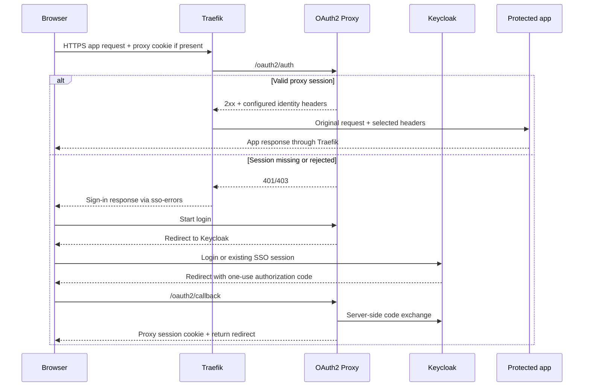
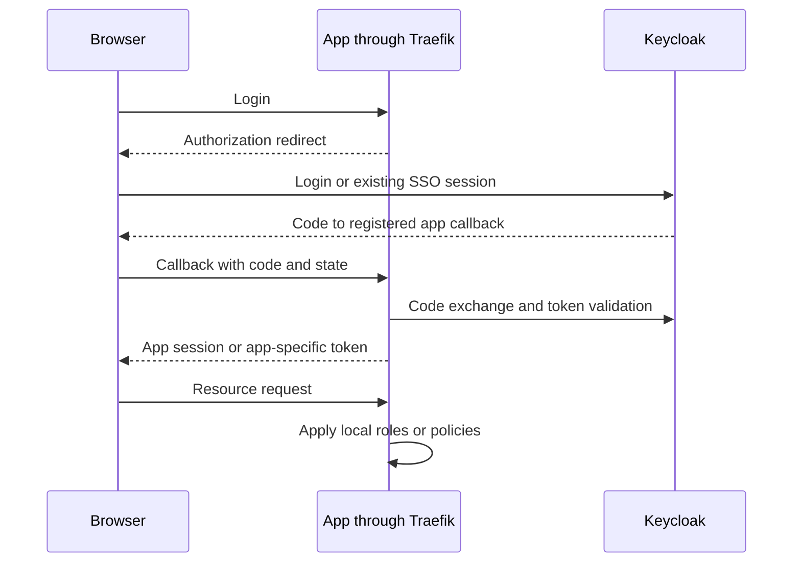

# Application Authentication Integration Guide

## Usage

### Overview

Keycloak, OAuth2 Proxy, Traefik, Kafbat UI, Airflow를 중복 인증 없이 연결하고
서비스별 authorization model을 유지하는 방법을 설명한다.

### Usage Type

`system-guide | how-to | integration-reference`

### Target Audience

- Infra/DevOps Engineers
- Operators
- Platform Developers
- AI Agents

### Purpose

- ForwardAuth와 Native OIDC의 책임 경계를 명확히 한다.
- Keycloak application client 설정을 일관되게 유지한다.
- Kafbat/Airflow RBAC와 OpenBao policy를 gateway auth와 충돌시키지 않는다.

### 용어와 책임

| 용어 | 의미 | 이 저장소에서의 역할 |
| --- | --- | --- |
| OAuth 2.0 | 클라이언트가 API 접근 권한을 위임받는 체계 | Access Token의 대상·범위와 수명 관리 |
| OIDC | OAuth 2.0 위에서 사용자 인증 정보를 전달하는 프로토콜 | `openid` 요청과 ID Token으로 로그인 결과 확인 |
| Keycloak | OIDC Provider이자 사용자·클라이언트 관리 서버 | `hy-home.realm`의 사용자, 그룹, 세션, 토큰 발급 |
| OAuth2 Proxy | OIDC 클라이언트인 인증 프록시 | Keycloak 로그인 후 자체 세션으로 ForwardAuth 응답 |
| Traefik | 요청 라우터와 TLS 진입점 | 서비스에 적용된 middleware에 따라 인증 검사 호출 |
| 애플리케이션 | OIDC 클라이언트 또는 보호 대상 | 자체 정책으로 데이터·기능 접근 권한 판단 |

OIDC는 제품명이 아니다. Keycloak은 OIDC를 구현하는 서버이고, OAuth2 Proxy와
OpenBao는 이 서버를 이용하는 서로 다른 클라이언트다. 로그인 성공이 모든 서비스의
관리자 권한을 뜻하지 않는다. 프로토콜 정의는
[OIDC Core](https://openid.net/specs/openid-connect-core-1_0.html),
Keycloak의 endpoint 역할은 [공식 OIDC 안내](https://www.keycloak.org/securing-apps/oidc-layers)를 따른다.

### Authentication Pattern

#### Gateway ForwardAuth



실제 앱 요청은 Traefik이 전달한다. `static://200`인 OAuth2 Proxy가 모든 앱의
본문을 대신 프록시하는 구성이 아니다. 현재 `sso-auth`는 내부
`/oauth2/auth`를 호출하고, `sso-errors`는 401/403을 sign-in으로 연결한다.
따라서 권한 거부도 재로그인처럼 보일 수 있다. 설정 근거는
[Traefik middleware](../../../infra/01-gateway/traefik/dynamic/middleware.yml)이며,
2xx일 때 원래 요청을 진행하는 동작은 [공식 ForwardAuth 문서](https://doc.traefik.io/traefik/reference/routing-configuration/http/middlewares/forwardauth/)에서 확인했다.

#### Application-native OIDC



Airflow, Kafbat UI, OpenBao, Open WebUI, Gatus, Superset이 이 경로를 사용한다. 이 router들은
`gateway-standard-chain@file`을 사용하며 `sso-auth@file`을 적용하지 않는다.
Keycloak에 이미 로그인했다면 비밀번호 입력이 생략될 수 있지만, 애플리케이션별
callback 처리와 세션·권한 생성은 여전히 필요하다. OpenBao의 OIDC 로그인은
게이트웨이 쿠키나 AppRole 토큰으로 대체되지 않는다.

### Keycloak Client Matrix

Realm은 `hy-home.realm`, issuer는
`https://keycloak.${DEFAULT_URL}/realms/hy-home.realm`이다.

| Application | Client ID | Callback | 권한 소유자·근거 |
| --- | --- | --- | --- |
| OAuth2 Proxy | 공개 예제 `home-proxy-client`; 실제 주입은 `OAUTH2_PROXY_CLIENT_ID` | `https://auth.${DEFAULT_URL}/oauth2/callback` | Proxy의 허용 조건 + 앱 자체 권한; [설정](../../../infra/02-auth/oauth2-proxy/docker-compose.yml) |
| Kafbat UI | `home-kafbat` | `https://kafbat-ui.${DEFAULT_URL}/login/oauth2/code/keycloak` | Kafbat 그룹 기반 RBAC; [선언](../../../infra/05-messaging/kafka/docker-compose.yml) |
| Airflow | `home-airflow` | `/auth/login_callback` at the Airflow origin | Keycloak Auth Manager와 Authorization Services; [운영 안내](0050-airflow.md) |
| OpenBao | `home-openbao` | `https://openbao.${DEFAULT_URL}/ui/vault/auth/oidc/oidc/callback` | `home-admin` → `hy-home-operator`; [검증된 로그인 절차](0085-openbao.md) |
| Open WebUI | `home-openwebui` | `https://chat.${DEFAULT_URL}/oauth/oidc/callback` | 기존 로컬 사용자 ID·역할 보존; [운영 절차](../runbooks/0057-open-webui.md) |
| Gatus | `home-gatus` | `https://status.${DEFAULT_URL}/authorization-code/callback` | 정확한 subject allowlist; [운영 절차](../runbooks/0087-gatus.md) |
| Superset | `home-superset` | `https://superset.${DEFAULT_URL}/oauth-authorized/keycloak` | 가입은 `Gamma`, 역할은 Superset Admin이 부여; [운영 절차](../runbooks/0097-superset.md) |

OpenBao CLI callback은 `http://localhost:8250/oidc/callback`이다. 이는 브라우저
루프백 수신점이며 서버의 공개 HTTP 주소가 아니다. 현재 OpenBao 그룹은
`/openbao-admins`이고 Kafbat의 `/admins`·`/users`와 별개다. 이 표는 새 client를
자동 생성하지 않는다. OpenBao의 실제 로그인은 확인됐고, 다른 앱은 이 조사에서
선언을 검토했으며 전체 재로그인·권한 검증을 다시 수행하지 않았다.

### Authorization Code와 검증 경계

1. 클라이언트가 discovery의 issuer·authorization endpoint·token endpoint·JWKS를 확인한다.
2. 브라우저는 등록된 client와 callback으로 인증을 시작한다.
3. callback의 `state`를 시작한 브라우저 세션과 대조하고 code를 서버에서 교환한다.
4. 클라이언트는 서명·issuer·대상 audience·만료와 요청한 nonce를 검증한다.
5. 그룹·역할 claim을 앱 정책으로 변환한 뒤 앱 세션을 발급한다.

PKCE의 S256은 code와 최초 요청을 연결하며 client secret이나 TLS 검증을 대신하지
않는다. 현재 Proxy와 OpenBao는 S256을 설정했다. 다른 앱까지 검증 없이 같은
상태로 표시하지 않는다. 새 연동은 정확한 callback 등록과 Authorization Code +
PKCE를 기준으로 설계하고, password grant나 implicit flow를 편의상 추가하지 않는다.
보안 근거는 [RFC 9700](https://www.rfc-editor.org/rfc/rfc9700.html)이다.

### 토큰·쿠키·권한의 구분

| 항목 | 소비자 | 주의할 점 |
| --- | --- | --- |
| ID Token | 로그인한 OIDC 클라이언트 | 사용자 인증 결과이며 범용 API 자격 증명이 아님 |
| Access Token | 해당 audience의 resource server | 다른 앱의 토큰과 임의 교환 불가 |
| Refresh Token | 발급받은 클라이언트 | 재발급용 비밀; 브라우저 URL·로그에 넣지 않음 |
| Keycloak SSO 세션 | Keycloak | 앱 자체 세션과 수명이 다름 |
| Proxy 쿠키/Valkey 세션 | OAuth2 Proxy | ForwardAuth 판단용이며 OpenBao 정책 권한을 부여하지 않음 |
| OpenBao 토큰 | OpenBao API | OIDC 결과로 발급되고 Bao 정책·TTL에 따름 |
| Airflow 내부 JWT | Airflow API | Keycloak Access Token과 별개 |

`groups`는 이 연동이 사용하는 claim이며 OIDC 표준이 자동 생성하는 그룹 권한이
아니다. mapper, scope, claim이 실리는 token 종류와 앱의 매핑을 함께 확인한다.
`openid`나 `groups` scope를 요청했다는 사실만으로 관리 권한이 생기지 않는다.

### OAuth2 Proxy의 현재 경계

현재 [설정](../../../infra/02-auth/oauth2-proxy/config/oauth2-proxy.cfg)은
`keycloak-oidc`, S256, Redis 프로토콜의 Valkey 세션을 사용한다.
`allowed_groups = ["/admins"]`이므로 Keycloak `/admins` 그룹 구성원만 SSO route를
통과한다(owner 결정 2026-09-24). 다른 realm 사용자는 앱에 도달하지 못한다.
`sso-errors`가 401–403을 로그인 흐름으로 바꾸므로 route에서 403이 그대로 보이지
않는다. 거부는 OAuth2 Proxy 로그의 그룹 거부 기록과 로그인 흐름 끝의 Proxy 오류
화면으로 확인한다.
`groups` claim은 Kafbat이 `/admins`를 매핑하는 것과 같은 전체 경로 형식이다.
native OIDC route는 이 allowlist를 거치지 않으므로 각 앱의 역할 매핑이 따로
권한을 정한다. 새 그룹에 SSO route를 열려면 이 설정과 POL-0079를 함께 바꾼다.

`trusted_ips`는 일치하는 client 주소의 **인증을 생략**하는 설정이다. 과거 값
`172.19.0.0/16`은 당시 공용 network의 모든 컨테이너가 Traefik 경유 요청에서 SSO를
우회하게 했고, 확인된 소비자(Gatus·exporter는 서비스를 직접 호출)가 없어
2026-09-21 변경에서 제거했다. `trusted_proxy_ips`는 forwarded header를 보낼 수 있는
proxy 범위를 정하는 별개 설정이며 인증 생략이 아니다. 현재 Traefik의 고정 주소
Traefik 고정 주소 `10.250.1.2/32`(`edge_net`, SPEC-0180 S05)만 신뢰한다(미설정 시 모든 주소를 신뢰한다는 경고가 있었음). Traefik 진입점에는
`forwardedHeaders` 신뢰가 없어 외부 client가 보낸 `X-Forwarded-For`를 덮어쓴다.
같은 날 host loopback과 LAN 주소에서 무인증 GET으로 SSO 보호 route(Alloy)를 요청해
두 경로 모두 `401`을 확인했다. 이는 한 route의 상태 코드 관측이며 전체 route의
인가 검증이 아니다.

표준 `sso-auth`는 이제 사용자·이메일·preferred username 헤더만 전달한다.
`Authorization`, access token, ID token 전달은 모든 upstream에 사용자 Keycloak
token을 재사용 가능하게 노출했고 SonarQube·Terrakube 같은 자체 Bearer 방식과
충돌했으므로 제거했다. token이 실제로 필요한 소비자는 전용 middleware를 별도로
정의하고 검증한다. `trustForwardHeader: false`여도 백엔드가 같은 network이나 host
port로 직접 접근 가능하면 신뢰 헤더 방식의 보호가 성립한다고 볼 수 없다.
Traefik dynamic 디렉터리는 파일 감시로 적용되므로 이 변경을 main checkout에
병합하는 순간이 gateway 적용 시점이며, Proxy 설정은 재시작 후 적용된다.

### 로그아웃과 권한 회수

앱 로그아웃, Proxy 쿠키 삭제, Keycloak SSO 종료, 이미 발급된 API 토큰 폐기는
각각 확인해야 한다. 하나의 쿠키 삭제가 모든 앱의 로그아웃을 증명하지 않는다.
Keycloak 세션 종료 후에도 앱 로컬 세션이나 이미 발급된 토큰이 유효할 수 있으므로
앱의 만료·재검증·폐기 동작을 점검한다. RP-initiated logout의 endpoint와 허용된
복귀 URI는 [공식 Logout 규격](https://openid.net/specs/openid-connect-rpinitiated-1_0.html)을 따른다.
Proxy의 구체적 절차는 [Proxy runbook](../runbooks/0015-oauth2-proxy.md)이 소유한다.

### 신규 앱 연동 순서와 완료 기준

- 먼저 native OIDC/RBAC 지원 여부로 인증 경로를 선택한다.
- client, 정확한 callback, Web Origin, 최소 scope, claim mapper를 등록한다.
- secret은 승인된 비밀 저장소로 전달하고 DNS·CA·issuer를 검증한다.
- 정상 사용자 성공, 비허용 사용자 거부, 만료 후 재로그인, 로그아웃 범위를 확인한다.
- API는 브라우저 쿠키와 별도 방식인지 확인하고, 오류 시 헤더·토큰 원문을 남기지 않는다.

등록만으로 완료하지 않는다. 브라우저 성공과 최소 권한 거부 사례가 해당 서비스의
Task에 기록되어야 해당 검증의 완료로 취급한다. 별도 실제 비허용 사용자가 없는
현재 Gatus 전환은 exact-subject 거부 회귀 검증과 실제 미인증/잘못된 세션 거부를
확인했다. 두 번째 실제 Keycloak 사용자 로그인 거부는 수행하지 않았으며, 이
검증 한계는 전환 완료와 구분해 Task에 남긴다.

### ForwardAuth Service Review

Native OIDC 전환은 제품의 browser login/session 기능이 Keycloak을 직접 신뢰할 수
있고, 현재 설치판에서 라이선스나 외부 plugin 없이 지원될 때만 선택한다.
OAuth2 Proxy 뒤에 있다는 사실만으로 애플리케이션 권한 모델이 OIDC를 이해한다고
보지 않는다.

2026-09-20 조사 및 단계별 구현 상태는 다음과 같다. 실제 로그인 검증이 끝나기 전에는
후보나 설정 완료를 전환 완료로 표시하지 않는다.

| 서비스 | 지원 근거와 현재 상태 | 처리 |
| --- | --- | --- |
| Open WebUI | Native OIDC; 전용 `home-openwebui` confidential client 생성, 정확한 `https://chat.hy.home.arpa/oauth/oidc/callback`, S256, 서비스 healthy | 실제 관리자 로그인·동일 계정 검증 완료, 임시 병합·로컬 로그인 비활성화, 표준 gateway chain만 유지 |
| Gatus | Native OIDC; session cookie·PKCE·정확한 subject·데이터 경로 보완, 전용 client와 실제 로그인 확인 | 전환 완료; 표준 gateway chain만 유지, 외부 metrics 차단·내부 수집 유지 |
| Terrakube | Direct issuer 선언은 있으나 미기동; API 외부 JWT 경로에서 명시적 audience 검사 미확인 | `iac` profile을 켤 때 처리(owner 결정 2026-09-24): 전용 public client `home-terrakube`, API route의 ForwardAuth 제거, audience/RBAC 실행 검증. 그 전까지 gateway 유지. API route의 ForwardAuth는 cookie가 없는 Terraform CLI·API token 호출과, `terrakube-api.` 공개 주소로 API를 부르는 `terrakube-executor`를 막는다. executor를 내부 주소로 돌릴지와 executor route의 SSO도 같은 시점에 정한다 |
| n8n Community | [공식 SSO 안내](https://docs.n8n.io/deploy/host-n8n/configure-n8n/security/configure-sso)는 self-hosted Business/Enterprise만 지원 | 유료 기능 도입 없이 ForwardAuth 유지 |
| Flower | [공식 인증 안내](https://flower.readthedocs.io/en/latest/auth.html)는 provider별 OAuth와 custom handler 제공; generic Keycloak OIDC 계약 없음 | custom 인증 코드 추가 없이 ForwardAuth 유지 |
| Stalwart WebUI | [OIDC backend](https://stalw.art/docs/auth/backend/oidc/)는 클라이언트가 제시한 bearer token 검증; 서버가 browser OIDC를 시작하지 않음 | mail/JMAP OIDC 지원을 WebUI SSO로 오인하지 않고 gateway 유지 |
| RedisInsight | [공식 설정](https://redis.io/docs/latest/operate/redisinsight/configuration/)에서 UI OIDC 연동 설정 미확인; DB 연결 인증과 구분 | native 지원 미검증으로 유지; 불가능하다고 단정하지 않음 |
| Open Notebook | [upstream OIDC 요청](https://github.com/lfnovo/open-notebook/issues/607)과 현재 배포의 password 인증 | native 계약 미확인; router는 ForwardAuth 없이 IP allowlist와 앱 password (2026-09 `b90b74837`) |
| ComfyUI | [custom OIDC 요청](https://github.com/Comfy-Org/ComfyUI/issues/12558); Comfy 계정 로그인과 Keycloak 연동은 별개 | 유지 |
| Mailpit, Ollama | [Mailpit HTTP 인증](https://mailpit.axllent.org/docs/configuration/http/), [Ollama 인증](https://docs.ollama.com/api/authentication)은 native Keycloak browser login 모델이 아님 | 유지 |
| SonarQube Community | [공식 인증 목록](https://docs.sonarsource.com/sonarqube-server/2025.4/instance-administration/authentication/overview/)의 SAML/위임 인증과 OIDC를 구분 | 설치판에서 native OIDC 미확인, 유지 |
| Prometheus, Alertmanager, Pushgateway, Loki, Tempo, Alloy, Pyroscope, cAdvisor | 현재 배포의 browser OIDC 계약 미확인; Grafana/API/reverse-proxy 보호 사용 | 유지 |

Open WebUI는 OAuth role/group 자동 관리를 끄고 기존 로컬 관리자 역할을 보존한다.
검증된 이메일을 가진 단일 기존 사용자만 초기 연결하며, 연결 후 email merge를 끈다.
기존 데이터 ID·역할·채팅 소유권과 provider subject를 대조한다. 로그인 폼 설정은
DB persistence 영향을 받으므로 UI/API readback으로 종료 여부를 확인한다.
구체적 파일 소유권과 복구는 [Open WebUI runbook](../runbooks/0057-open-webui.md)에 있다.

Candidate cutover completion criteria:

- 전용 Keycloak client와 정확한 redirect URI를 등록하고 client secret은 Docker Secret
  또는 승인된 secret store로만 전달한다.
- gateway ForwardAuth 제거는 해당 서비스의 native login success, 접근 거부 검증의 범위·한계,
  logout/session behavior, data/account preservation, rollback evidence가 기록된 뒤에만
  적용한다.
- rejected 또는 unverified 서비스는 `sso-errors@file,sso-auth@file` chain을 유지한다.

Primary references: Open WebUI SSO docs (<https://docs.openwebui.com/features/sso/>),
Gatus OIDC source (<https://raw.githubusercontent.com/TwiN/gatus/master/security/oidc.go>),
Prometheus web config (<https://prometheus.io/docs/prometheus/latest/configuration/https/>),
Loki authentication docs (<https://grafana.com/docs/loki/latest/operations/authentication/>),
n8n SSO docs (<https://docs.n8n.io/user-management/saml/>), Mailpit docs
(<https://mailpit.axllent.org/docs/>), Stalwart OIDC backend docs
(<https://stalw.art/docs/auth/backend/oidc/>).

### Kafbat UI

현재 구현:

- [kafbat/kafka-ui image declaration](../../../infra/05-messaging/kafka/docker-compose.yml)
- `auth.type: OAUTH2`
- direct Keycloak issuer
- `roles-field: groups`
- gateway-only Traefik route

Keycloak client:

- Client ID: `home-kafbat`
- Client Authentication: ON
- Standard Flow: ON
- Redirect: `https://kafbat-ui.${DEFAULT_URL}/login/oauth2/code/keycloak`
- Web Origin: `https://kafbat-ui.${DEFAULT_URL}`

RBAC:

- `/admins` -> admin
- `/users` -> readonly

`rbac.roles[*].clusters`는 `KAFKA_CLUSTERS_0_NAME`과 일치해야 한다.

#### Local CA Trust

```text
JDK default cacerts
  -> copy
  -> import mkcert rootCA.pem
  -> use copied truststore
```

local root CA만 담긴 새 truststore로 JDK public CA roots를 대체하지 않는다.

### Airflow

현재 구현:

- Airflow: [build declaration](../../../infra/07-workflow/airflow/Dockerfile)
- Keycloak provider: [build declaration](../../../infra/07-workflow/airflow/Dockerfile)
- `KeycloakAuthManager`
- `home-airflow`
- fixed Airflow API JWT secret
- certifi + local root CA bundle
- `--proxy-headers`
- gateway-only Airflow router

#### Token model

Keycloak tokens:

- OIDC login
- Authorization Services evaluation

Airflow internal JWT:

- Airflow browser/API session
- `AIRFLOW__API_AUTH__JWT_SECRET`으로 서명

두 token은 서로 대체하지 않는다.

#### Keycloak prerequisites

Realm roles:

```text
Viewer
User
Op
Admin
SuperAdmin
```

Client:

- Client Authentication ON
- Authorization ON
- Standard Flow ON
- Redirect: `https://airflow.${DEFAULT_URL}/*`
- Web Origin: `https://airflow.${DEFAULT_URL}`

#### Authorization bootstrap

```bash
docker compose exec airflow-apiserver   airflow keycloak-auth-manager create-all     --username keycloak_admin     --user-realm master     --password
```

생성 대상:

- scopes: `GET`, `POST`, `PUT`, `DELETE`, `MENU`, `LIST`
- resources: `Dag`, `Asset`, `Pool`, `View`, ...
- role policies
- permissions

0.9.0 upgrade 후 기존 non-team permission repair <!-- runtime-version-exception: compatibility — 이 provider 경계부터 기존 permission row를 새 team-aware schema로 다시 생성해야 함 -->:

```bash
docker compose exec airflow-apiserver   airflow keycloak-auth-manager create-permissions     --username keycloak_admin     --user-realm master     --password
```

provider update만으로 기존 Keycloak permissions는 자동 갱신되지 않는다.

### Airflow 장애 패턴

#### Config PermissionError

`airflow-init` root-created file과 runtime UID mismatch를 확인한다.

#### DB migration

```bash
docker compose exec airflow-apiserver airflow db migrate
docker compose exec airflow-apiserver airflow db check
```

#### JWT algorithm/format error

OAuth2 Proxy Bearer token이 Airflow application JWT 경계로 유입된 경우를 의심한다.
Airflow router는 gateway-only + Native Keycloak Auth Manager를 사용한다.

#### `invalid_scope`

Keycloak Authorization Services bootstrap 미완료.

#### role 404

`Viewer`, `User`, `Op`, `Admin`, `SuperAdmin` realm role을 먼저 생성한다.

#### provider 0.8.2 Admin 403 <!-- runtime-version-exception: compatibility — 이 provider release에는 later admin permission repair가 없어 403이 재현됨 -->

`Admin` permission에 alternative role policies가 `UNANIMOUS`로 묶일 수 있다.
0.9.0으로 upgrade하고 `create-permissions`를 다시 실행한다. <!-- runtime-version-exception: compatibility — 새 provider schema에 맞는 permission row 재생성이 필요함 -->

#### `/auth/login_callback` 403

query `state`와 `_oauth_state` cookie mismatch.
old callback URL을 재사용하지 않고 `/auth/login`에서 새 flow를 시작한다.

#### 일부 resource만 403

`/ui/auth/me` 등은 200인데 Pool/DAG/Asset만 403이면 authentication이 아니라
Keycloak resource authorization 문제다.

### Route Authentication Matrix

Every Traefik HTTP router, from Compose labels and from the file provider
(`infra/01-gateway/traefik/dynamic/`), either carries
`sso-errors@file,sso-auth@file` or appears below with the authentication that
replaces it. The test checks each declaration separately, so a router name
declared by two services (`opensearch`) fails if either loses its chain. There are no TCP
routers, because ForwardAuth cannot protect them.
`RouteAuthContractTests` in `tests/validation/test_compose_baseline_gates.py`
fails when a router is neither, when this list names a router that no longer
exists or now uses SSO, or when a router has no middleware at all (except
`grafana-static`).

| Router | Authentication without the SSO chain |
| --- | --- |
| `airflow`, `dozzle`, `gatus`, `grafana`, `kafka-ui`, `open-webui`, `openbao`, `superset` | native OIDC (Dozzle also IP allowlist) |
| `keycloak`, `oauth2-proxy` | the identity provider and the ForwardAuth service |
| `couchdb`, `haproxy-stats`, `neo4j` | application admin credentials |
| `influxdb` | InfluxDB token (auth on by default) |
| `mongo-express` | mongo-express basic auth (`ME_CONFIG_BASICAUTH=true`) |
| `open-notebook` | application password and IP allowlist |
| `opensearch` (both variants), `opensearch-dashboards` | OpenSearch security plugin |
| `dashboard` (Traefik), `prometheus-api` | Traefik basic auth |
| `s3` | S3 SigV4 identities |
| `grafana-static` | none: two static files only |

On 2026-09-24 (SPEC-0180 S18) four routes that reached an application with no
identity check were closed: `qdrant` (HOME, no API key) and the Kafka
`kafka-rest` and `schema-registry` APIs now use the SSO chain; `mongo-express`
now enables the basic auth its credentials were meant for. The Qdrant gRPC
TCP route was removed. Containers keep using the service names on their
networks.

### SSO Behavioural Matrix

The route matrix above is static. This matrix records how the live gateway
behaves (SPEC-0182 criterion 9). Every row ends as pass, fail, or
owner-declined with a reason. Agent rows use read-only GETs without
credentials or cookies, sent from the host to the gateway address
(`curl -sk --resolve <host>:443:192.168.0.13 https://<host>/`). Owner rows
need a signed-in browser or Keycloak admin access.

| Behaviour | Routers covered | Method | Expected | Performer | Result |
| --- | --- | --- | --- | --- | --- |
| No cookie, SSO route | the 19 live routers carrying `sso-auth`: `alertmanager`, `alloy`, `cadvisor`, `comfyui`, `flower`, `jupyter`, `kafka-connect`, `kafka-rest`, `loki`, `mlflow`, `n8n`, `ollama`, `prometheus`, `pyroscope`, `qdrant`, `redisinsight`, `redisinsight-static`, `schema-registry`, `tempo` | GET `/` (`/favicon.ico` for `redisinsight-static`) | No upstream content; response points to the Keycloak authorization endpoint | agent | pass (2026-09-25): every router returned `401` with `Location` and body link to `keycloak.hy.home.arpa/realms/hy-home.realm/protocol/openid-connect/auth`, `client_id=home-proxy-client`, callback `auth.hy.home.arpa/oauth2/callback`, S256. The status is `401`, not `302`, so a browser shows a one-link page instead of redirecting; #274 rewrites that `401` to `302` |
| No cookie, API client | `alloy` (`Accept: application/json`), `prometheus` (`/api/v1/status/buildinfo`) | GET without credentials | `401` | agent | pass (2026-09-25): both `401`. After #274, `prometheus` `/api/v1/...` stays `401` and `alloy` with `Accept: application/json` gets `302` to Keycloak with no upstream content |
| No session, native OIDC | `open-webui`, `grafana`, `airflow`, `gatus`, `kafka-ui`, `dozzle`, `openbao` | GET `/`, the app's login path, and one API path | Login starts at Keycloak or the app's login page; the API refuses | agent | pass (2026-09-25): Open WebUI `/` 200 (app shell), `/api/models` 401, `/oauth/oidc/login` 302 to Keycloak; Grafana `/` 302 `/login`, 307 `/login/generic_oauth`, 302 to Keycloak, `/api/search` 401; Airflow `/` 200 (app shell), `/api/v2/dags` 401, `/auth/login` 307 to Keycloak; Gatus `/` 200 (app shell), `/api/v1/endpoints/statuses` 401, `/oidc/login` 302 to Keycloak; Kafbat `/` and `/api/clusters` 302 to `/oauth2/authorization/keycloak`, then 302 to Keycloak; Dozzle `/` 307 `/login` (200), `/api/events/stream` 401; OpenBao `/` 307 `/ui/`, `/v1/sys/mounts` 403. `superset` is not running |
| User outside `/admins` | every SSO route | Sign in as a realm user outside `/admins`, open an SSO route | Refused: OAuth2 Proxy logs the group denial; the flow ends on the Proxy error page (`sso-errors` hides the `403`) | owner | pending owner |
| Logout | every SSO route | Signed in, open `https://auth.hy.home.arpa/oauth2/sign_out`, then an SSO route | Proxy cookie cleared; the next request goes to Keycloak again (Keycloak SSO may sign in again without a prompt) | owner | pending owner |
| Role removal | every SSO route | Signed in, remove the user from `/admins` in Keycloak, wait for `cookie_refresh` (1h) or sign out and back in | Access refused after the session refresh | owner | pending owner |
| Valkey unreachable | every SSO route | Disconnect only `oauth2-proxy` from `mng_data_net`, request an SSO route with and without a cookie, reconnect | Fails closed: no upstream content, with or without a cookie | owner approval, then agent or owner | pass 2026-09-25: 401 with and without a forged cookie |
| Native OIDC signed-in behaviour | `open-webui`, `grafana`, `airflow`, `gatus`, `kafka-ui`, `dozzle`, `openbao` | Sign in, check role mapping, sign out | Each app applies its own client and role mapping; the Proxy allowlist does not apply | owner | pending owner |

### 서비스별 정적 검증

```bash
HYHOME_COMPOSE_PROFILES=auth bash scripts/validation/validate-docker-compose.sh
HYHOME_COMPOSE_PROFILES=messaging bash scripts/validation/validate-docker-compose.sh
HYHOME_COMPOSE_PROFILES=security bash scripts/validation/validate-docker-compose.sh
HYHOME_COMPOSE_PROFILES='workflow dev' bash scripts/validation/validate-docker-compose.sh

bash scripts/hardening/check-all-hardening.sh 02-auth
bash scripts/hardening/check-all-hardening.sh 03-security
bash scripts/hardening/check-all-hardening.sh 05-messaging
bash scripts/hardening/check-all-hardening.sh 07-workflow
```

Airflow:

```bash
docker compose exec -T airflow-apiserver airflow providers list | grep -i keycloak
docker compose exec -T airflow-apiserver airflow db check
docker compose exec -T airflow-apiserver airflow dags list
```

## Runbook Handoff

- [Keycloak Runbook](../runbooks/0014-keycloak.md)
- [OAuth2 Proxy Runbook](../runbooks/0015-oauth2-proxy.md)
- [Kafka/Kafbat Runbook](../runbooks/0036-kafka.md)
- [Airflow Runbook](../runbooks/0050-airflow.md)

## Common Checks

Verify each application uses its documented ForwardAuth or native OIDC path, the client ID matches provisioned Keycloak metadata, and unauthorized access is rejected. Do not print client secrets or tokens. Container health alone does not prove role authorization.

## Traceability

- Parent: [POL-0079](../policies/0079-application-auth-integration.md)
- Decision: [ADR-0038](../../02.architecture/decisions/0038-selective-native-oidc-for-native-auth-apps.md)
- Architecture: [AD-0002](../../02.architecture/descriptions/0002-auth-architecture.md)

## Related Documents

- Runtime pins: Compose/Dockerfile declarations are authoritative; the [derived Compose image projection](../../../infra/tech-stack.versions.json) provides drift verification.

- [Keycloak Guide](0014-keycloak.md)
- [OAuth2 Proxy Guide](0015-oauth2-proxy.md)
- [Kafka/Kafbat Guide](0036-kafka.md)
- [Airflow Guide](0050-airflow.md)
- [OpenBao Guide](0085-openbao.md)
- Official references reviewed: 2026-09-19; runtime pins remain in implementation sources.
