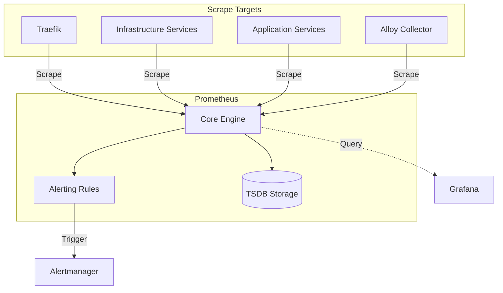

# [OPERATIONAL-POLICY] 06-observability: prometheus

Standardized procedures for maintaining Prometheus metrics collection and alerting integrity.

## Procedures

### 1. Scrape Target Registration

To add a new service for monitoring:

1. Ensure the target service exposes metrics (usually on port `9090` or `8080`).
2. Update `infra/06-observability/prometheus/config/prometheus.yml`:

   ```yaml
   - job_name: 'new-service'
     static_configs:
       - targets: ['new-service:port']
   ```

3. Validate configuration:

   ```bash
   docker exec infra-prometheus promtool check config /etc/prometheus/prometheus.yml
   ```

4. Reload Prometheus (send `SIGHUP` or use API `-X POST /-/reload`).

### 2. Alerting Rule Management

- **Definition**: Rules must be added to the appropriate file in `config/alert_rules/`.
- **Naming**: Use camelCase for alert names (e.g., `PostgresInstanceDown`).
- **Standard Labels**:
  - `severity`: `critical` (immediate action), `warning` (investigation), `info` (notification only).
- **Testing**:

  ```bash
  promtool test rules config/alert_rules/tests/*.yml
  ```

### 3. Performance Monitoring

- **Cardinality Audit**: Periodically review high-cardinality metrics (e.g., `container_...` from cAdvisor).
- **Rule Evaluation**: Monitor `prometheus_rule_evaluation_duration_seconds` to ensure evaluations complete within the `15s` window.
- **TSDB Integrity**: Check for compaction failures in Prometheus logs.

## Constraints

- **Scrape Intervals**: Never set below `10s` without architectural approval.
- **Retention**: Default is `15d`; any changes require volume resizing.
- **Rule Format**: Use `expr`, `for`, `labels`, and `annotations` (Summary/Description).

---
**AI Agent Note**: AI agents must verify that every new infrastructure component includes a corresponding scrape configuration and basic "up" alert.

## Related Documents

- **Procedure**: [prometheus.md](./prometheus.md)
- **Plan**: [2026-03-26-06-observability-standardization.md](../../../04.execution/plans/2026-03-26-06-observability-standardization.md)

---

## Overview (KR)

이 문서는 `docs/05.operations/06-observability/prometheus.md` 주제의 운영 정책을 정의한다. 기존 운영 내용을 유지하면서 적용 범위, 통제, 검증 기준을 명시한다.

## Policy Scope

이 정책은 관련 서비스의 운영 기준, 변경 통제, 검증 방법을 다룬다.

## Applies To

- **Systems**: 관련 Docker Compose 서비스와 문서화된 운영 자산
- **Agents**: repo-local governance를 따르는 AI agents
- **Environments**: local, development, homelab operations

## Controls

- **Required**: 변경 전 관련 README, guide, runbook 확인
- **Allowed**: 문서와 검증 절차의 in-place 보강
- **Disallowed**: secret 값 노출, 승인 없는 runtime 변경, 정책과 절차의 중복 SSoT 생성

## Exceptions

- 정책 예외는 사용자 승인과 관련 plan/task evidence가 있을 때만 허용한다.

## Verification

- 관련 repository validation script와 문서 heading audit로 준수 여부를 확인한다.

## Review Cadence

- 서비스 구성 변경 시 검토
- 문서 템플릿 변경 시 검토
- 주요 운영 정책 변경 시 검토

## AI Agent Policy Section (If Applicable)

- **Model / Prompt Change Process**: agent runtime 변경은 이 문서에서 직접 수행하지 않고 governance 문서로 분리한다.
- **Eval / Guardrail Threshold**: 문서 변경 후 관련 validation을 통과해야 한다.
- **Log / Trace Retention**: 검증 evidence는 task 문서나 대화 요약에 남긴다.
- **Safety Incident Thresholds**: secret 노출 또는 승인 없는 runtime 변경 징후가 있으면 즉시 중단한다.

## Usage

> Migrated from `docs/05.operations/06-observability/prometheus.md` during the 2026-05-10 operations taxonomy consolidation.

### [SYSTEM-GUIDE] 06-observability: prometheus

Prometheus is the core metrics engine for the `hy-home.docker` platform, responsible for metrics collection, alerting, and time-series storage.

#### Architecture



#### Key Components

##### 1. Scrape Configurations

The `prometheus.yml` file contains precise configurations for discovering and scraping various components:

- **Internal Monitoring**: Self-scraping and Alertmanager monitoring.
- **Telemetry Pipe**: Grafana Alloy integration for logs/metrics collection.
- **Infrastructure Tier**: Scrapers for PostgreSQL (v16+), Valkey (Redis-clone), Kafka, and MinIO.
- **System Layer**: cAdvisor for container-level resource metrics.

##### 2. Alerting Rule System

Rules are partitioned into domain-specific files in `config/alert_rules/`:

- `datastores.yml`: Database health and performance alerts.
- `infra.yml`: General infrastructure and service availability.
- `prometheus.yml`: Self-monitoring for the metrics engine.
- `gateway.yml`: Traffic and entrypoint health (Traefik).

##### 3. Storage (TSDB)

- **Retention**: Data is persisted in a dedicated volume with a configurable retention period.
- **Performance**: Recording rules are used to pre-calculate expensive PromQL expressions.

#### Integration Patterns

##### Grafana DataSource

Prometheus is configured as the primary Prometheus datasource in Grafana, enabling dashboarding for all system components.

##### Alertmanager Integration

Prometheus evaluates rules every `15s` and dispatches active alerts to Alertmanager for deduplication and notification routing.

##### Keycloak Observation

Prometheus scrapes the Keycloak `/metrics` endpoint (enabled via theme/provider) to monitor authentication health.

---
**AI Agent Note**: When adding new services, ensure they expose a `/metrics` endpoint and register them in `prometheus.yml` under the appropriate job name.

---

#### Overview (KR)

이 문서는 `docs/05.operations/06-observability/prometheus.md` 주제의 사용 가이드다. 기존 본문을 기준으로 작업자가 필요한 배경, 절차, 주의사항을 빠르게 찾도록 보강한다.

#### Usage Type

`system-guide`

#### Target Audience

- Developer
- Operator
- AI Agent

#### Purpose

관련 인프라 서비스나 문서 영역을 이해하고 안전하게 변경 또는 운영할 수 있도록 돕는다.

#### Prerequisites

- Repository root README 확인
- 관련 `infra/` 서비스 README 확인
- 필요한 경우 대응 operation/runbook 문서 확인

#### Step-by-step Instructions

1. 관련 README와 기존 본문을 먼저 읽는다.
2. 실제 compose/config 경로와 문서 설명이 일치하는지 확인한다.
3. 변경이 필요하면 대응 템플릿과 상위 README 링크를 함께 갱신한다.
4. 관련 검증 스크립트 또는 문서 audit를 실행한다.

#### Common Pitfalls

- guide 문서에 운영 정책이나 incident timeline을 섞지 않는다.
- secret 값, token, 인증서 원문을 열람하거나 문서화하지 않는다.
- runtime 변경이 필요한 경우 문서 보강과 별도 작업으로 분리한다.

#### Related Documents

- [../README.md](../../README.md)
- [../../05.operations/README.md](../../README.md)
- [../../05.operations/README.md](../../README.md)

## Procedure

> Migrated from `docs/05.operations/06-observability/prometheus.md` during the 2026-05-10 operations taxonomy consolidation.

### [RECOVERY-RUNBOOK] 06-observability: prometheus

Recovery procedures for common Prometheus service disruptions and metrics collection failures.

#### Incident Scenarios

##### 1. Prometheus Container Crash (OOM/Corruption)

**Symptoms**: Prometheus UI unreachable, Grafana metrics `NaN` or missing, alerts stop firing.
**Recovery**:

1. Check container logs:

   ```bash
   docker logs infra-prometheus
   ```

2. If OOM, increase memory limits in `infra/06-observability/docker-compose.yml`.
3. If corruption, check TSDB integrity and consider restarting without the corrupted WAL.
4. Final restart:

   ```bash
   docker compose restart prometheus
   ```

##### 2. Scrape Target Unavailable

**Symptoms**: Alert `PrometheusAllTargetsMissing` or specific service metrics missing.
**Recovery**:

1. Identify failing job in Prometheus UI (`/targets`).
2. Verify target reachability:

   ```bash
   docker exec -it infra-prometheus ping <target-service-name>
   ```

3. Ensure target service is healthy and exposing `/metrics`.
4. Validate `prometheus.yml` configuration (ports, job name).

##### 3. Alerting Rule Evaluation Failure

**Symptoms**: Alert `PrometheusRuleEvaluationFailures` is firing.
**Recovery**:

1. Check Prometheus logs for syntax or performance errors in rules.
2. Validate rule files using `promtool`:

   ```bash
   docker exec infra-prometheus promtool check rules /etc/prometheus/alert_rules/*.yml
   ```

3. Fix any syntax errors or simplify expensive PromQL expressions.

#### Verification

1. Access the Prometheus UI: [http://prometheus.hy-home.local/-/healthy](http://prometheus.hy-home.local/-/healthy) (or internal port `9090`).
2. Verify all "critical" scrape targets are "UP" in the `/targets` page.
3. Confirm that Grafana dashboards are receiving new metrics data.

---
**AI Agent Note**: AI agents should use the `promtool` command to verify any proposed changes to Prometheus or Alerting configurations before applying them.

#### Related Operational Documents

- **Operation**: [prometheus.md](./prometheus.md)
- **Plan**: [2026-03-26-06-observability-standardization.md](../../../04.execution/plans/2026-03-26-06-observability-standardization.md)

---

#### Overview (KR)

이 런북은 `docs/05.operations/06-observability/prometheus.md` 주제의 실행 절차를 정의한다. 기존 절차를 유지하면서 검증, evidence, rollback 기준을 명확히 한다.

#### Purpose

운영자가 관련 서비스나 문서 작업을 반복 가능하고 검증 가능한 방식으로 수행하도록 돕는다.

#### Canonical References

- [../README.md](../../README.md)
- [../../05.operations/README.md](../../README.md)
- [../../05.operations/README.md](../../README.md)

#### When to Use

- 관련 서비스 점검, 재시작, 검증, 문서 보강이 필요할 때
- 운영 절차와 evidence capture가 필요한 변경을 수행할 때

#### Procedure or Checklist

##### Checklist

- [ ] 관련 operation policy를 확인한다.
- [ ] 현재 compose/config/docs 상태를 확인한다.
- [ ] 필요한 절차를 수행한다.
- [ ] 검증 결과와 evidence를 기록한다.

##### Procedure

1. 관련 README와 operation 문서를 확인한다.
2. 작업 전 현재 상태를 기록한다.
3. 절차를 최소 변경으로 수행한다.
4. 검증 명령 또는 수동 확인을 실행한다.

#### Verification Steps

- [ ] 관련 validation script를 실행한다.
- [ ] 문서 변경이면 template/heading audit를 확인한다.
- [ ] runtime 변경이 있었다면 compose validation을 확인한다.

#### Observability and Evidence Sources

- **Signals**: command output, validation logs, service health status, documentation diff
- **Evidence to Capture**: 실행 명령, 결과 요약, 실패 시 원인과 조치

#### Safe Rollback or Recovery Procedure

- [ ] 실패한 문서 변경은 직전 diff 단위로 되돌린다.
- [ ] runtime 변경이 필요한 경우 이 런북 범위를 벗어난 별도 승인 절차로 분리한다.

#### Agent Operations (If Applicable)

- **Prompt Rollback**: 적용하지 않음
- **Model Fallback**: 적용하지 않음
- **Tool Disable / Revoke**: secret 노출 위험이 있으면 파일 열람을 중단한다.
- **Eval Re-run**: 관련 validation과 문서 audit를 재실행한다.
- **Trace Capture**: 변경 파일, 명령, 결과를 task evidence에 기록한다.
