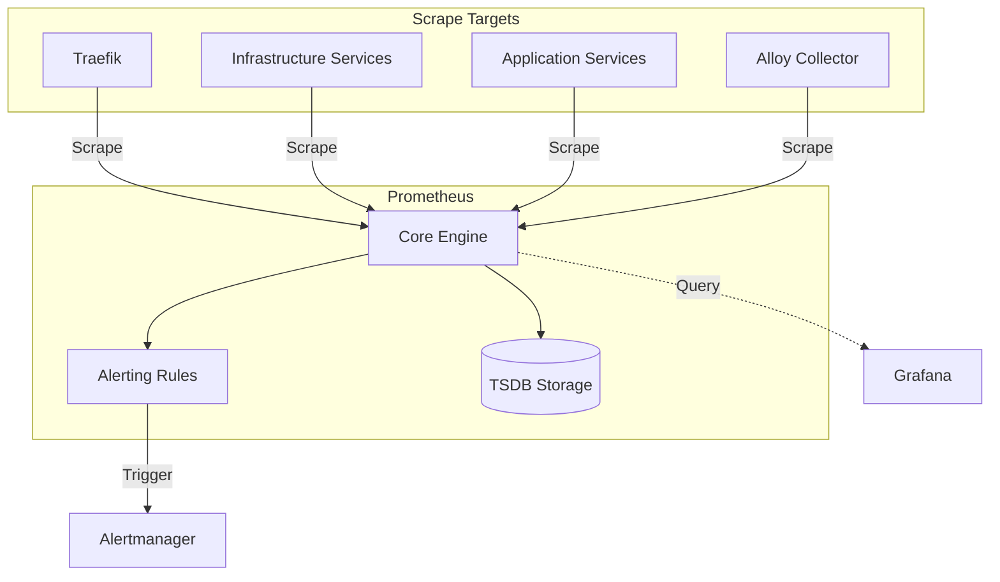

<!-- Target: docs/05.operations/guides/06-observability/prometheus.md -->

# Prometheus Usage Guide

## Usage

### Overview

이 가이드는 `06-observability` 계층의 Prometheus 사용 맥락과 설정 확인 방법을 설명한다. Prometheus는 `infra/06-observability/prometheus/config/prometheus.yml`의 scrape job을 기준으로 metrics를 수집하고, `config/alert_rules/`의 rule files를 평가하며, `prometheus-data` TSDB volume에 데이터를 저장한다.

### Usage Type

`system-guide`

### Target Audience

- Operator
- SRE
- Developer
- AI Agent

### Purpose

- Prometheus compose service, scrape config, alert rule, and TSDB boundary를 빠르게 파악한다.
- 새 scrape target 또는 alert rule을 검토할 때 확인해야 할 파일과 검증 명령을 찾는다.
- 반복 실행, reload, restart, TSDB symptom triage는 연결된 runbook으로 넘긴다.

### Prerequisites

- Repository checkout 접근 권한.
- `infra/06-observability/docker-compose.yml` and `infra/06-observability/prometheus/config/prometheus.yml` 확인 권한.
- 필요 시 `obs` Docker Compose profile과 `infra-prometheus` container에 대한 read-only inspection 권한.
- Docker Secret values는 열람하지 않는다. 문서에는 secret ID와 file reference만 기록한다.

### Step-by-step Instructions

1. Compose service boundary를 확인한다.

   ```bash
   rg -n 'service: template-stateful-high|image: prom/prometheus:v3.13.0|container_name: infra-prometheus|--web.enable-lifecycle|prometheus-data|prometheus.middlewares' infra/06-observability/docker-compose.yml
   ```

2. Scrape job과 rule file boundary를 확인한다.

   ```bash
   rg -n '^  - job_name:' infra/06-observability/prometheus/config/prometheus.yml
   rg --files infra/06-observability/prometheus/config/alert_rules
   ```

   현재 repository 기준 scrape job은 34개, alert/recording rule file은 12개다.

3. Config or rule 변경 전후로 Prometheus 내장 검증 도구를 사용한다.

   ```bash
   docker exec infra-prometheus promtool check config /etc/prometheus/prometheus.yml
   docker exec infra-prometheus promtool check rules /etc/prometheus/alert_rules/*.yml
   ```

4. Target 상태는 Prometheus UI `Targets` page 또는 Prometheus API로 확인한다. Route는 `https://prometheus.${DEFAULT_URL}`이며, container 내부 health endpoint는 `http://localhost:9090/-/healthy`다.

5. Reload, restart, scrape 장애 대응, TSDB symptom triage가 필요하면 runbook으로 이동한다.

### Common Pitfalls

- Prometheus restart 명령에서 profile과 compose file을 생략하면 다른 project context에서 실행될 수 있다. 운영 절차는 runbook의 profile 포함 명령을 따른다.
- 현재 compose command에는 explicit `--storage.tsdb.retention.*` flag가 없다. retention 동작을 문서화할 때는 policy와 compose 근거를 함께 확인한다.
- High-cardinality label을 추가하면 TSDB memory와 query cost가 커진다. label 추가는 policy의 cardinality review 대상이다.
- Rule file 변경 후 `promtool`을 실행하지 않으면 reload 시점에 rule evaluation failure로 이어질 수 있다.
- 복구 절차, WAL/TSDB 조치, rollback 판단을 guide에 직접 넣지 않는다. 해당 내용은 runbook에서 evidence와 escalation 기준으로 처리한다.

### Architecture



### Key Components

#### 1. Scrape Configurations

`prometheus.yml`은 Prometheus가 수집하는 scrape job의 source of truth다.

- **Internal monitoring**: Prometheus self-scrape, Alertmanager, Alloy, gateway and observability services.
- **Infrastructure tier**: PostgreSQL 17/18 family services, Valkey, Kafka, MinIO, Qdrant, OpenSearch, etcd.
- **Kubernetes/GitOps**: k3d NodePort targets for Argo CD, kube-state-metrics, Istio, and Argo Rollouts.
- **Applications**: Keycloak, n8n, Airflow, Vault, Ollama exporter.

#### 2. Alerting Rule System

Rules are partitioned into domain-specific files in `config/alert_rules/`.

- Local domain files use the `alert_rules.local.*.yml` naming pattern.
- Kubernetes, Keycloak, Vault, and recording rules are loaded as explicit files in `prometheus.yml`.
- Rule changes must be validated before reload.

#### 3. Storage (TSDB)

- Prometheus data is persisted in the `prometheus-data` volume.
- Current compose does not declare explicit retention flags.
- Recording rules are used to pre-calculate expensive PromQL expressions.

### Integration Patterns

#### Grafana DataSource

Prometheus is the primary metrics datasource for Grafana dashboards.

#### Alertmanager Integration

Prometheus evaluates rules on the configured `evaluation_interval` and dispatches active alerts to Alertmanager for deduplication and notification routing.

#### Keycloak Observation

Prometheus scrapes `keycloak:9000` with `domain: "auth"` label in the current config.

## Common Checks

- `rg -n '^  - job_name:' infra/06-observability/prometheus/config/prometheus.yml`
- `rg --files infra/06-observability/prometheus/config/alert_rules`
- `docker exec infra-prometheus promtool check config /etc/prometheus/prometheus.yml`
- `docker exec infra-prometheus promtool check rules /etc/prometheus/alert_rules/*.yml`

## Runbook Handoff

반복 실행 절차, 장애 대응, rollback 또는 escalation 기준은 [recovery runbook](../../runbooks/06-observability/prometheus.md)을 따른다.

## Related Documents

- [Operations index](../../README.md)
- [Operations policy](../../policies/06-observability/prometheus.md)
- [Recovery runbook](../../runbooks/06-observability/prometheus.md)
