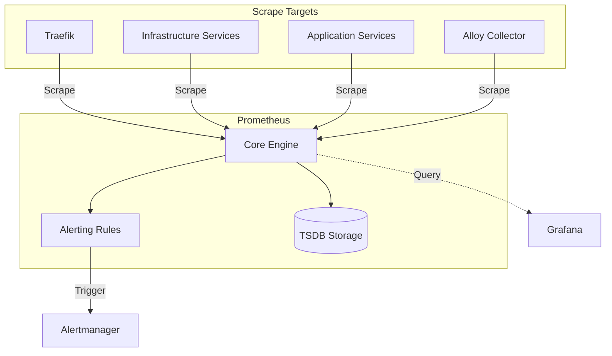

<!-- Target: docs/05.operations/guides/06-observability/prometheus.md -->

# [OPERATIONAL-POLICY] 06-observability: prometheus Usage Guide

## Usage

### Overview

이 가이드는 [OPERATIONAL-POLICY] 06-observability: prometheus Usage Guide의 사용 맥락, 전제 조건, 일반 점검, runbook handoff 기준을 설명한다.

### Usage Type

`system-guide | how-to`

### Target Audience

- Operators
- Developers
- Contributors
- AI Agents

### Purpose

- [OPERATIONAL-POLICY] 06-observability: prometheus Usage Guide의 운영 사용 맥락을 빠르게 파악한다.
- 반복 실행 절차와 장애 대응은 연결된 runbook으로 넘긴다.
- 통제 기준은 연결된 policy 문서와 분리해 유지한다.

### Prerequisites

- Repository checkout 접근 가능
- 관련 `docs/03.specs/` 또는 operations 문서 확인 가능
- 필요한 경우 Docker/Docker Compose 명령 실행 권한

### Step-by-step Instructions

1. 이 문서의 overview와 usage context를 확인한다.
2. 관련 service, configuration, 또는 documentation target을 식별한다.
3. `## Common Checks`의 검증 항목을 실행하거나 검토한다.
4. 반복 절차, 장애 대응, rollback, escalation이 필요하면 `## Runbook Handoff`의 runbook으로 이동한다.

### Common Pitfalls

- guide에 policy control이나 복구 절차를 직접 섞어 목적 프로파일을 흐리는 경우
- target-relative link를 템플릿 위치 기준으로 계산하는 경우
- 검증 명령 실행 결과 없이 운영 가능 상태를 단정하는 경우

### Implementation Context (KR)

이 문서는 `docs/05.operations/guides/06-observability/prometheus.md` 주제의 사용 가이드다. 기존 본문을 기준으로 작업자가 필요한 배경, 절차, 주의사항을 빠르게 찾도록 보강한다.

### Prometheus System Usage

Prometheus is the core metrics engine for the `hy-home.docker` platform, responsible for metrics collection, alerting, and time-series storage.

### Architecture

### Key Components

#### 1. Scrape Configurations

The `prometheus.yml` file contains precise configurations for discovering and scraping various components:

- **Internal Monitoring**: Self-scraping and Alertmanager monitoring.
- **Telemetry Pipe**: Grafana Alloy integration for logs/metrics collection.
- **Infrastructure Tier**: Scrapers for PostgreSQL 17/18 family services, Valkey, Kafka, and MinIO.
- **System Layer**: cAdvisor for container-level resource metrics.

#### 2. Alerting Rule System

Rules are partitioned into domain-specific files in `config/alert_rules/`:

- `datastores.yml`: Database health and performance alerts.
- `infra.yml`: General infrastructure and service availability.
- `prometheus.yml`: Self-monitoring for the metrics engine.
- `gateway.yml`: Traffic and entrypoint health (Traefik).

#### 3. Storage (TSDB)

- **Retention**: Data is persisted in a dedicated volume with a configurable retention period.
- **Performance**: Recording rules are used to pre-calculate expensive PromQL expressions.

### Integration Patterns

#### Grafana DataSource

Prometheus is configured as the primary Prometheus datasource in Grafana, enabling dashboarding for all system components.

#### Alertmanager Integration

Prometheus evaluates rules every `15s` and dispatches active alerts to Alertmanager for deduplication and notification routing.

#### Keycloak Observation

Prometheus scrapes the Keycloak `/metrics` endpoint (enabled via theme/provider) to monitor authentication health.

---
**AI Agent Note**: When adding new services, ensure they expose a `/metrics` endpoint and register them in `prometheus.yml` under the appropriate job name.

---

## Common Checks

- Step-by-step Instructions 의 검증 단계를 따른다.

## Runbook Handoff

반복 실행 절차, 장애 대응, rollback 또는 escalation 기준은 [recovery runbook](../../runbooks/06-observability/prometheus.md)을 따른다.

## Related Documents

- [Operations index](../../README.md)
- [Operations policy](../../policies/06-observability/prometheus.md)
- [Recovery runbook](../../runbooks/06-observability/prometheus.md)
