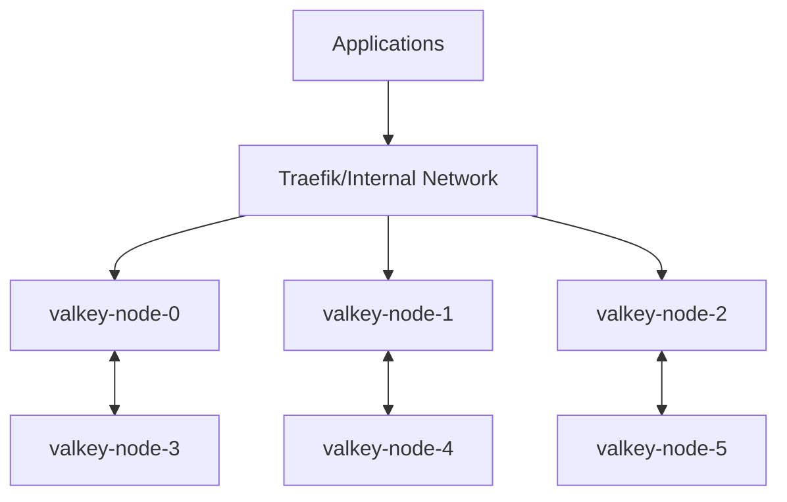

# Valkey Distributed Cluster Guide

> High-Performance, 6-Node Distributed Cache Cluster (Redis Compatible)

## Overview

Valkey Cluster provides a high-throughput, low-latency caching and state storage layer for the `hy-home.docker` ecosystem. It is designed with 3 primary nodes and 3 replicas to ensure automatic partitioning and high availability.

### Key Features

- **Scalability**: Automatic data sharding across 3 shards (16,384 slots).
- **High Availability**: Automatic failover from primary to replica.
- **Compatibility**: Fully compatible with Redis OSS cluster protocol.

## Setup & Configuration

### Prerequisites
- `hy-home.docker` internal network (`infra_net`) must be available.
- `DEFAULT_DATA_DIR` environment variable must be set.

### Deployment
The cluster is deployed using Docker Compose:

```bash
cd infra/04-data/cache-and-kv/valkey-cluster
docker compose up -d
```

### Initializing the Cluster
The `valkey-cluster-init` container automatically handles the initial handshake. If you need to re-initialize manually:
```bash
./scripts/valkey-cluster-init.sh
```

## Developer Guide

### Connection String
Applications should use the following seeding nodes:
- `valkey-node-0:6379`
- `valkey-node-1:6380`
- `valkey-node-2:6381`

### Authentication
Authentication is required using the secret `service_valkey_password`.

### Client Configuration
Use a cluster-aware client (e.g., `redis-py` with `RedisCluster`, `ioredis` with `Cluster`).

## Technical Architecture

### Node Layout
| Node | Role | Port | Bus Port |
| :--- | :--- | :--- | :--- |
| `valkey-node-0` | Primary | 6379 | 16379 |
| `valkey-node-1` | Primary | 6380 | 16380 |
| `valkey-node-2` | Primary | 6381 | 16381 |
| `valkey-node-3` | Replica (0) | 6382 | 16382 |
| `valkey-node-4` | Replica (1) | 6383 | 16383 |
| `valkey-node-5` | Replica (2) | 6384 | 16384 |

### Connectivity Flow


## Related Documents
- **Operations**: [Valkey Cluster Operations](../../../08.operations/04-data/cache-and-kv/valkey-cluster.md)
- **Runbooks**: [Valkey Cluster Recovery](../../../09.runbooks/04-data/cache-and-kv/valkey-cluster.md)
