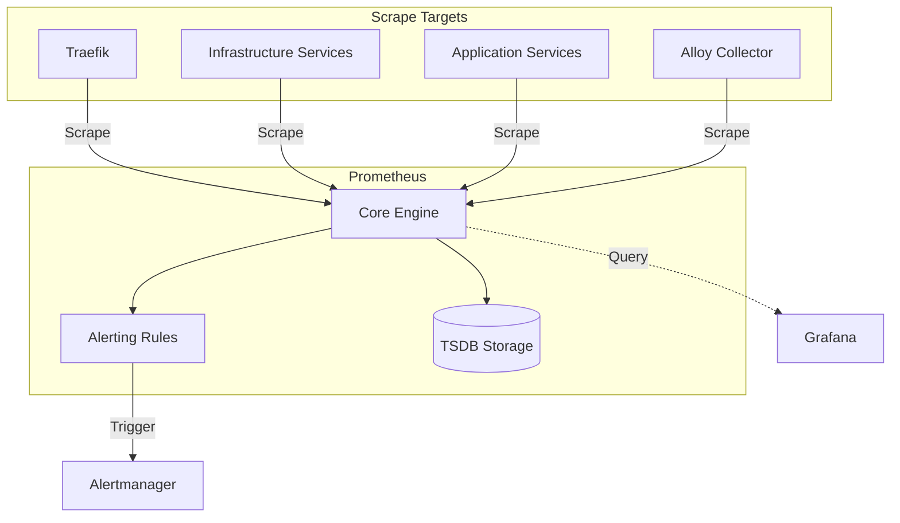

# [SYSTEM-GUIDE] 06-observability: prometheus

Prometheus is the core metrics engine for the `hy-home.docker` platform, responsible for metrics collection, alerting, and time-series storage.

## Architecture

## Key Components

### 1. Scrape Configurations

The `prometheus.yml` file contains precise configurations for discovering and scraping various components:

- **Internal Monitoring**: Self-scraping and Alertmanager monitoring.
- **Telemetry Pipe**: Grafana Alloy integration for logs/metrics collection.
- **Infrastructure Tier**: Scrapers for PostgreSQL (v16+), Valkey (Redis-clone), Kafka, and MinIO.
- **System Layer**: cAdvisor for container-level resource metrics.

### 2. Alerting Rule System

Rules are partitioned into domain-specific files in `config/alert_rules/`:

- `datastores.yml`: Database health and performance alerts.
- `infra.yml`: General infrastructure and service availability.
- `prometheus.yml`: Self-monitoring for the metrics engine.
- `gateway.yml`: Traffic and entrypoint health (Traefik).

### 3. Storage (TSDB)

- **Retention**: Data is persisted in a dedicated volume with a configurable retention period.
- **Performance**: Recording rules are used to pre-calculate expensive PromQL expressions.

## Integration Patterns

### Grafana DataSource

Prometheus is configured as the primary Prometheus datasource in Grafana, enabling dashboarding for all system components.

### Alertmanager Integration

Prometheus evaluates rules every `15s` and dispatches active alerts to Alertmanager for deduplication and notification routing.

### Keycloak Observation

Prometheus scrapes the Keycloak `/metrics` endpoint (enabled via theme/provider) to monitor authentication health.

---
**AI Agent Note**: When adding new services, ensure they expose a `/metrics` endpoint and register them in `prometheus.yml` under the appropriate job name.
