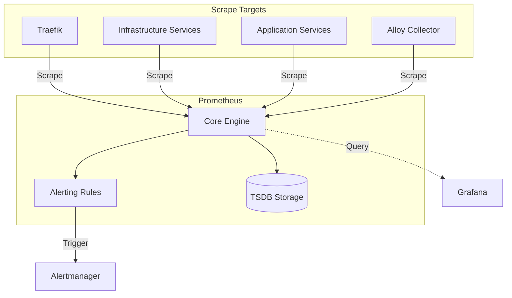

# [SYSTEM-GUIDE] 06-observability: prometheus

Prometheus is the core metrics engine for the `hy-home.docker` platform, responsible for metrics collection, alerting, and time-series storage.

## Architecture

## Key Components

### 1. Scrape Configurations

The `prometheus.yml` file contains precise configurations for discovering and scraping various components:

- **Internal Monitoring**: Self-scraping and Alertmanager monitoring.
- **Telemetry Pipe**: Grafana Alloy integration for logs/metrics collection.
- **Infrastructure Tier**: Scrapers for PostgreSQL (v16+), Valkey (Redis-clone), Kafka, and MinIO.
- **System Layer**: cAdvisor for container-level resource metrics.

### 2. Alerting Rule System

Rules are partitioned into domain-specific files in `config/alert_rules/`:

- `datastores.yml`: Database health and performance alerts.
- `infra.yml`: General infrastructure and service availability.
- `prometheus.yml`: Self-monitoring for the metrics engine.
- `gateway.yml`: Traffic and entrypoint health (Traefik).

### 3. Storage (TSDB)

- **Retention**: Data is persisted in a dedicated volume with a configurable retention period.
- **Performance**: Recording rules are used to pre-calculate expensive PromQL expressions.

## Integration Patterns

### Grafana DataSource

Prometheus is configured as the primary Prometheus datasource in Grafana, enabling dashboarding for all system components.

### Alertmanager Integration

Prometheus evaluates rules every `15s` and dispatches active alerts to Alertmanager for deduplication and notification routing.

### Keycloak Observation

Prometheus scrapes the Keycloak `/metrics` endpoint (enabled via theme/provider) to monitor authentication health.

---
**AI Agent Note**: When adding new services, ensure they expose a `/metrics` endpoint and register them in `prometheus.yml` under the appropriate job name.

---

## Overview (KR)

이 문서는 `docs/07.guides/06-observability/prometheus.md` 주제의 사용 가이드다. 기존 본문을 기준으로 작업자가 필요한 배경, 절차, 주의사항을 빠르게 찾도록 보강한다.

## Guide Type

`system-guide`

## Target Audience

- Developer
- Operator
- AI Agent

## Purpose

관련 인프라 서비스나 문서 영역을 이해하고 안전하게 변경 또는 운영할 수 있도록 돕는다.

## Prerequisites

- Repository root README 확인
- 관련 `infra/` 서비스 README 확인
- 필요한 경우 대응 operation/runbook 문서 확인

## Step-by-step Instructions

1. 관련 README와 기존 본문을 먼저 읽는다.
2. 실제 compose/config 경로와 문서 설명이 일치하는지 확인한다.
3. 변경이 필요하면 대응 템플릿과 상위 README 링크를 함께 갱신한다.
4. 관련 검증 스크립트 또는 문서 audit를 실행한다.

## Common Pitfalls

- guide 문서에 운영 정책이나 incident timeline을 섞지 않는다.
- secret 값, token, 인증서 원문을 열람하거나 문서화하지 않는다.
- runtime 변경이 필요한 경우 문서 보강과 별도 작업으로 분리한다.

## Related Documents

- [../README.md](../README.md)
- [../../08.operations/README.md](../../08.operations/README.md)
- [../../09.runbooks/README.md](../../09.runbooks/README.md)
