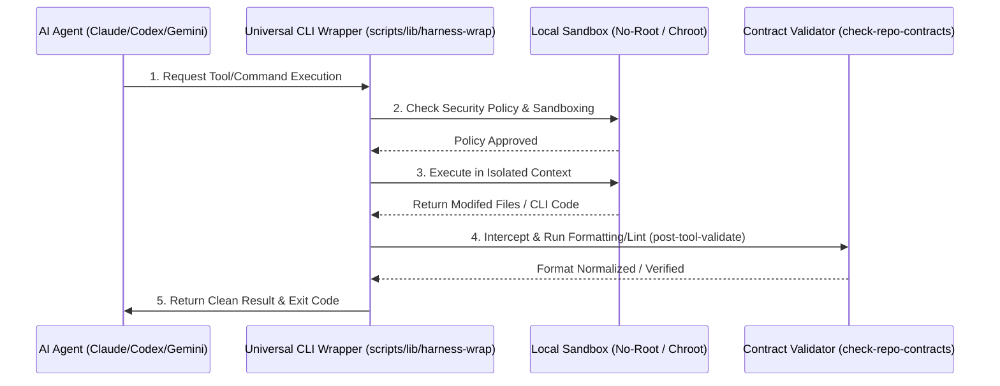

<!-- Target: docs/90.references/research/2026-07-07-agentic-research-pack-update/harness-engineering.md -->

# Reference: Harness Engineering and Framework Integration

This document defines the theoretical background of Harness Engineering, details the workspace's harness system and rules, and compares the implementation across Claude, Codex, and Gemini, proposing a Universal CLI Wrapper design.

---

## Overview

Harness Engineering refers to the practice of building a secure, isolated sandbox and validation framework (testbed) for autonomous AI agents. It isolates execution environments, restricts tool permissions, and dynamically monitors and validates inputs (contexts) and outputs (code/artifacts) in real time.

```text
       ┌────────────────────────────────────────────────────────┐
       │                 Harness Safety Boundary                │
       │                                                        │
       │  [Sandbox Environment] ──> [Tool & Permission Router]  │
       │           │                              │             │
       │           ▼                              ▼             │
       │  [JIT Context Injector] ──> [Output Contract Validator]│
       └────────────────────────────────────────────────────────┘
```

The four core technical pillars of Harness Engineering are:

1. **Sandbox Environment**: Restricts agents from executing destructive commands (e.g., `rm -rf`, raw socket binds) using container isolation (Docker), chroot, or non-root user privileges.
2. **Tool and Permission Router**: Binds a curated set of allowed tools (read/write files, git operations) to the agent, forcing explicit human approval (Y/N) for high-risk commands.
3. **JIT Context Injector**: Prunes agent context inputs to include only the minimum required specs, decisions, memory, and rules, preventing token overhead and logical confusion.
4. **Output Contract Validator**: Intercepts modifications to code or docs (via git pre-commit or post-tool hooks) and verifies them against formatting, linting, and grammar rules before persistence.

## Purpose

This reference study provides an architectural analysis of the workspace's harness mechanisms to identify functional gaps and design future unified wrappers. It underpins the secure and predictable execution of coding agents.

## Repository Role

This document serves as an advisory technical reference. It does not replace active governance specifications, runtime configurations, scripts, or operational guides.

## Scope

### In Scope

- Theoretical definition and four pillars of Harness Engineering.
- Analysis of the workspace harness environment (root shims, scripts, network segregation).
- Evaluation of harness sandboxing and tool routing in Claude, Codex, and Gemini.
- Conceptual architecture for a Universal CLI Wrapper.
- Gaps in the current harness model (lack of Gemini hooks, resource limit quotas).

### Out of Scope

- Direct modifications to provider-specific configuration folders (`.claude/`, `.codex/`, `.agents/`).
- Creation of executable shell wrapper scripts.
- Inspection of plaintext secrets.

## Definitions / Facts

### 1. Workspace Harness Implementation

The workspace implements a multi-surface contract routing system, defined in [harness-implementation-map.md](../../../00.agent-governance/harness-implementation-map.md):

- **Entry Gates (Root Shims)**: [AGENTS.md](../../../../AGENTS.md), [CLAUDE.md](../../../../CLAUDE.md), and [GEMINI.md](../../../../GEMINI.md) act as lightweight shims routing agents to the Stage 00 SSoT.
- **Contract Verification**: Script [check-repo-contracts.sh](../../../../scripts/validation/check-repo-contracts.sh) enforces file layouts, target formatting, and Markdown link integrity.
- **Network Isolation**: All compose networks restrict external bridges, forcing traffic through Nginx/Traefik reverse-proxies.

### 2. Multi-Provider Harness Comparison

The workspace adapts its rules to three LLM execution runtimes:

- **Claude Code**: Utilizes `.claude/` for settings and `.claude/agents/*.md` for guidelines. Prompts for CLI-level human approval (Y/N) on file writes and runs [agent-event-hook.sh](../../../../scripts/hooks/agent-event-hook.sh) post-tool use for spacing and formatting adjustments.
- **OpenAI Codex**: Uses TOML files under `.codex/` and `.codex/agents/*.toml` to restrict allowed tool paths and argument scopes via a strict whitelist approach. Hooks are registered in `.codex/hooks.json` to trigger validators.
- **Gemini Code Assist**: Relies on `.agents/` as the runtime surface with markdown specifications copied to `.agents/agents/`. It lacks native terminal-level sandboxing and hook systems, relying heavily on self-correction prompts and host IDE bounds.

### 3. Universal CLI Wrapper Architecture

To address provider capabilities skew, a **Universal CLI Wrapper** is proposed:



1. **Standardized Tool Interface**: Agents invoke commands via `harness-wrap <tool> --args` instead of raw binaries.
2. **Whitelist Registry**: Instantly allows read-only compose actions (`config`, `ps`) while intercepting mutable commands (`up -d`, `down`, `rm`) for approval verification.
3. **Automated Rollbacks**: Executed post-tool checks automatically run `git checkout` on formatting/link verification failures, reporting the tracebacks directly to the agent's outer loop.

### 4. Identified Gaps

- **Gemini Hook Limitations**: Without client-side hooks, formatting and spacing drift frequently occur when using Gemini.
- **Resource Constraints**: Lacks hardware limits (cgroups) for CPU and Memory, permitting rogue scripts to exhaust host resources.

## Sources

- [HAFE Specification](../../../03.specs/094-harness-agent-first-engineering/spec.md) - Harness and Agent-First Engineering specifications
- [Harness Implementation Map](../../../00.agent-governance/harness-implementation-map.md) - Routing map for harness components
- [Claude Code Developer Guide](https://code.claude.com/docs/en/overview) - Claude CLI hooks details
- [Codex Hook Event Schema](https://developers.openai.com/codex/hooks) - Codex execution and hook protocols

## Maintenance

- **Owner**: Workspace Platform Runtime Security Engineers
- **Review Cadence**: Bi-annually, or upon releases of updated AI CLI tooling.
- **Update Trigger**: Modifications to `agent-event-hook.sh` routing or integration of new LLM runtimes.

## Related Documents

- [Research Index README](./README.md)
- [References Category README](../README.md)
- [workspace-baseline.md](./workspace-baseline.md)
