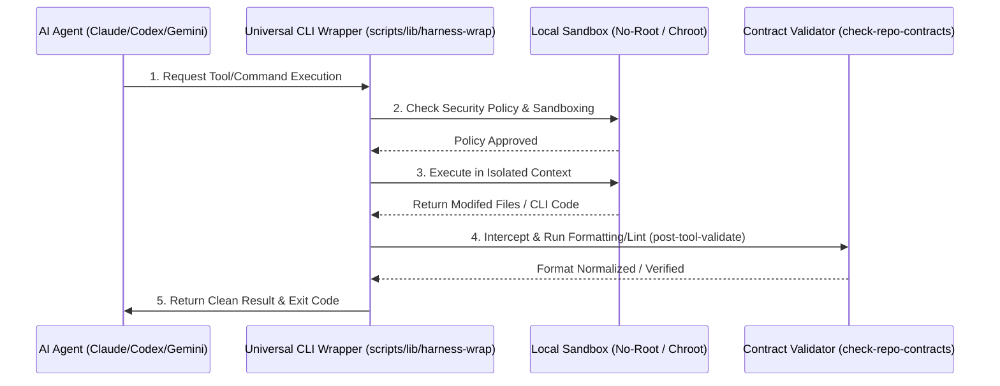

<!-- Target: docs/90.references/research/2026-07-07-agentic-research-pack-update/harness-engineering.md -->

# Reference: Harness Engineering and Framework Integration

본 문서는 하네스 엔지니어링(Harness Engineering)의 이론적 정의와 핵심 아키텍처적 요소들을 정의하고, 이를 `hy-home.docker` 워크스페이스 내에서 3대 주요 AI Provider(Claude Code, OpenAI Codex, Gemini Code Assist)의 로컬 샌드박스 및 검증기 통합 현황과 매핑하여 비교 연구한 분석 자료입니다.

---

## 목차 (Table of Contents)

1. [하네스 엔지니어링 (Harness Engineering) 이론적 배경](#1-하네스-엔지니어링-harness-engineering-이론적-배경)
2. [워크스페이스 하네스 체계 및 환경 규칙](#2-워크스페이스-하네스-체계-및-환경-규칙)
3. [3대 AI Provider별 하네스 구현 현황 분석](#3-3대-ai-provider별-하네스-구현-현황-분석)
4. [공통 하네스 구축을 위한 Universal CLI Wrapper 설계안](#4-공통-하네스-구축을-위한-universal-cli-wrapper-설계안)
5. [결론 및 부족한 요소 (Gaps)](#5-결론-및-부족한-요소-gaps)

---

## 1. 하네스 엔지니어링 (Harness Engineering) 이론적 배경

**하네스 엔지니어링(Harness Engineering)**이란 자율적 의사결정을 수행하는 AI 에이전트의 작동 환경을 격리하고, 에이전트에게 제공되는 도구(Tools)의 권한을 통제하며, 에이전트의 입력(Context)과 출력(Code/Artifacts)을 실시간으로 감시 및 검증하기 위한 **소프트웨어 안전망(Safety Sandbox) 및 테스트 베드**를 구축하는 공학적 실무를 뜻합니다.

하네스 엔지니어링의 4대 핵심 기술적 기둥은 다음과 같습니다.

```text
       ┌────────────────────────────────────────────────────────┐
       │                 Harness Safety Boundary                │
       │                                                        │
       │  [Sandbox Environment] ──> [Tool & Permission Router]  │
       │           │                              │             │
       │           ▼                              ▼             │
       │  [JIT Context Injector] ──> [Output Contract Validator]│
       └────────────────────────────────────────────────────────┘
```

1.  **샌드박스 격리 (Sandbox Environment)**: 에이전트가 호스트 운영체제에 파괴적인 명령어(`rm -rf`, raw socket bind)를 임의 실행하지 못하도록 컨테이너(Docker), 가상 파일 시스템 또는 사용자 권한(Non-root UID) 레벨에서 작업을 격리하는 장치입니다.
2.  **도구 및 권한 제어 (Tool & Permission Router)**: 에이전트에게 승인된 도구 세트(파일 읽기/쓰기, 네트워크 패치 등)만 제한적으로 바인딩하고, 파괴적이거나 외부 영향력이 큰 도구의 경우 실행 전 인간의 명시적 동의(Interactive Approval)를 강제하는 게이트웨이입니다.
3.  **JIT 컨텍스트 주입 (JIT Context Injection)**: 에이전트의 제한된 컨텍스트 윈도우(Context Window)를 효율화하기 위해, 작업 수행에 필수적인 설계서, 이전 작업 이력(Memory), 규칙(Rules) 등 최소한의 정보만 적시에 로드하여 오버헤드를 차단하는 가중치 제어 필터입니다.
4.  **출력 계약 검증 (Output Contract Validator)**: 에이전트가 도구 실행의 결과물로 소스 코드를 생성하거나 문서를 편집했을 때, 해당 소스가 프로젝트의 린팅 기준, 포맷팅, 파싱 문법을 만족하는지 커밋 전(Git Hook, Post-tool Hook)에 가로채어 자동 검증하는 런타임 컴파일러입니다.

---

## 2. 워크스페이스 하네스 체계 및 환경 규칙

`hy-home.docker`는 단일 도구가 아닌, 인프라 전체를 아우르는 다차원 계약형 하네스를 구성하고 있습니다. 이는 [harness-implementation-map.md](file:///home/hy/projects/hy-home.docker/docs/00.agent-governance/harness-implementation-map.md)에 상세히 표면화되어 조율됩니다.

### 2.1 하네스 제어를 위한 체계 및 환경
-   **진입 규칙(Root Shims)**: 에이전트가 로드되는 첫 관문인 [AGENTS.md](file:///home/hy/projects/hy-home.docker/AGENTS.md), [CLAUDE.md](file:///home/hy/projects/hy-home.docker/CLAUDE.md), [GEMINI.md](file:///home/hy/projects/hy-home.docker/GEMINI.md)는 개별 에이전트가 아닌 Stage 00 거버넌스로의 얇은 프록시 라우팅만 담당하게 하여 정책의 단일화(SSoT)를 달성합니다.
-   **계약 검증 스크립트([check-repo-contracts.sh](file:///home/hy/projects/hy-home.docker/scripts/validation/check-repo-contracts.sh))**: 에이전트가 수정하는 모든 문헌 구조, 마크다운 링크, Docker 이미지 이미지 정책 태그 가이드라인 준수 여부를 컴파일러처럼 엄격하게 정밀 감사(Deep Lint)합니다.
-   **격리 네트워크 모델**: 루트 `docker-compose.yml` 및 하위 스택은 외부 망이 전면 차단된 독립 네트워크(`internal-bridge`) 위주로 통신을 제한하며, 모든 외부 통신은 리버스 프록시(Nginx/Traefik) 게이트웨이를 경유하도록 강제합니다.

---

## 3. 3대 AI Provider별 하네스 구현 현황 분석

본 워크스페이스는 상이한 3가지 LLM 실행 런타임에 대하여 개별 어댑터 레이어를 생성해 거버넌스를 동기화하고 있습니다.

### 3.1 Claude Code 하네스 현황
-   **구조 및 런타임**: `.claude/` 디렉토리를 물리적 런타임 저장소로 활용하며, `.claude/agents/*.md`에 기재된 마크다운 기반의 시스템 지침을 동적으로 컴파일하여 주입합니다.
-   **도구 권한 제어**: Claude Code CLI 수준에서 터미널 명령어 실행, 파일 쓰기 시 인간의 CLI 키보드 입력 승인 인터페이스(Y/N)가 깊숙이 결합되어 있어 높은 권한 제어 신뢰성을 보여줍니다.
-   **이벤트 훅(Event Hooks)**: [agent-event-hook.sh](file:///home/hy/projects/hy-home.docker/scripts/hooks/agent-event-hook.sh) 디스패처가 Claude 툴 사용 성공 이후 직접 동작하여 변경 결과의 공백 정리 및 Prettier 포맷 보정을 수행합니다.

### 3.2 OpenAI Codex 하네스 현황
-   **구조 및 런타임**: `.codex/` 디렉토리와 TOML 포맷의 메타 선언([.codex/agents/*.toml])을 기반으로 샌드박스를 관리합니다.
-   **도구 권한 제어**: 에이전트가 사용할 수 있는 바이너리 및 툴 경로를 TOML 파일 내에 엄격히 정의하며, 사전에 승인되지 않은 도구의 경우 메모리 공간으로의 매핑 조차 차단하는 하드웨어 수준의 화이트리스트 규제가 적용됩니다.
-   **이벤트 훅(Event Hooks)**: `.codex/hooks.json` 이벤트 맵에 따라 코드 쓰기 및 쉘 명령어 실행 이벤트를 후킹하여 정적 검사 도구를 강제 구동하고 에러 코드를 에이전트 컨텍스트로 역류(Feedback Loop)시킵니다.

### 3.3 Gemini Code Assist 하네스 현황
-   **구조 및 런타임**: `.agents/` 디렉토리를 어댑터 접점으로 두고, `.agents/agents/`에 페르소나 매핑 파일을 생성해 관리합니다.
-   **도구 권한 제어**: Gemini Code Assist는 IDE 플러그인 또는 API 서버 기반으로 조작되므로, 클라이언트 터미널 수준의 독자적인 샌드박싱이나 툴 실행 Y/N 차단 메커니즘이 부재합니다. 따라서 행동적 프롬프트 제약과 IDE 자체의 시스템 접근 권한에 전적으로 의존하는 한계를 보입니다.
-   **이벤트 훅(Event Hooks)**: IDE 변경 추적 인터페이스가 닫혀 있어 자동화된 파일 변경 훅을 내부 트리거할 수 없으며, 모든 포맷 검사와 아키텍처 가이드 준수는 프롬프트 지침을 통한 에이전트 자율 점검(Self-Evaluation)에 기댑니다.

---

## 4. 공통 하네스 구축을 위한 Universal CLI Wrapper 설계안

Provider별로 상이한 보안 샌드박싱 수준과 훅 메커니즘 편차를 원천 극복하기 위해, 본 저장소는 어댑터 레이어 아래에 통합된 **Universal CLI Wrapper** 아키텍처를 도입할 것을 제안합니다.



1.  **입출력 표준 인터페이스**: 에이전트가 쉘 명령어나 파일 편집 도구를 직접 다루지 않고, `harness-wrap <tool-name> --args` 형태의 공통 스크립트를 경유하도록 API를 바인딩합니다.
2.  **화이트리스트 명령어 레지스트리**: 컨테이너 런타임에 직접 접근할 수 있는 `docker compose` 명령어 중, 안전한 조회계 명령어(`config`, `ps`)는 즉시 허용하되 변경계 명령어(`up -d`, `down`, `rm`)는 사용자 확인 모듈을 이 프레임워크가 강제하도록 래핑합니다.
3.  **에이전트 이탈 자동 격리**: 특정 파일 변경 시점에 `post-tool-validate.sh`와 `check-repo-contracts.sh`를 즉시 구동하여 단 1바이트의 문법 이탈이나 링크 손상이 발견될 경우, 작업을 롤백(Git checkout)시키고 에이전트에게 에러 스택을 반환함으로써 코드 무결성을 강제 통제합니다.

---

## 5. 결론 및 부족한 요소 (Gaps)

### 5.1 요약
하네스 엔지니어링은 단순히 에이전트의 폭주를 막는 "방어막"이 아니라, 규칙 준수를 자동화하는 "안전한 통로"입니다. 본 워크스페이스는 독자적인 쉘 검증 툴과 거버넌스 맵을 통해 AI 에이전트에게 높은 규칙 준수 역량을 부과하고 있으나, 실행 런타임별 기계적 편차를 여전히 메워야 하는 과제를 안고 있습니다.

### 5.2 부족한 요소 (Gaps)
1.  **Gemini 런타임의 훅 결여**: Gemini 환경에서 코드 수정 후 포맷 미준수나 빈 라인 누적 문제가 빈발합니다. Gemini 어댑터의 툴 파이프라인 출력을 가로채 로컬 훅을 강제 대리 실행하는 래퍼 보강이 필요합니다.
2.  **리소스 한도 제어(Resource Quota) 미비**: 에이전트가 쉘 명령어로 무한 루프 코드를 실행하거나 대량의 컨테이너를 한꺼번에 시작하여 CPU/Memory 고갈을 유발하는 시나리오에 대비한 물리적 리소스 격리 규칙(`cgroups` 결합)이 결여되어 있습니다.

---

## Sources

- [HAFE Specification](file:///home/hy/projects/hy-home.docker/docs/03.specs/094-harness-agent-first-engineering/spec.md) - 로컬 하네스 및 에이전트 설계 사양
- [Harness Implementation Map](file:///home/hy/projects/hy-home.docker/docs/00.agent-governance/harness-implementation-map.md) - 하네스 컴포넌트 분할 구조
- [Claude Code Agent Hooks](https://code.claude.com/docs/en/hooks) - Claude 도구 이벤트 훅 명세
- [Codex Runtime Configuration](https://developers.openai.com/codex/cli) - Codex TOML 샌드박스 규약

---

## Maintenance

- **소유자**: 워크스페이스 하드웨어 및 런타임 보안 엔지니어
- **검토 주기**: 연 2회 정기 검토 및 신규 AI CLI 툴 릴리스 시 특별 검토
- **업데이트 트리거**: `agent-event-hook.sh` 내부 라우팅 구조 변경 및 신규 LLM provider 통합 시
