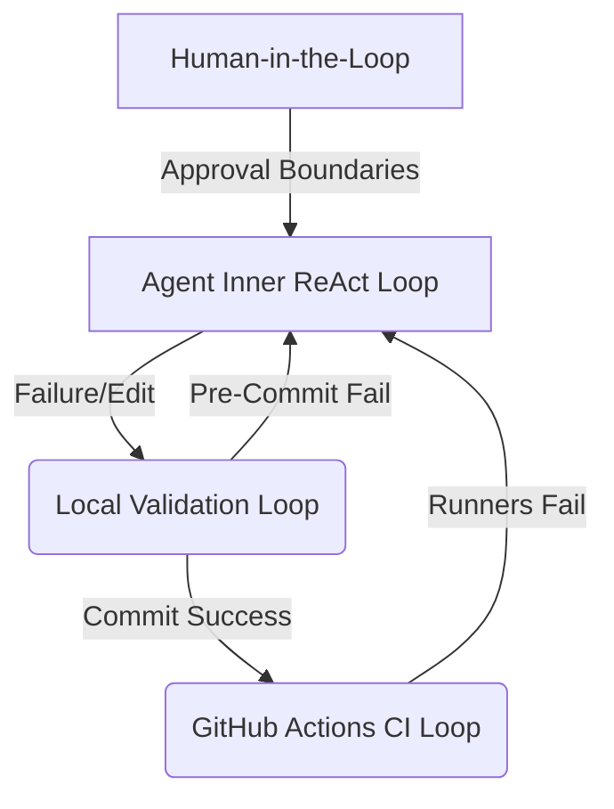

<!-- Target: docs/90.references/research/2026-07-07-agentic-research-pack-update/loop-engineering.md -->

# Reference: Loop Engineering and Feedback Systems

본 문서는 에이전트 피드백 루프(Inner & Outer Loops), 로컬 및 원격 자동화 검증 파이프라인, 그리고 인간의 승인 경계가 맞물려 형성되는 **루프 엔지니어링(Loop Engineering)** 모델을 정밀하게 연구하고, 에이전트의 정적 및 동적 자율 교정(Self-Correction)을 유도하는 최적의 설계 기법을 분석한 리서치 레퍼런스입니다.

---

## 목차 (Table of Contents)

1. [루프 엔지니어링 (Loop Engineering) 정의](#1-루프-엔지니어링-loop-engineering-정의)
2. [다층 구조의 루프 체계 (Multi-Tier Loops)](#2-다층-구조의-루프-체계-multi-tier-loops)
3. [에이전트 자율 교정을 위한 자동 진단 파서 (Diagnostic Parser)](#3-에이전트-자율-교정을-위한-자동-진단-파서-diagnostic-parser)
4. [3대 AI Provider별 루프 실행 환경 대조](#4-3대-ai-provider별-루프-실행-환경-대조)
5. [결론 및 차기 개선 기회 (Gaps)](#5-결론-및-차기-개선-기회-gaps)

---

## 1. 루프 엔지니어링 (Loop Engineering) 정의

**루프 엔지니어링(Loop Engineering)**은 AI 에이전트가 코드를 관찰, 설계, 구현, 검증하는 과정 전반에 걸쳐 **피드백(Feedback)**을 주입하여, 에이전트가 오류 발생 시 외부 개입 없이 자율적으로 문제를 해결(Self-Correction)하고 최종 명세를 보장하도록 제어 루프를 아키텍처적으로 다지는 실무를 뜻합니다.

자율 제어의 기본 주기 모델은 다음과 같습니다.

```text
    ┌─────────────┐       ┌─────────────┐
    │ 1. Observe  │ ───>  │   2. Plan   │
    └─────────────┘       └─────────────┘
           ▲                     │
           │                     ▼
    ┌─────────────┐       ┌─────────────┐
    │  4. Verify  │  <───  │ 3. Execute  │
    └─────────────┘       └─────────────┘
```

*   **관찰 (Observe)**: 현재 저장소와 런타임의 증적 및 에러 메시지(stdout/stderr) 수집.
*   **계획 (Plan)**: 획득한 증적을 분석하여 최적의 최소 수정 경로 설계.
*   **실행 (Execute)**: 격리된 도구를 사용하여 수술적 변경(Surgical Edit) 유도.
*   **검증 (Verify)**: 컴파일 에러, 린트 오류, 테스트 실패 등의 검증을 돌려 피드백 데이터를 생성한 뒤 다시 1단계로 순환.

---

## 2. 다층 구조의 루프 체계 (Multi-Tier Loops)

`hy-home.docker`는 에이전트의 작동 신뢰성을 누적시키기 위해 총 4가지 계층의 루프 통제 장치를 중첩하여 가동합니다.



### 2.1 내측 루프 (Inner ReAct Loop)
LLM 내부의 추론 루프(Reasoning-Action)입니다. 에이전트가 "Thought -> Act -> Observation" 단계를 반복하며 하나의 목표를 조각 내어 수행합니다. 이 단계의 피드백은 주로 도구 호출의 반환 텍스트와 파일 변경 내역을 통해 실시간으로 LLM의 컨텍스트 윈도우에 피딩됩니다.

### 2.2 외측 로컬 루프 (Outer Validation Loop)
에이전트 외부(Local System)에서 작동하는 제어 장치입니다. 에이전트가 파일 작성을 완료하면 터미널 훅([post-tool-validate.sh](file:///home/hy/projects/hy-home.docker/scripts/hooks/post-tool-validate.sh)) 및 로컬 검증 스크립트([run-local-qa-gates.sh](file:///home/hy/projects/hy-home.docker/scripts/validation/run-local-qa-gates.sh))가 동작하여 1차 정적 검증을 강제합니다. 규칙 위반 시 변경 사항이 차단되고 즉시 에러 로그가 내측 루프의 Observation 데이터로 주입되어 에이전트의 즉각적인 수정 행위를 촉발합니다.

### 2.3 CI 파이프라인 루프 (CI Loop)
원격 저장소와의 동기화 및 PR 단계의 최종 관문입니다. GitHub Actions가 가동되어 로컬 컴퓨터 외부의 깨끗한 러너 환경에서 [.github/workflows/ci-quality.yml](file:///home/hy/projects/hy-home.docker/.github/workflows/ci-quality.yml)에 규정된 전체 게이트를 검증합니다. 원격 CI에서 실패한 경우 PR 병합(Merge)이 기술적으로 차단되므로, 에이전트는 로컬 터미널에서 에러를 확인하여 문제를 완전히 해결할 때까지 추가적인 커밋 순환 루프를 돌아야 합니다.

### 2.4 인간 개입 루프 (Human-in-the-Loop)
거버넌스 아키텍처의 최종 규제선입니다. [approval-boundaries.md](file:///home/hy/projects/hy-home.docker/docs/00.agent-governance/rules/approval-boundaries.md)에 의거하여, 에이전트는 작업을 개시하기 전 `implementation_plan.md`를 제출하여 인간의 명시적 승인을 얻어야 하며(Planning Gate), 작업 완료 후에는 `walkthrough.md` 및 검증 증적을 확인받아야 마무리가 허가됩니다.

---

## 3. 에이전트 자율 교정을 위한 자동 진단 파서 (Diagnostic Parser)

에이전트가 검증 실패 메시지를 보고 스스로 학습/수정하게 만들려면, 에러 메시지(stdout/stderr)에 포함된 풍부한 시그널을 적절히 정형화하여 컨텍스트로 전달해야 합니다. 이를 위해 워크스페이스는 다음과 같은 **자동 진단 파서 (Diagnostic Parser)** 로직을 구현 및 설계합니다.

```text
    ┌──────────────────────┐
    │  Raw Build/Lint Log  │ ──> (npm run lint, shellcheck, yaml-lint)
    └──────────────────────┘
               │
               ▼
    ┌──────────────────────┐
    │  Diagnostic Parser   │ ──> (Regex match & severity level labeling)
    └──────────────────────┘
               │
               ▼
    ┌─────────────────────────────────────────────────────────────┐
    │ Output for Agent Context:                                   │
    │ [CRITICAL] check-repo-contracts.sh: L45 - Markdown Link Broken│
    │ => Resolution Recommendation: Repair relative link path     │
    └─────────────────────────────────────────────────────────────┘
```

1.  **컴파일 & 정적 분석 에러 필터링**: `shellcheck -f json` 또는 ESLint의 구조화된 JSON 출력을 파싱하여 파일 위치, 에러 라인, 문제 원인 코드를 정밀 캡처합니다.
2.  **가중치 기반 에러 리포팅**: 사소한 경고(Warning)와 치명적인 구문 분석 실패(Syntax Error)를 분리하여, 빌드를 중단시킬 크리티컬 등급(Critical/Error) 에러만 에이전트의 Action 실패 반환문으로 강조 전송합니다.
3.  **조치 권고안(Actionable Suggestions) 결합**: 에러 코드(예: `SC2154` 등) 발생 시 대응되는 로컬 대처 가이드를 매핑하여, 에이전트가 단순히 "코드 실패"가 아닌 "변수가 초기화되지 않았으므로 로컬 스크립트 상단에 선언해야 함" 같은 구체적인 조치 방향을 지시받게 만듭니다.

---

## 4. 3대 AI Provider별 루프 실행 환경 대조

3대 실행 Runtimes는 피드백 루프를 유도하는 방식에서 뚜렷한 특징을 지닙니다.

| 분석 항목 | Claude Code | OpenAI Codex | Gemini Code Assist |
| :--- | :--- | :--- | :--- |
| **자율 루프 제어 방식** | ReAct 추론 기반 자율 도구 실행 및 연속 쉘 명령 실행 | TOML 시퀀서 기반 명령 조합 및 엄격한 트랜잭션 수행 | CLI 수준의 루프 부재, 프롬프트 가이드에 따른 의사 루프 |
| **에러 인지 및 교정율** | 에러 파싱 능력이 우수하여 실패 원인을 보고 코드 즉시 보완 | `hooks.json` 피드백 정보를 TOML 프레임에 로드하여 수정 | IDE 컴파일러 에러를 사용자가 수동 복사하여 전달해야 인지 |
| **자동화 파이프라인 연동** | 로컬 Git Hook 및 디스패처 훅을 실행 결과에 밀접 바인딩 | 실행 게이트와 샌드박스가 툴체인 내에 임베디드되어 강제 연동 | 외부 실행 래퍼가 없으면 자동 연동이 불가해 수동 실행 의존 |
| **인간 피드백 (HITL)** | 툴 실행 건별 CLI 승인 인터페이스가 세밀하게 지원됨 | 사전에 규정된 TOML 스키마 한도 내에서 정적 승인 수행 | IDE 채팅 창을 경유하여 비정형 대화식으로 피드백 수용 |

---

## 5. 결론 및 차기 개선 기회 (Gaps)

### 5.1 요약
품질과 안정성은 단발적인 결과물의 검사가 아니라, 올바른 제어 루프 설계의 종속물입니다. `hy-home.docker`는 로컬 훅, 검증기, CI 빌드, 인간 승인의 4중 통제 루프를 보유하여 고도의 안전성을 입증하고 있지만, 루프에 제공되는 피드백 데이터의 정형성과 파싱 지능에서 보완할 여지가 남아있습니다.

### 5.2 부족한 요소 (Gaps)
1.  **구조화된 진단 파서의 구현 부재**: 현재 에러 메시지는 단순히 터미널의 로우 텍스트(Raw Text)를 통째로 에이전트 컨텍스트에 넘깁니다. 이는 불필요한 토큰 낭비와 문맥 왜곡을 유발하므로, `jq` 또는 파이썬 스크립트를 경유하여 핵심 에러만 JSON 형태로 축약 전달하는 정밀 파서 도입이 요구됩니다.
2.  **자동 롤백 임계치 설계 미흡**: 에이전트가 잘못된 방향으로 코드를 계속 수정하여 무한 ReAct 루프(토큰 및 자원 무단 고갈)를 도는 경우, 이를 감지하여 작업 공간을 이전 정상 커밋으로 강제 되돌리는(Auto-checkout/Rollback) 안전 차단 장치(Circuit Breaker)가 현재 구비되어 있지 않습니다.

---

## Sources

- [QA Scope](file:///home/hy/projects/hy-home.docker/docs/00.agent-governance/scopes/qa.md) - 에이전트 검증 및 CI 루프 정의
- [CI Quality Workflow](file:///home/hy/projects/hy-home.docker/.github/workflows/ci-quality.yml) - 원격 품질 게이트 워크플로
- [Post Tool Validate Hook](file:///home/hy/projects/hy-home.docker/scripts/hooks/post-tool-validate.sh) - 도구 완료 정규화 스크립트
- [Claude Code Agent Hooks Guide](https://code.claude.com/docs/en/hooks) - 런타임 이벤트 훅 바인딩

---

## Maintenance

- **소유자**: 워크스페이스 DevOps 및 품질 보증 아키텍트
- **검토 주기**: 연 1회 혹은 CI 파이프라인 빌드 실패율 급증 시 수시 감사
- **업데이트 트리거**: `validate-docker-compose.sh` 실행 정책 수정 및 신규 린터 도구 도입 시
