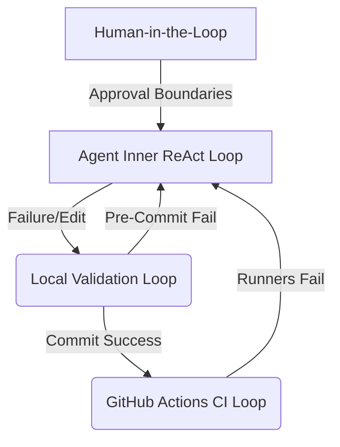

<!-- Target: docs/90.references/research/2026-07-07-agentic-research-pack-update/loop-engineering.md -->

# Reference: Loop Engineering and Feedback Systems

This document defines the concepts of Loop Engineering, describes the multi-tier feedback loops in the workspace, explores the role of automated Diagnostic Parsers, and compares loop execution properties across Claude, Codex, and Gemini.

---

## Overview

Loop Engineering focuses on establishing structural feedback loops that govern how an AI agent observes, plans, executes, and verifies its work. Rather than relying on simple, linear execution, it enables self-correction cycles, allowing agents to respond to compile, lint, and runtime errors dynamically.

```text
    ┌─────────────┐       ┌─────────────┐
    │ 1. Observe  │ ───>  │   2. Plan   │
    └─────────────┘       └─────────────┘
           ▲                     │
           │                     ▼
    ┌─────────────┐       ┌─────────────┐
    │  4. Verify  │  <───  │ 3. Execute  │
    └─────────────┘       └─────────────┘
```

The cycle consists of:

- **Observe**: Gathering target files, compiler outputs, and error outputs (stdout/stderr).
- **Plan**: Designing targeted, surgical adjustments (Surgical Changes) to minimize system churn.
- **Execute**: Modifying code surfaces using sandboxed tool capabilities.
- **Verify**: Invoking test commands and contract validators, returning results directly back to the agent's observation window.

## Purpose

This reference baseline studies the workspace's multi-layered feedback loops to expose structural bottlenecks, identify self-correction failures, and guide the development of programmatic diagnostic parsers.

## Repository Role

This document acts as an advisory technical reference. It does not replace active policies, plans, postmortems, or runtime configurations.

## Scope

### In Scope

- Theoretical definition and cycles of Loop Engineering.
- Workspace's multi-tier loops (Inner ReAct, Outer Validation, CI Pipeline, and Human-in-the-loop).
- Architecture of automated Diagnostic Parsers for refining terminal tracebacks.
- Comparison of feedback and error correction capabilities between Claude, Codex, and Gemini.
- Diagnostic gaps (unstructured error streams, lack of self-correction circuit breakers).

### Out of Scope

- Direct alterations to GitHub Actions workflows or pre-commit hooks.
- Execution of active plans or logging of task checklists.
- Plaintext secrets or credentials.

## Definitions / Facts

### 1. Multi-Tier Feedback Loops

The `hy-home.docker` workspace combines four feedback loops to guarantee high code and documentation quality:



- **Inner ReAct Loop**: The internal LLM reasoning cycle (Thought -> Act -> Observation). The environment feeds tool results directly back into the context window.
- **Outer Validation Loop**: A local safeguard driven by git pre-commit, [post-tool-validate.sh](../../../../scripts/hooks/post-tool-validate.sh), and [run-local-qa-gates.sh](../../../../scripts/validation/run-local-qa-gates.sh). Formatting or link syntax errors block commits and feed error diagnostics back to the agent's inner loop.
- **CI Pipeline Loop**: Remote GitHub Actions ([ci-quality.yml](../../../../.github/workflows/ci-quality.yml)) execute isolated checks. Merging is locked if any check fails, forcing agents to resolve dependencies on local branches.
- **Human-in-the-Loop (HITL)**: Enforced via [approval-boundaries.md](../../../00.agent-governance/rules/approval-boundaries.md). Humans review plans (`implementation_plan.md`) and verify completed evidence (`walkthrough.md`).

### 2. Automated Diagnostic Parser

A diagnostic parser structures terminal tracebacks to guide agent adjustments:

```text
    ┌──────────────────────┐
    │  Raw Build/Lint Log  │ ──> (npm run lint, shellcheck, yaml-lint)
    └──────────────────────┘
               │
               ▼
    ┌──────────────────────┐
    │  Diagnostic Parser   │ ──> (Regex match & severity level labeling)
    └──────────────────────┘
               │
               ▼
    ┌─────────────────────────────────────────────────────────────┐
    │ Output for Agent Context:                                   │
    │ [CRITICAL] check-repo-contracts.sh: L45 - Markdown Link Broken│
    │ => Resolution Recommendation: Repair relative link path     │
    └─────────────────────────────────────────────────────────────┘
```

1. **Structured Extraction**: Converts compiler or linter errors (e.g. ESLint, Shellcheck) into machine-readable formats.
2. **Severity Weighting**: Separates trivial warnings from compile errors to focus agent context on blocking issues.
3. **Actionable Suggestions**: Maps error codes to specific solutions, reducing repetitive trial-and-error edits.

### 3. Provider Self-Correction Comparison

The three runtimes handle correction feedback differently:

- **Claude Code**: Native ReAct logic handles multi-step tool calls. It dynamically adapts when a command returns an error exit code, resolving compiler errors on the fly.
- **OpenAI Codex**: Relies on hooks to capture validator outputs. The system feeds JSON-formatted error maps directly into the prompt frame for corrective editing.
- **Gemini Code Assist**: Lacks native error interceptors. Users must manually copy terminal tracebacks or compiler errors into the chat session to trigger self-correction.

### 4. Identified Gaps

- **Unstructured Terminal Output**: Raw terminal texts are fed into the prompt, bloating context sizes.
- **Lack of Circuit Breakers**: No auto-rollback limits (Auto-checkout) exist to stop agents stuck in infinite ReAct loop cycles.

## Sources

- [QA Scope](../../../00.agent-governance/scopes/qa.md) - QA/CI loop and validation models
- [CI Quality Workflow](../../../../.github/workflows/ci-quality.yml) - Remote quality gate configuration
- [Post Tool Validate Hook](../../../../scripts/hooks/post-tool-validate.sh) - Formatting normalization triggers
- [Claude CLI Hooks Reference](https://code.claude.com/docs/en/hooks) - Event-hook integration specs

## Maintenance

- **Owner**: Workspace Platform DevOps and QA Architects
- **Review Cadence**: Annually, or when main pipeline change failure rates spike.
- **Update Trigger**: Triggered by changes to `validate-docker-compose.sh` execution logic or addition of new linters.

## Related Documents

- [Research Index README](./README.md)
- [References Category README](../README.md)
- [workspace-baseline.md](./workspace-baseline.md)
- [harness-engineering.md](./harness-engineering.md)
