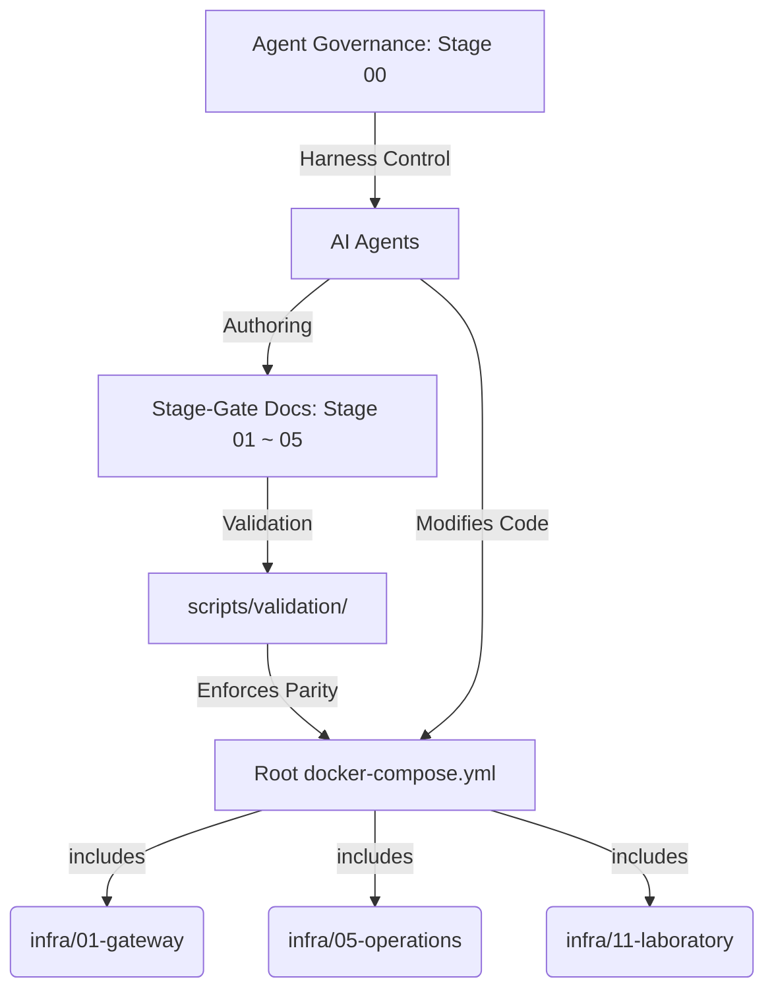

<!-- Target: docs/90.references/research/2026-07-07-agentic-research-pack-update/workspace-baseline.md -->

# Reference: Agentic Engineering Workspace Baseline

본 문서는 `hy-home.docker` 워크스페이스의 기본 환경, 목적, 역할, 개발 수명 주기(SDLC), 품질 보증(QA), 포맷팅 및 스타일 린팅 규칙, 보안 통제 체계, 그리고 AI 에이전트의 규칙적 통제 방안을 외부 공식 표준 및 소프트웨어 공학 프레임워크와 결합하여 심층 분석하고 정리한 리서치 레퍼런스입니다.

---

## 목차 (Table of Contents)

1. [개요 및 워크스페이스 정보](#1-개요-및-워크스페이스-정보)
2. [소프트웨어 개발 수명 주기 (SDLC) 및 스펙 주도 개발](#2-소프트웨어-개발-수명-주기-sdlc-및-스펙-주도-개발)
3. [CI/CD 파이프라인 및 품질 보증 (QA) 체계](#3-cicd-파이프라인-및-품질-보증-qa-체계)
4. [포맷팅, 스타일 검사 (Linting) 및 문법 오류 통제](#4-포맷팅-스타일-검사-linting-및-문법-오류-통제)
5. [보안 거버넌스 및 크리덴셜 경계](#5-보안-거버넌스-및-크리덴셜-경계)
6. [운영 계약, 템플릿 및 자동화 스크립트 가이드](#6-운영-계약-템플릿-및-자동화-스크립트-가이드)
7. [결론 및 차기 개선 과제 (Gap Analysis)](#7-결론-및-차기-개선-과제-gap-analysis)

---

## 1. 개요 및 워크스페이스 정보

### 1.1 워크스페이스 개요 (Workspace Overview)
`hy-home.docker`는 **공유 하네스 엔지니어링(Shared Harness Engineering)** 및 **에이전트 우선 엔지니어링(Agent-First Engineering)** 모델을 적용한 모듈형 Docker Compose 기반 홈/개발 인프라스트럭처 워크스페이스입니다. 
인프라의 런타임 상태와 구조적 문서를 1:1로 일치시켜 추적 가능성(Traceability)과 검증 가능성(Verifiability)을 극대화하는 아키텍처를 가집니다.



### 1.2 워크스페이스의 목적 (Workspace Purpose)
1. **인프라 계층 분리 및 표준화**: 각 Docker Compose 스택을 독립적인 계층으로 격리하여 서비스 추가와 변경의 파급 효과를 제한합니다.
2. **문서-실행 간 결합(Traceability)**: 요구사항 정의부터 최종 배포, 운영 런북까지 하나의 추적 가능한 체인으로 연결하여 설계 및 실행 결과의 괴리를 방지합니다.
3. **AI 에이전트 자율 협업 통제**: 사람이 정의한 거버넌스 규칙(Rules)과 하네스(Harness) 제약 안에서 에이전트가 안전하게 코드와 문서를 작성하도록 규제합니다.

### 1.3 워크스페이스의 역할 (Workspace Roles)
워크스페이스는 사용자 유형에 따라 다른 인터페이스와 책임을 제공합니다.
- **인프라 운영자**: 계층형 Compose 스택과 Secret, 환경 설정 등을 배포하고 컨테이너의 영속적 상태를 감시합니다.
- **개발자**: `projects/` 하위 공간에서 에이전트 도구, 보조 웹 앱 또는 API 모듈을 설계하고 테스트합니다.
- **문서 작성자 (인간 & AI 에이전트)**: Stage 01 ~ 05의 문서를 규칙에 맞게 생성/갱신하고, README를 동기화합니다.
- **AI Agents**: 정의된 페르소나와 바인딩 스코프를 따르며, 자율적 리서치 및 구현을 전개합니다.

---

## 2. 소프트웨어 개발 수명 주기 (SDLC) 및 스펙 주도 개발

워크스페이스는 스펙과 설계를 먼저 정의하고 코드를 나중에 도출하는 **스펙 주도 개발(Spec-Driven Development)** 아키텍처를 강제하며, 국제 표준에 부합하는 SDLC 단계를 구축하고 있습니다.

### 2.1 ISO/IEC/IEEE 표준 기반 SDLC 매핑
소프트웨어 및 시스템 공학 국제 표준인 **ISO/IEC/IEEE 12207 (Lifecycle Processes)** 및 **ISO/IEC/IEEE 29148 (Requirements Engineering)**을 로컬 아키텍처에 구현한 구조는 다음과 같습니다.

| SDLC 수명 주기 단계 | 주요 활동 및 책임 (ISO 표준 정의) | 워크스페이스 실물 구현 경로 | 산출물 및 문서 규칙 |
| :--- | :--- | :--- | :--- |
| **요구사항 정의** | 이해관계자의 필요와 가치를 획득하고 범위 식별 | [docs/01.requirements/](file:///home/hy/projects/hy-home.docker/docs/01.requirements/) | 요구사항 정의서(PRD) 및 승인 기준 (Acceptance Criteria) |
| **아키텍처 설계** | 시스템 경계를 설계하고 품질 속성 및 결정 사항 기록 | [docs/02.architecture/](file:///home/hy/projects/hy-home.docker/docs/02.architecture/) | 아키텍처 요구사항(ARD) 및 아키텍처 결정 기록(ADR) |
| **상세 설계 및 명세** | 컴포넌트 간 인터페이스, 구성 계약 및 검증 수단 명시 | [docs/03.specs/](file:///home/hy/projects/hy-home.docker/docs/03.specs/) | 기술 스펙(Spec) 및 런타임 데이터 계약서 |
| **실행 및 검증 계획** | 작업 순서를 세분화하고 리스크 제어 방안 수립 | [docs/04.execution/plans/](file:///home/hy/projects/hy-home.docker/docs/04.execution/plans/) | 실행 계획서 (`implementation_plan.md`) |
| **구현 및 작업 완료** | 코드를 수정하고 단위 검증 이력 및 실행 증거 획득 | [docs/04.execution/tasks/](file:///home/hy/projects/hy-home.docker/docs/04.execution/tasks/) | 실행 이력 및 검증 로그 (`task.md` / `walkthrough.md`) |
| **운영 및 유지보수** | 운영 가이드, 정책, 사건 대응 및 런북 절차 표준화 | [docs/05.operations/](file:///home/hy/projects/hy-home.docker/docs/05.operations/) | 운영 가이드(Guides), 정책(Policies), 런북(Runbooks), 장애 리포트 |

### 2.2 스펙 주도 개발 (Spec-Driven Development) 모델
Martin Fowler가 제시한 **SDD(Spec-Driven Development)**는 단순한 사전 문서화를 넘어 "스펙을 시스템의 최종 소스이자 실행 불변의 계약(Spec-as-Source)"으로 다룹니다.
1. **스펙 앵커(Spec-Anchored) 통제**: 본 워크스페이스의 코드는 사전에 합의된 Spec([docs/03.specs/](file:///home/hy/projects/hy-home.docker/docs/03.specs/)) 및 계획서에 앵커링(Anchored)되어야 수정될 수 있습니다.
2. **BDD(Behavior-Driven Development) 개념 활용**: Cucumber BDD의 실행 스펙(Executable Specification) 철학처럼, 문서 안의 인수 테스트 기준(Acceptance Criteria)은 자동화된 검증 스크립트(`check-doc-implementation-alignment.sh`)를 통해 실제 인프라의 Compose 상태 및 코드 구현과 동기화 상태가 대조 검증됩니다.

---

## 3. CI/CD 파이프라인 및 품질 보증 (QA) 체계

품질과 배포 안정성은 원격 CI 파이프라인과 로컬 검증 스크립트의 2단계 피드백 루프로 통제됩니다.

### 3.1 DORA Metrics 기반 평가
DORA (DevOps Research and Assessment) 프레임워크가 정의한 핵심 4대 지표를 본 워크스페이스 관점에서 투영한 현황은 다음과 같습니다.

*   **배포 빈도 (Deployment Frequency)**: 로컬 검증과 CI 품질 게이트의 사전 통과를 통해 변경분을 항시 릴리스 가능한 상태(Production-Ready)로 유지함으로써 배포 파이프라인의 병목을 제거합니다.
*   **변경 리스크 리드타임 (Lead Time for Changes)**: 자동화된 pre-commit 및 Git 훅을 통하여 정적 오류를 로컬 수준에서 1차 차단하여, PR 제출부터 검증 완료까지의 물리적 시간을 대폭 단축합니다.
*   **변경 실패율 (Change Failure Rate)**: 인프라 변경 시 `validate-docker-compose.sh` 및 `check-all-hardening.sh`를 강제 적용함으로써 컨테이너 설정 오류나 보안 홀로 인한 실행 실패율을 0%에 가깝게 유지합니다.
*   **서비스 복구 시간 (Time to Restore Service)**: 장애 발생 시 가이드에 따른 사후 분석서([docs/05.operations/incidents/](file:///home/hy/projects/hy-home.docker/docs/05.operations/incidents/)) 작성과 런북 재실행을 통해 복구의 결정론적 경로를 보장합니다.

### 3.2 CI/CD 파이프라인 아키텍처
원격 저장소에 코드가 푸시되거나 PR이 생성되면, GitHub Actions 워크플로인 [.github/workflows/ci-quality.yml](file:///home/hy/projects/hy-home.docker/.github/workflows/ci-quality.yml)이 가동됩니다. 본 워크플로는 다중 잡(Parallel Jobs) 구조로 설계되어 병렬 실행 효율성을 극대화합니다.

```text
GitHub Actions CI/CD Pipeline
├── Job 1: docs-traceability
│   └── 문서 간 상대 링크 정합성 검사 (check-doc-traceability.sh)
├── Job 2: repo-contracts
│   └── 에이전트 카탈로그 동기화, YAML 포맷, 중복 스크립트 검사 (check-repo-contracts.sh)
├── Job 3: compose-validation
│   └── Core 및 All-profile Compose 문법 Config 파싱 검사 (validate-docker-compose.sh)
├── Job 4: infrastructure-hardening
│   └── 컨테이너 보안, 네트워크 단절, 권한 격리 검사 (check-all-hardening.sh)
├── Job 5: zizmor-security
│   └── GitHub Actions 워크플로 정적 보안 스캔 (zizmor)
└── Job 6: frontend-quality
    └── Node.js 빌드 안정성, ESLint 및 Storybook 정합성 검사
```

### 3.3 로컬 QA 게이트 체계
품질 검증은 CI 환경에만 의존하지 않고 로컬에서도 완벽하게 재현(Reproducible) 가능해야 합니다.
- **[run-local-qa-gates.sh](file:///home/hy/projects/hy-home.docker/scripts/validation/run-local-qa-gates.sh)**: CI 환경에 전달하기 전, 로컬 시스템의 Compose 컨텍스트, 스크립트 실행 권한, 하네스 정합성을 한 번에 실행하고 리포팅합니다.
- **예외 이력 기록**: 불가피하게 검증을 건너뛰는 경우, 그 사유를 명시적으로 문서화하고 `memory/progress.md`에 예외 처리 근거를 증적으로 서명 기록합니다.

---

## 4. 포맷팅, 스타일 검사 (Linting) 및 문법 오류 통제

코드 및 문서의 일관성을 제어하여 가독성을 높이고 정적 파싱 에러를 미연에 방지합니다.

### 4.1 정적 포맷터 및 스타일 린터 목록
워크스페이스는 파일 확장자별로 구체적인 도구 체인을 설정하고 있습니다.

1.  **EditorConfig**: 크로스 에디터 간 들여쓰기(Indent Size), 줄바꿈 규칙(EndOfLine)을 표준화합니다. ([.editorconfig](file:///home/hy/projects/hy-home.docker/.editorconfig))
2.  **Prettier**: 마크다운, JSON, JS/TS 파일의 공백과 정렬을 자동 보정합니다. ([.prettierrc.json](file:///home/hy/projects/hy-home.docker/.prettierrc.json), [.prettierignore](file:///home/hy/projects/hy-home.docker/.prettierignore))
3.  **Shellcheck**: 쉘 스크립트 내의 안티패턴, 미지정 변수 사용, 비정상적인 파이프 처리를 탐지하여 사전에 교정합니다. ([.shellcheckrc](file:///home/hy/projects/hy-home.docker/.shellcheckrc))
4.  **YAML Lint**: YAML 파일의 구조적 인덴트 및 키 중복을 방지합니다. ([.yamllint](file:///home/hy/projects/hy-home.docker/.yamllint))
5.  **Markdown Lint**: 마크다운 문서의 헤더 단계 누락, 불필요한 공백 행, 인라인 HTML 사용 제약을 적용합니다. ([.markdownlint-cli2.yaml](file:///home/hy/projects/hy-home.docker/.markdownlint-cli2.yaml))

### 4.2 자동화된 훅 메커니즘
- **Pre-commit**: 커밋 시점에 [.pre-commit-config.yaml](file:///home/hy/projects/hy-home.docker/.pre-commit-config.yaml)에 구성된 도구들이 백그라운드로 실행되어 스타일 위반이 있는 코드의 커밋을 자동 차단합니다.
- **Post-Tool Validation Hook**: 에이전트가 도구를 호출하여 코드를 변경하면, [post-tool-validate.sh](file:///home/hy/projects/hy-home.docker/scripts/hooks/post-tool-validate.sh)가 즉시 구동되어 해당 파일의 공백을 제거하고 프리티어 포맷을 적용하여 소스 코드의 무결성을 실시간 강제합니다.

---

## 5. 보안 거버넌스 및 크리덴셜 경계

에이전트가 동작하는 로컬 환경 및 원격 CI 파이프라인에서 보안 사고(크리덴셜 유출, 비인가 스크립트 실행)가 발생하지 않도록 제로 트러스트(Zero Trust) 경계를 설정합니다.

### 5.1 NIST SSDF & OWASP SAMM 맵핑
-   **NIST SSDF (Secure Software Development Framework - SP 800-218)**:
    *   *PO (Prepare the Organization)*: 보안 취약점 제보 채널([.github/SECURITY.md](file:///home/hy/projects/hy-home.docker/.github/SECURITY.md)) 운영 및 에이전트의 비밀값 접근 범위 최소화 규정.
    *   *PS (Protect the Software)*: `gitleaks` 및 `zizmor`를 사용한 크리덴셜 누출 탐지 및 CI 워크플로 변조 정적 스캔.
    *   *PW (Produce Well-Secured Software)*: [check-template-security-baseline.sh](file:///home/hy/projects/hy-home.docker/scripts/validation/check-template-security-baseline.sh)를 통해 인프라 서비스 템플릿의 최소 권한(Least Privilege) 구현 검증.
-   **OWASP SAMM (Software Assurance Maturity Model)**:
    *   *Governance (Policy & Compliance)*: Stage 00 거버넌스를 아키텍처와 분리된 단독 합의체로 관리.
    *   *Implementation (Secure Build)*: GitHub CI 러너 내에서의 제3자 액션(Third-party actions) 실행 시 SHA 해시 핀 고정 적용.

### 5.2 크리덴셜 격리 기법
-   **환경 변수 격리**: 모든 기본 환경 변수 구조는 [.env.example](file:///home/hy/projects/hy-home.docker/.env.example)에 명시하되, API Key, 데이터베이스 비밀번호, 인증서 패스워드 등 실제 민감 값은 `.env` 혹은 Git 추적에서 제외된 로컬 환경 파일에만 저장합니다.
-   **비밀값 탑재 경계**: Docker Compose 내에서 비밀 키 정보는 컨테이너 환경 변수(`environment:`)로 주입하지 않고, `secrets/` 하위 경로에 저장한 뒤 파일 마운트 방식(`secrets:`)으로만 컨테이너 내부에 바인딩합니다.
-   **Redaction Boundary (마스킹 의무)**:
    *   에이전트 실행 로그, 작업 계획서, 리포트 문서 등에 비밀 정보 본문, 프라이빗 키 문자열, 토큰을 기입하는 것은 절대 금지합니다.
    *   검증에는 오직 파일의 존재 여부, 권한(Permissions) 상태, 성공/실패 코드(Exit Code)만 기록할 수 있습니다.

### 5.3 바이브 코딩(Vibe Coding)의 규칙적 억제
에이전트가 요구사항이나 기술적 검증 없이 감에 의존하여 코드를 난도질하는 **바이브 코딩(Vibe Coding)** 현상을 방지하기 위해 다음과 같은 제약을 둡니다:
1.  **계획 수립의 의무**: 대형 변경 전 반드시 `implementation_plan.md`를 제출하여 인간의 명시적 검토와 승인을 획득해야 합니다.
2.  **Surgical Changes (최소 변경 원칙)**: 요구사항에 포함되지 않은 인접 코드 포맷 수정, 사용하지 않는 변수 임의 삭제, 중복 리팩토링 등을 원천 차단하고 오직 주어진 기능만 격리 수정합니다.
3.  **검증 로그 자동 첨부**: 수동 확인은 불인정하며, 로컬/원격 빌드와 린트 검사 로그의 증적이 서면으로 증명되어야 작업이 완료(Completed)로 승인됩니다.

---

## 6. 운영 계약, 템플릿 및 자동화 스크립트 가이드

규칙적인 문서화와 안정적인 유지보수를 지원하기 위한 표준 에셋과 운영 규정입니다.

### 6.1 운영 계약 (Operating Contracts) 및 템플릿 (Templates)
문서 생산 시 일관성 유지를 위하여 [docs/99.templates/](file:///home/hy/projects/hy-home.docker/docs/99.templates/)에 구현된 템플릿을 무조건 참조해야 합니다.
- **[documentation-protocol.md](file:///home/hy/projects/hy-home.docker/docs/00.agent-governance/rules/documentation-protocol.md)**: 문서의 언어 규칙(거버넌스는 영어, 운영 문서는 한국어), 필수 메타데이터 프론트매터, 연관 문서 링크 규칙을 바인딩합니다.
- **[harness-task-contract.template.md](file:///home/hy/projects/hy-home.docker/docs/99.templates/templates/governance/harness-task-contract.template.md)**: 하네스 엔지니어링 작업 승인을 위한 표준 체크리스트 규격을 공급합니다.

### 6.2 자동화 스크립트 구조
[scripts/README.md](file:///home/hy/projects/hy-home.docker/scripts/README.md)에 따라 모든 스크립트는 목적에 맞는 6대 전용 폴더에 분산 배치되며, 루트 디렉토리에 중복된 래퍼(Wrapper) 스크립트를 생성하여 네임스페이스를 오염시키는 동작이 원천 금지됩니다.

*   `scripts/validation/`: Docker Compose 정합성, 문서 링크 정합성 등 변경 검증.
*   `scripts/hardening/`: 컨테이너 권한 격리 및 운영 체제 취약점 진단.
*   `scripts/hooks/`: 에이전트 입력 제어 및 코드 가공 처리.
*   `scripts/knowledge/`: 레포지토리 맵 구성 및 지식 인덱스 갱신.
*   `scripts/operations/`: 크리덴셜 생성 및 백업 등 운영 자동화.
*   `scripts/lib/`: 공통으로 활용되는 쉘 라이브러리 및 헬퍼.

### 6.3 통합 가이드
에이전트가 새로운 개발 브랜치에서 작업을 개시하면 다음 시퀀스를 실행합니다.
1.  **Bootstrap 로드**: `docs/00.agent-governance/rules/bootstrap.md`를 읽고 작업 레이어와 페르소나 설정.
2.  **의존성 식별**: 변경할 인프라 영역의 Docker compose include 상태와 `.env` 선언 유무 확인.
3.  **Graphify Context 사용**: 로컬에 생성된 아키텍처 관계 그래프 정보를 참고하여 변경해야 할 영향도 범위 추정. (단, `graphify` 명령어 사용이 불가능한 샌드박스 환경에서는 정보 읽기만 수행하고 빌드는 건너뜀)

---

## 7. 결론 및 차기 개선 과제 (Gap Analysis)

### 7.1 평가 요약
현재 `hy-home.docker`는 로컬 훅부터 원격 CI에 이르기까지 완성도 높은 계약 중심의 거버넌스 및 QA 인프라를 보유하고 있습니다. 인프라를 코드(IaC)로 관리하는 수준을 넘어, 문서를 활용해 AI 에이전트의 작동 경계를 실시간 규제하는 독자적인 하네스 체계를 갖춘 것으로 분석됩니다.

### 7.2 부족한 요소 및 개선 계획 (Follow-up Gap)
1.  **지식 그래프 자동 갱신 부재**: 인프라 변경 시 `graphify update .` 명령어를 수동으로 입력해야 합니다. 이를 커밋 훅이나 PR 빌드 시 CI 파이프라인 내부에서 자동으로 실행하도록 설계할 필요가 있습니다.
2.  **DORA 지표 측정 기능 부족**: 로컬 및 사설 인프라 환경이므로 배포 빈도와 변경 리드타임을 실시간 측정할 수 있는 통합 대시보드가 없습니다. 추후 프로메테우스나 그라파나 등 OBS 계층과 배포 이벤트를 연계하는 방안을 리서치해야 합니다.
3.  **보안 진단 고도화**: 컨테이너 정적 이미지 검사(`Trivy`) 및 Docker 데몬 런타임 보안 스캔 모듈을 QA 파이프라인의 필수 잡으로 추가하여, 인프라의 위협 모델 분석 깊이를 강화해야 합니다.

---

## Sources

- [Root README](file:///home/hy/projects/hy-home.docker/README.md) - 워크스페이스 아키텍처 및 품질 게이트
- [Agent Governance README](file:///home/hy/projects/hy-home.docker/docs/00.agent-governance/README.md) - 에이전트 계약 프레임워크
- [Bootstrap rules](file:///home/hy/projects/hy-home.docker/docs/00.agent-governance/rules/bootstrap.md) - SDLC 단계 분류 및 로딩 우선순위
- [Documentation protocol](file:///home/hy/projects/hy-home.docker/docs/00.agent-governance/rules/documentation-protocol.md) - 문서 작성 언어 및 템플릿 바인딩 규칙
- [QA Scope](file:///home/hy/projects/hy-home.docker/docs/00.agent-governance/scopes/qa.md) - 로컬/원격 QA 게이트 정책
- [Security Scope](file:///home/hy/projects/hy-home.docker/docs/00.agent-governance/scopes/security.md) - 비밀 정보 경계 및 제로 트러스트 규칙
- [GitHub Governance](file:///home/hy/projects/hy-home.docker/docs/00.agent-governance/rules/github-governance.md) - 원격 파이프라인 및 변경 승인 정책
- [Harness Implementation Map](file:///home/hy/projects/hy-home.docker/docs/00.agent-governance/harness-implementation-map.md) - 로컬 하네스 표면 상세 매핑
- [NIST SP 800-218 SSDF Specification](https://csrc.nist.gov/pubs/sp/800/218/final) - NIST 보안 소프트웨어 개발 프레임워크 표준
- [OWASP SAMM Version 2.0](https://owasp.org/www-project-samm/) - OWASP 소프트웨어 보증 성숙도 모델

---

## Maintenance

- **소유자**: 워크스페이스 플랫폼 거버넌스 위원회
- **검토 주기**: 매 분기 1회 혹은 CI/CD 파이프라인 및 포맷팅 규칙 변경 시 수시 검토
- **업데이트 트리거**: 로컬 검증 스크립트 수정, 신규 Docker Compose 계층 추가, 혹은 외부 보안 표준 개정 시
