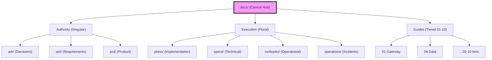

# Documentation Hub (`docs/`)

> Integrated hub for architecture, decisions, requirements, and guides.

## Overview

**KR**: 프로젝트의 전반적인 아키텍처, 결정 사항, 요구사항 및 운영 가이드를 포함하는 통합 문서 허브입니다.
**EN**: Comprehensive hub for system architecture, ADRs, PRDs, and operational guides.

## 🗺️ System Documentation Map

---

## 📂 Documentation Inventory

### Authority & Strategy (Living)

| Category | Purpose | Entry Point |
| :--- | :--- | :--- |
| **ADR** | Architecture Decision Records | [adr/README.md](adr/README.md) |
| **ARD** | Architectural Requirements | [ard/README.md](ard/README.md) |
| **PRD** | Product/System Requirements | [prd/README.md](prd/README.md) |

### Execution & Operation (Actionable)

| Category | Purpose | Entry Point |
| :--- | :--- | :--- |
| **Plans** | Implementation Workflows | [plans/README.md](plans/README.md) |
| **Specs** | Technical Specifications | [specs/README.md](specs/README.md) |
| **Runbooks** | Operational Procedures | [runbooks/README.md](runbooks/README.md) |
| **Guides** | Tier-based SRE Manuals | [guides/README.md](guides/README.md) |

---

### Key Policy & Standards

- [Agent Governance](agentic/core-governance.md)
- [Metadata & Taxonomy Standard](adr/archive/2026-02-27-0016-doc-taxonomy.md)
- [Agent Gateway](agentic/gateway.md)

---
*Maintained by Documentation Architects & Platform SREs*
