# Migrated Infra Architecture & Topologies

## 1. Architecture & Optimization Analysis

Based on the review of the current `docker-compose.yml` topology and the files in the `infra/` directory, the following architectural insights and optimization opportunities have been identified:

### 1.1 Infrastructure Network & Static IPs

- **Current State**: The `infra_net` bridge network configures subnet `172.19.0.0/16`. Containers (e.g., `traefik` at `172.19.0.13`, `mng-valkey` at `172.19.0.70`, `mng-pg` at `172.19.0.72`) are explicitly assigned static `ipv4_address` values.
- **Analysis**: While static IPs provide a sense of predictability, they introduce fragility in containerized environments. They can lead to IP conflicts, hinder scalability (e.g., running multiple instances or creating ephemeral test environments), and are generally considered a Docker anti-pattern.
- **Optimization Strategy**:
  - **Remove Static IPs**: Remove the `ipv4_address` field from all service configurations.
  - **Rely on Docker DNS**: Leverage Docker's native internal DNS. Services should discover and communicate with each other using their `container_name` or `aliases` (e.g., connecting to `mng-valkey:6379` instead of `172.19.0.70:6379`).

### 1.2 Redundant Initialization Containers

- **Current State**: In the `mng-db` stack (`infra/04-data/mng-db/docker-compose.yml`), a dedicated initialization container `mng-pg-init` is used to execute the `init_users_dbs.sql` script by explicitly waiting for `mng-pg` to be ready and then running `psql`.
- **Analysis**: The primary database container (`mng-pg`) already mounts `./init-scripts/init_users_dbs.sql` into `/docker-entrypoint-initdb.d/init_users_dbs.sql`. The official `postgres` Docker image automatically executes any `.sql` or `.sh` scripts found in `/docker-entrypoint-initdb.d/` precisely once during the initial database creation.
- **Optimization Strategy**:
  - **Remove `mng-pg-init`**: The `mng-pg-init` service is redundant. Relying on the official image's built-in initialization mechanism reduces resource overhead, simplifies the `docker-compose.yml`, and lowers the risk of race conditions during startup.

### 1.3 Best Practices Observed

- **Resource Limits**: The `deploy.resources.limits` and `reservations` are properly configured across services, adhering to stability and resource stewardship principles.
- **Security Contexts**: Excellent use of `read_only: true` and `security_opt: ["no-new-privileges:true"]` where applicable (e.g., in exporters and Traefik).
- **Restart Policies & Health Checks**: Well-defined health checks and `restart: unless-stopped` policies ensure robustness. Service dependencies use `condition: service_healthy`, which is the correct pattern for orchestrating startup sequences.
- **Secret Management**: Proper usage of Docker Secrets to avoid exposing sensitive variables in composing files is consistently applied.

<!-- MIGRATED CONTENT BELOW -->

## Context: Observability Stack (LGTM + Alloy) (06-observability)

## Overview

A comprehensive, enterprise-grade observability stack based on the **LGTM** pattern (Loki, Grafana, Tempo, Mimir/Prometheus). This stack provides full-spectrum visibility into infrastructure and application health, utilizing **Grafana Alloy** as a unified telemetry collector for metrics, logs, and distributed traces.

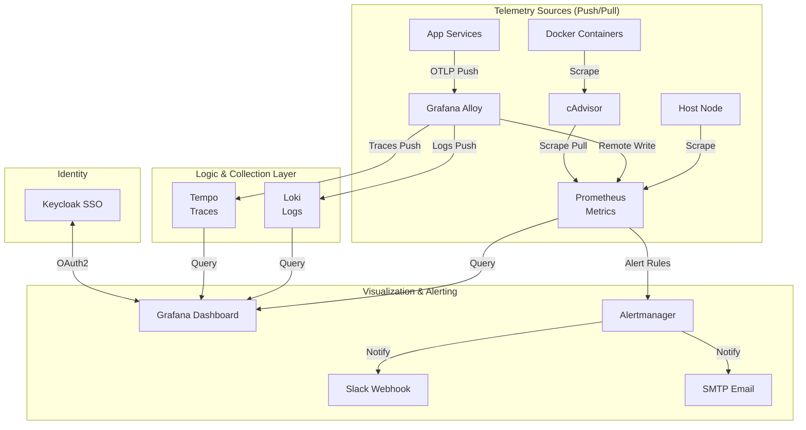
```mermaid
graph TB
    subgraph "Telemetry Sources (Push/Pull)"
        A[App Services] -->|OTLP Push| E[Grafana Alloy]
        B[Docker Containers] -->|Scrape| F[cAdvisor]
        C[Host Node] -->|Scrape| P[Node Exporter]
    end

    subgraph "Logic & Collection Layer"
        E -->|Remote Write| P[Prometheus<br/>Metrics]
        E -->|Logs Push| L[Loki<br/>Logs]
        E -->|Traces Push| T[Tempo<br/>Traces]
        F -->|Scrape Pull| P
    end

    subgraph "Visualization & Alerting"
        G[Grafana Dashboard]
        AM[Alertmanager]

        P -->|Query| G
        L -->|Query| G
        T -->|Query| G

        P -->|Alert Rules| AM
        AM -->|Notify| Slack[Slack Webhook]
        AM -->|Notify| Mail[SMTP Email]
    end

    subgraph "Identity"
        KC[Keycloak SSO] <-->|OAuth2| G
    end
```

## Context: Prometheus (prometheus)

## 🚀 Overview

- **Service**: `prometheus`
- **Docker Image**: `prom/prometheus:v3.9.0`
- **Port**: `9090` (Web UI/API)

## Context: Grafana (grafana)

## 🚀 Overview

- **Service**: `grafana`
- **Docker Image**: `grafana/grafana:12.3.1`
- **Port**: `3000` (Web UI)

## Context: Loki (loki)

## 🚀 Overview

- **Service**: `loki`
- **Docker Image**: `grafana/loki:3.6.3`
- **Ports**:
  - `3100`: HTTP (Ingestion/Query)
  - `9096`: gRPC

## Context: Grafana Alloy (alloy)

## 🚀 Overview

- **Service**: `alloy`
- **Docker Image**: `grafana/alloy:v1.12.1`
- **Ports**:
  - `12345`: Alloy UI (Internally exposed)
  - `4317`: OTLP gRPC Receiver
  - `4318`: OTLP HTTP Receiver

## Context: Tempo (tempo)

## 🚀 Overview

- **Service**: `tempo`
- **Docker Image**: `grafana/tempo:2.9.0`
- **Ports**:
  - `3200`: HTTP (Distributor/Otlp)
  - `4317`: OTLP gRPC Receiver
  - `4318`: OTLP HTTP Receiver

## Context: Alertmanager (alertmanager)

## 🚀 Overview

- **Service**: `alertmanager`
- **Docker Image**: `prom/alertmanager:v0.30.0`
- **Port**: `9093` (Web UI/API)

## Context: Pushgateway (pushgateway)

## 🚀 Overview

- **Service**: `pushgateway`
- **Docker Image**: `prom/pushgateway:v1.11.2`
- **Port**: `9091` (Web UI/API)

## Context: Messaging (05-messaging) (05-messaging)

## Overview

Event streaming and messaging services. **Kafka** provides the core streaming platform for high-throughput event processing. **ksqlDB** is available for real-time stream SQL processing. **RabbitMQ** provides a robust AMQP-based message broker for reliable asynchronous communication.

## Context: RabbitMQ (05-messaging/rabbitmq) (rabbitmq)

## Overview

RabbitMQ는 AMQP(Advanced Message Queuing Protocol)를 지원하는 오픈 소스 메시지 브로커입니다. 이 구성에는 웹 기반 관리 인터페이스(Management UI)가 포함되어 있어 큐, 교환기(Exchanges), 바인딩 등을 쉽게 모니터링하고 관리할 수 있습니다.

## Context: Kafka Cluster (KRaft Mode) (kafka)

## Overview

A robust, production-grade **3-node Kafka Cluster** running in **KRaft mode** (ZooKeeper-less). This deployment integrates the full Confluent Platform ecosystem, including Schema Registry, Connect, REST Proxy, and advanced monitoring.

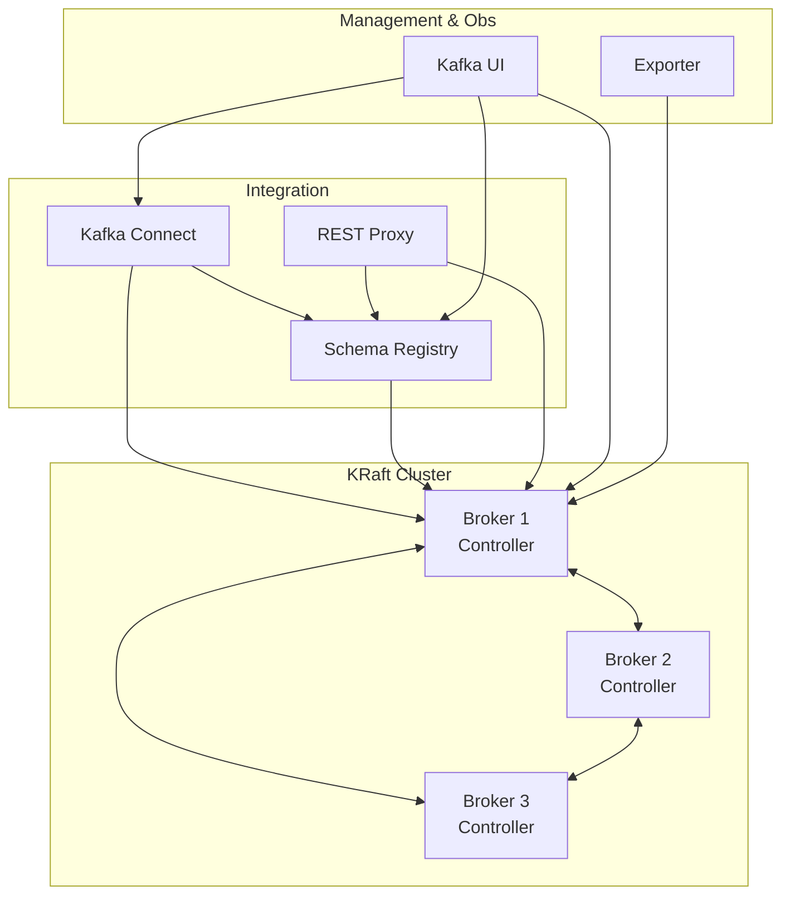
```mermaid
graph TB
    subgraph "KRaft Cluster"
        K1[Broker 1<br/>Controller]
        K2[Broker 2<br/>Controller]
        K3[Broker 3<br/>Controller]
    end

    subgraph "Integration"
        SR[Schema Registry]
        KC[Kafka Connect]
        RP[REST Proxy]
    end

    subgraph "Management & Obs"
        UI[Kafka UI]
        EXP[Exporter]
    end

    K1 <--> K2
    K1 <--> K3
    K2 <--> K3

    KC --> K1
    KC --> SR
    SR --> K1
    RP --> K1
    RP --> SR
    UI --> K1
    UI --> KC
    UI --> SR
    EXP --> K1
```

## Context: ksqlDB (ksql)

## Overview

ksqlDB is a database purpose-built for stream processing applications. It allows you to build event streaming applications using a familiar SQL syntax.

## Context: Gateway (01-gateway) (01-gateway)

## Overview

Edge ingress and routing services for the stack. **Traefik** is the default gateway. **Nginx** is an optional standalone proxy for path-based routing, caching, or custom auth flow testing.

## Context: Traefik Edge Router (traefik)

## Overview

**Traefik** acts as the central **Edge Router** (Reverse Proxy) for the entire infrastructure. It handles incoming HTTP/HTTPS traffic, terminates SSL, and routes requests to appropriate Docker containers based on dynamic labels. It also enforces security policies like SSO and Rate Limiting.

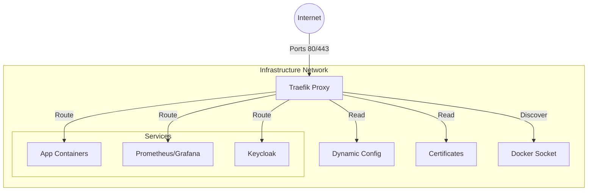
```mermaid
graph TB
    Internet((Internet))

    subgraph "Infrastructure Network"
        Traefik[Traefik Proxy]

        subgraph "Services"
            App1[App Containers]
            App2[Prometheus/Grafana]
            App3[Keycloak]
        end

        Config[Dynamic Config]
        Certs[Certificates]
        Socket[Docker Socket]
    end

    Internet -->|Ports 80/443| Traefik

    Traefik -->|Discover| Socket
    Traefik -->|Read| Config
    Traefik -->|Read| Certs

    Traefik -->|Route| App1
    Traefik -->|Route| App2
    Traefik -->|Route| App3
```

## Context: Nginx Standalone Proxy (nginx)

## Overview

A standalone **Nginx** reverse proxy and web server instance. While the primary gateway of this infrastructure is **Traefik**, this Nginx instance serves as an alternative ingress point, specifically optimized for path-based routing, advanced caching, and custom SSO integration.

## Context: Nginx Standalone Proxy (nginx)

## Profile

This stack is **optional** and runs under the `nginx` profile.

```bash
docker compose --profile nginx up -d nginx
```

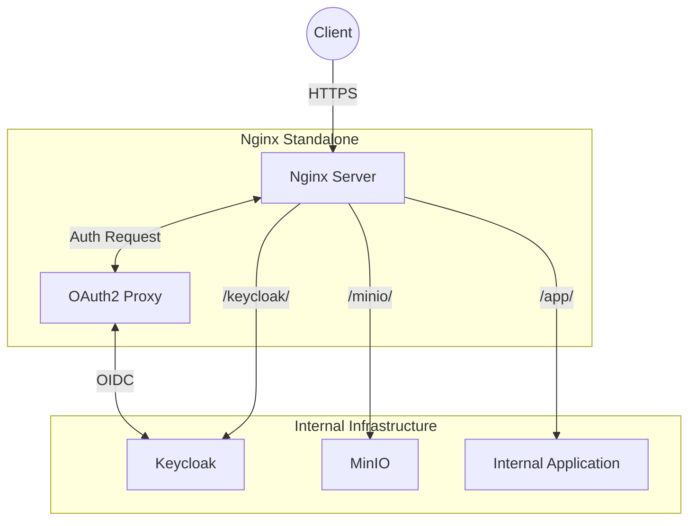
```mermaid
graph TD
    Client((Client))

    subgraph "Nginx Standalone"
        NGX[Nginx Server]
        Auth[OAuth2 Proxy]
    end

    subgraph "Internal Infrastructure"
        KC[Keycloak]
        Min[MinIO]
        App[Internal Application]
    end

    Client -->|HTTPS| NGX
    NGX <-->|Auth Request| Auth
    Auth <-->|OIDC| KC

    NGX -->|/keycloak/| KC
    NGX -->|/minio/| Min
    NGX -->|/app/| App
```

## Context: Data (04-data) (04-data)

## Overview

Persistent data stores for the stack: relational databases, caches, search, object storage, and vector databases. Most services are included from the repo root; a few are optional (profiles) or standalone.

## Context: InfluxDB (influxdb)

## Overview

**InfluxDB** is a high-performance open-source time-series database (TSDB) optimized for fast, high-availability storage and retrieval of time-stamped data. This deployment uses **InfluxDB v2**, providing an integrated environment for data collection, visualization, and alerting.

## Context: InfluxDB (influxdb)

## Profile

This stack is **optional** and runs under the `influxdb` profile.

```bash
docker compose --profile influxdb up -d influxdb
```

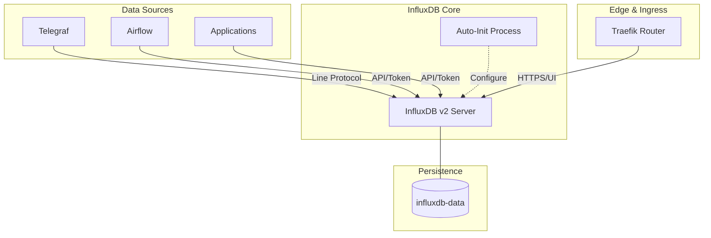
```mermaid
graph TD
    subgraph "Data Sources"
        Tel[Telegraf]
        Air[Airflow]
        App[Applications]
    end

    subgraph "Edge & Ingress"
        GW[Traefik Router]
    end

    subgraph "InfluxDB Core"
        IDX[InfluxDB v2 Server]
        Init[Auto-Init Process]
    end

    subgraph "Persistence"
        Vol[(influxdb-data)]
    end

    Tel -->|Line Protocol| IDX
    Air -->|API/Token| IDX
    App -->|API/Token| IDX

    GW -->|HTTPS/UI| IDX

    IDX --- Vol
    Init -.->|Configure| IDX
```

## Context: Management Databases Infrastructure (mng-db)

## Overview

A shared data persistence layer acting as the backbone for various platform services. It hosts **Valkey** (for cache/queues) and **PostgreSQL** (for relational data), along with their monitoring exporters and management UIs.

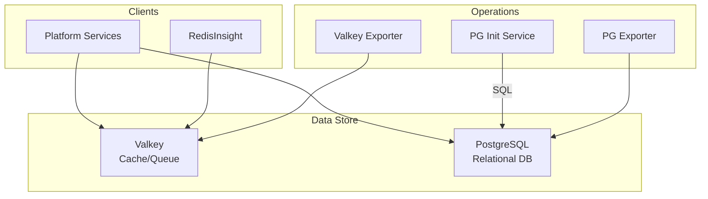
```mermaid
graph TB
    subgraph "Clients"
        Apps[Platform Services]
        UI[RedisInsight]
    end

    subgraph "Data Store"
        V[Valkey<br/>Cache/Queue]
        P[PostgreSQL<br/>Relational DB]
    end

    subgraph "Operations"
        Init[PG Init Service]
        EXP_V[Valkey Exporter]
        EXP_P[PG Exporter]
    end

    Apps --> V
    Apps --> P
    UI --> V
    Init -->|SQL| P

    EXP_V --> V
    EXP_P --> P
```

## Context: Qdrant Vector Database (qdrant)

## Overview

A high-performance **Vector Database** optimized for AI applications, specifically acting as the Knowledge Base for the local RAG (Retrieval-Augmented Generation) stack. It stores high-dimensional vectors generated by embedding models.

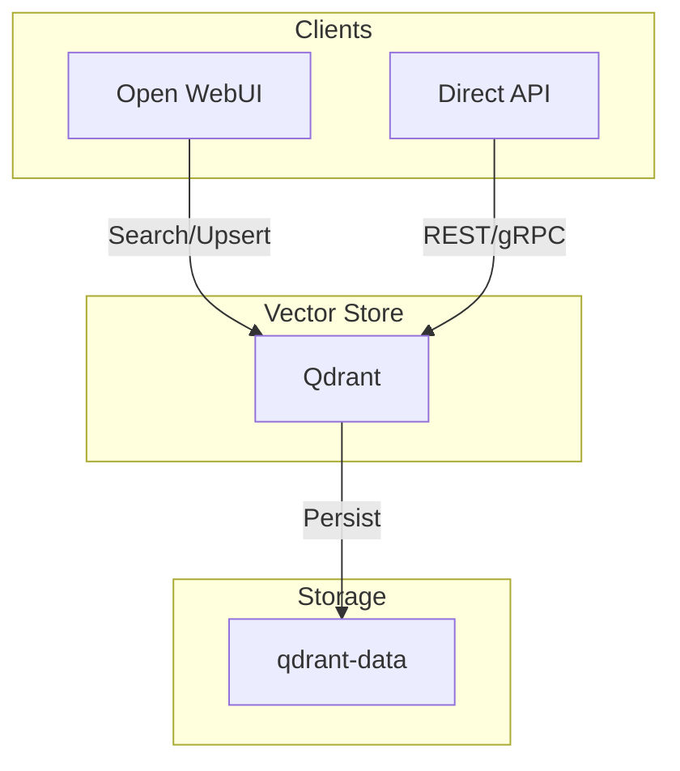
```mermaid
graph TB
    subgraph "Clients"
        UI[Open WebUI]
        Users[Direct API]
    end

    subgraph "Vector Store"
        Q[Qdrant]
    end

    subgraph "Storage"
        Vol[qdrant-data]
    end

    UI -->|Search/Upsert| Q
    Users -->|REST/gRPC| Q
    Q -->|Persist| Vol
```

## Context: Valkey Cluster (valkey-cluster)

## Overview

**Valkey** is a high-performance open-source (Linux Foundation) alternative to Redis. This directory configures a distributed **6-node Cluster** (3 Masters, 3 Replicas) offering horizontal scalability and high availability.

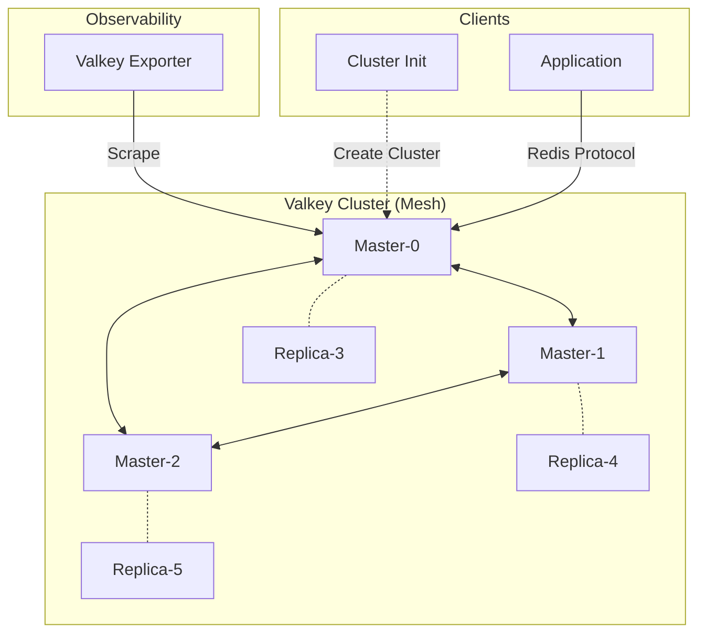
```mermaid
graph TD
    subgraph "Clients"
        App[Application]
        Init[Cluster Init]
    end

    subgraph "Valkey Cluster (Mesh)"
        M1[Master-0] <--> M2[Master-1]
        M2 <--> M3[Master-2]
        M1 <--> M3

        M1 -.- R1[Replica-3]
        M2 -.- R2[Replica-4]
        M3 -.- R3[Replica-5]
    end

    subgraph "Observability"
        Exp[Valkey Exporter]
    end

    App -->|Redis Protocol| M1
    Init -.->|Create Cluster| M1
    Exp -->|Scrape| M1
```

## Context: MinIO Object Storage (minio)

## Overview

A high-performance, S3-compatible object storage server. This deployment acts as the central storage layer for logs (Loki), traces (Tempo), and static assets (CDN), initialized automatically via a sidecar container.

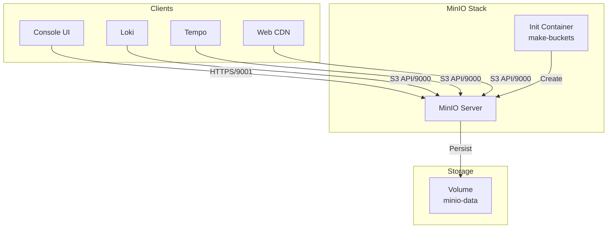
```mermaid
graph TB
    subgraph "Clients"
        Loki
        Tempo
        CDN[Web CDN]
        Browser[Console UI]
    end

    subgraph "MinIO Stack"
        M[MinIO Server]
        Init[Init Container<br/>make-buckets]
    end

    subgraph "Storage"
        Vol[Volume<br/>minio-data]
    end

    Browser -->|HTTPS/9001| M
    Loki -->|S3 API/9000| M
    Tempo -->|S3 API/9000| M
    CDN -->|S3 API/9000| M

    Init -->|Create| M
    M -->|Persist| Vol
```

## Context: CouchDB Cluster (couchdb)

## Overview

A high-availability **3-node CouchDB Cluster** designed for distributed data storage and fault tolerance. This setup leverages CouchDB's native clustering capabilities, using a dedicated initialization assistant to automate node discovery and cluster creation.

## Context: CouchDB Cluster (couchdb)

## Profile

This stack is **optional** and runs under the `couchdb` profile.

```bash
docker compose --profile couchdb up -d
```

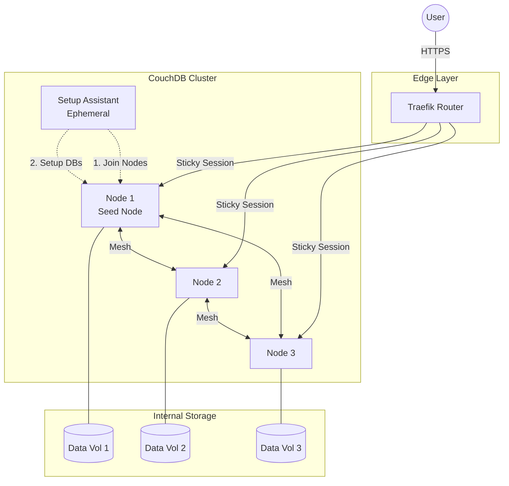
```mermaid
graph TB
    User((User))

    subgraph "Edge Layer"
        GW[Traefik Router]
    end

    subgraph "CouchDB Cluster"
        C1[Node 1<br/>Seed Node]
        C2[Node 2]
        C3[Node 3]
        Init[Setup Assistant<br/>Ephemeral]
    end

    subgraph "Internal Storage"
        V1[(Data Vol 1)]
        V2[(Data Vol 2)]
        V3[(Data Vol 3)]
    end

    User -->|HTTPS| GW
    GW -->|Sticky Session| C1
    GW -->|Sticky Session| C2
    GW -->|Sticky Session| C3

    Init -.->|1. Join Nodes| C1
    Init -.->|2. Setup DBs| C1

    C1 <-->|Mesh| C2
    C1 <-->|Mesh| C3
    C2 <-->|Mesh| C3

    C1 --- V1
    C2 --- V2
    C3 --- V3
```

## Context: OpenSearch Cluster (opensearch)

## Overview

A scalable search and analytics suite derived from Elasticsearch. This deployment is configured as a **Single Node** cluster by default for development/testing, but includes configuration for a robust **3-Node High Availability Cluster**.

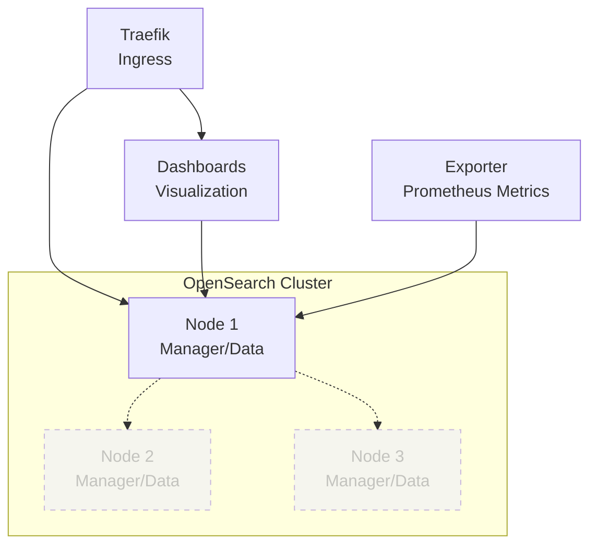
```mermaid
graph TB
    subgraph "OpenSearch Cluster"
        N1[Node 1<br/>Manager/Data]
        N2[Node 2<br/>Manager/Data]:::inactive
        N3[Node 3<br/>Manager/Data]:::inactive
    end

    D[Dashboards<br/>Visualization]
    E[Exporter<br/>Prometheus Metrics]
    T[Traefik<br/>Ingress]

    T --> D
    T --> N1
    D --> N1
    E --> N1
    N1 -.-> N2
    N1 -.-> N3

    classDef inactive stroke-dasharray: 5 5,opacity:0.5;
```

## Context: PostgreSQL HA Cluster (postgresql-cluster)

## Overview

A robust **High Availability (HA) PostgreSQL Cluster** designed for mission-critical data. It utilizes **Patroni** for automated failover, **etcd** as the distributed consensus store, and **HAProxy** for intelligent read/write routing.

```mermaid
graph TB
    subgraph "Clients"
        App[Application]
        Init[Init Service]
    end

    subgraph "Routing Layer"
        LB[HAProxy<br/>Write: 5432 / Read: 5433]
    end

    subgraph "Data Layer (Patroni Cluster)"
        P1[PG-0<br/>(Leader?)]
        P2[PG-1<br/>(Replica?)]
        P3[PG-2<br/>(Replica?)]
    end

    subgraph "Consensus (DCS)"
        E1[etcd-1]
        E2[etcd-2]
        E3[etcd-3]
    end

    App --> LB
    Init --> LB

    LB -->|Write| P1
    LB -->|Read Round-Robin| P2
    LB -->|Read Round-Robin| P3

    P1 <--> E1
    P1 <--> E2
    P1 <--> E3
    P2 <--> E1
    P3 <--> E1

    P1 -.->|Replication| P2
    P1 -.->|Replication| P3
```

## Context: Workflow (07-workflow) (07-workflow)

## Overview

Workflow orchestration tools for automation and data pipelines. **n8n** is part of the core stack, while **Airflow** is available via profiles for more advanced scheduling.

## Context: n8n (Workflow Automation) (n8n)

## Overview

**n8n** is an extendable workflow automation tool that enables you to connect anything to everything via its node-based interface. This deployment is configured in **Queue Mode** (Distributed Architecture) to handle high-volume workloads by separating the Editor/Webhook handling from the actual execution processing using Workers.

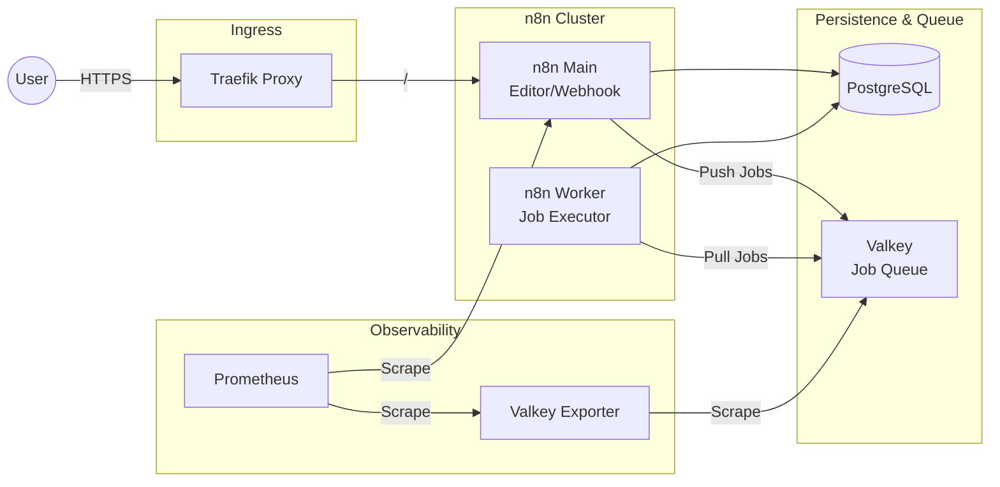
```mermaid
graph LR
    subgraph "Ingress"
        GW[Traefik Proxy]
    end

    subgraph "n8n Cluster"
        N[n8n Main<br/>Editor/Webhook]
        W[n8n Worker<br/>Job Executor]
    end

    subgraph "Persistence & Queue"
        PG[(PostgreSQL)]
        V[Valkey<br/>Job Queue]
    end

    subgraph "Observability"
        E[Valkey Exporter]
        P[Prometheus]
    end

    User((User)) -->|HTTPS| GW
    GW -->|/| N

    N -->|Push Jobs| V
    W -->|Pull Jobs| V
    N --> PG
    W --> PG

    E -->|Scrape| V
    P -->|Scrape| E
    P -->|Scrape| N
```

## Context: Apache Airflow (airflow)

## Overview

A platform to programmatically author, schedule, and monitor workflows. This deployment uses the **CeleryExecutor** architecture for distributed task execution, allowing for high availability and scalability.

## Context: Apache Airflow (airflow)

## Profiles

- `airflow`: Base Airflow stack (scheduler, webserver, workers).
- `flower`: Optional Celery monitoring UI.
- `debug`: Optional debug webserver and extra tooling.

```bash
docker compose --profile airflow up -d
docker compose --profile airflow --profile flower up -d
```

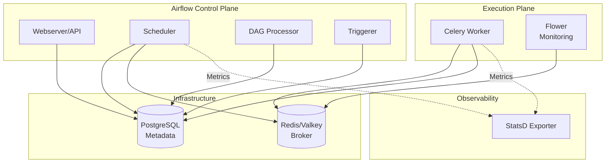
```mermaid
graph TB
    subgraph "Airflow Control Plane"
        W[Webserver/API]
        S[Scheduler]
        DP[DAG Processor]
        T[Triggerer]
    end

    subgraph "Execution Plane"
        WK[Celery Worker]
        FL[Flower<br/>Monitoring]
    end

    subgraph "Infrastructure"
        DB[(PostgreSQL<br/>Metadata)]
        RD[(Redis/Valkey<br/>Broker)]
    end

    subgraph "Observability"
        EXP[StatsD Exporter]
    end

    W --> DB
    S --> DB
    S --> RD
    WK --> RD
    WK --> DB
    DP --> DB
    T --> DB
    FL --> RD

    S -.->|Metrics| EXP
    WK -.->|Metrics| EXP
```

## Context: Security (03-security) (03-security)

## Overview

Secrets and security services. Currently **Vault** is provided as an optional stack to centralize secrets, encryption, and PKI.

## Context: HashiCorp Vault Integration Guide (vault)

## 1. 개요 (Overview)

**HashiCorp Vault**는 현대적인 인프라 환경에서 **Secrets(비밀값)**, **Encryption(암호화)**, **Identity(신원)** 관리를 중앙집중화하는 업계 표준 솔루션입니다.
`hy-home.docker` 환경에서 Vault를 도입함으로써 단순한 서비스별 `.env` 기반의 관리를 넘어, **동적 시크릿(Dynamic Secrets)**, **데이터 암호화(Encryption-as-a-Service)**, **정교한 접근 제어(ACL)** 를 구현할 수 있습니다.

### 1.1 Profile

Vault is **optional** and runs under the `vault` profile.

```bash
docker compose --profile vault up -d vault
```

---

## Context: HashiCorp Vault Integration Guide (vault)

## 3. 아키텍처 설계 (Architecture Design)

### 3.1 배포 모델

- **Storage Backend**: Raft (Integrated Storage) - 별도의 Consul 없이 Vault 자체적으로 고가용성 클러스터링 지원.
- **Network**: `infra_net` (172.19.0.0/16) 내부에서 동작하며, 외부 노출은 Traefik을 통해 제어.
- **URL**: `vault.${DEFAULT_URL}` (예: `vault.127.0.0.1.nip.io`)

### 3.2 연동 흐름 (Workflow)

```mermaid
graph TD
    Client[Client / App] -->|1. Auth (AppRole/K8s)| V[Vault]
    V -->|2. Token Issue| Client
    Client -->|3. Request Secret| V
    V -->|4. Generate Dynamic Creds| DB[PostgreSQL / MongoDB]
    DB -->|5. Return Creds| V
    V -->|6. Return Creds| Client
    Client -->|7. Access DB| DB
```

---

## Context: Tooling (09-tooling) (09-tooling)

## Overview

DevOps and tooling services for infrastructure management and code quality. Terrakube and SonarQube are optional profiles. A standalone Terraform CLI container is provided for local runs.

## Context: SonarQube (sonarqube)

## Overview

**SonarQube** is a continuous code quality inspection platform that performs automatic reviews with static analysis of code to detect bugs, code smells, and security vulnerabilities. It supports 25+ programming languages.

## Context: SonarQube (sonarqube)

## Profile

This stack is **optional** and runs under the `sonarqube` profile.

```bash
docker compose --profile sonarqube up -d sonarqube
```

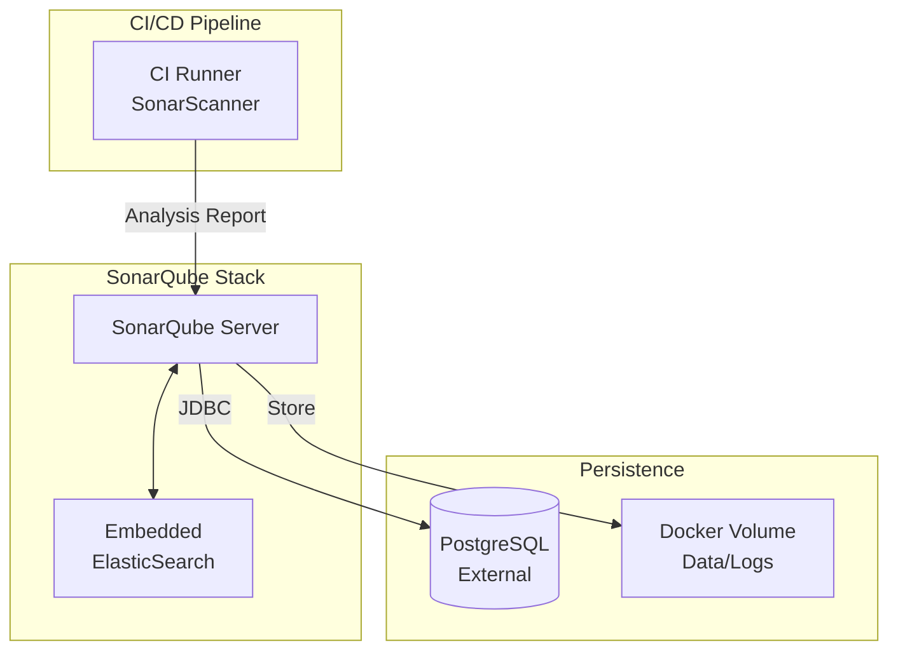
```mermaid
graph TB
    subgraph "CI/CD Pipeline"
        Runner[CI Runner<br/>SonarScanner]
    end

    subgraph "SonarQube Stack"
        Server[SonarQube Server]
        ES[Embedded<br/>ElasticSearch]
    end

    subgraph "Persistence"
        DB[(PostgreSQL<br/>External)]
        Vol[Docker Volume<br/>Data/Logs]
    end

    Runner -->|Analysis Report| Server
    Server <--> ES
    Server -->|JDBC| DB
    Server -->|Store| Vol
```

## Context: Terrakube (terrakube)

## Overview

**Terrakube** is an open-source Infrastructure as Code (IaC) management platform that serves as an alternative to Terraform Cloud/Enterprise. It orchestrates Terraform runs (Plan/Apply) and manages state files securely.

## Context: Terrakube (terrakube)

## Profile

This stack is **optional** and runs under the `terrakube` profile.

```bash
docker compose --profile terrakube up -d
```

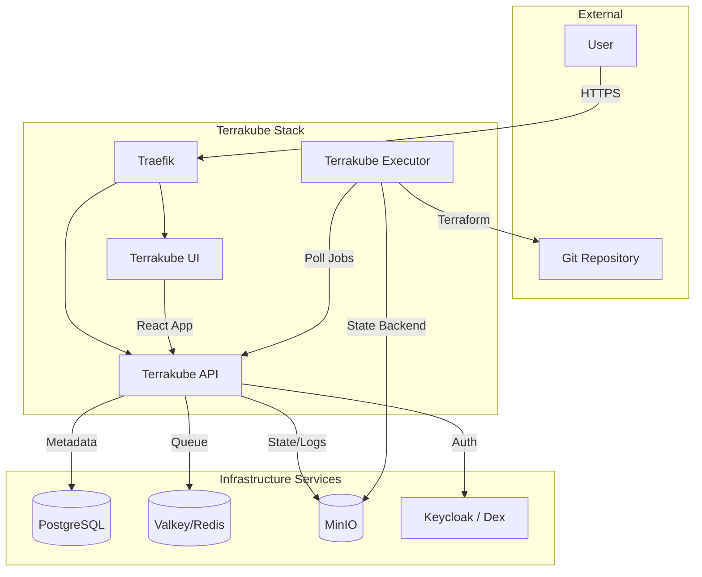
```mermaid
graph TB
    subgraph "External"
        User[User]
        Repo[Git Repository]
    end

    subgraph "Terrakube Stack"
        GW[Traefik]
        UI[Terrakube UI]
        API[Terrakube API]
        Exec[Terrakube Executor]
    end

    subgraph "Infrastructure Services"
        DB[(PostgreSQL)]
        Cache[(Valkey/Redis)]
        S3[(MinIO)]
        Dex[Keycloak / Dex]
    end

    User -->|HTTPS| GW
    GW --> UI
    GW --> API

    UI -->|React App| API
    API -->|Auth| Dex
    API -->|State/Logs| S3
    API -->|Metadata| DB
    API -->|Queue| Cache

    Exec -->|Poll Jobs| API
    Exec -->|Terraform| Repo
    Exec -->|State Backend| S3
```

## Context: Auth (02-auth) (02-auth)

## Overview

Authentication and SSO layer for the platform. **Keycloak** provides IAM, while **OAuth2 Proxy** fronts internal services with ForwardAuth for Traefik/Nginx.

## Context: OAuth2 Proxy (SSO) (oauth2-proxy)

## Overview

A flexible authentication proxy that acts as the **Global SSO (Single Sign-On)** provider for the infrastructure. It authenticates users against an external Identity Provider (Keycloak, Google, GitHub) and protects downstream services via Traefik Middleware.

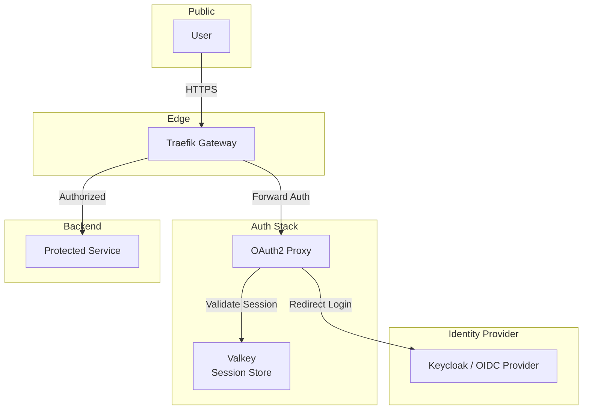
```mermaid
graph TB
    subgraph "Public"
        User[User]
    end

    subgraph "Edge"
        Traefik[Traefik Gateway]
    end

    subgraph "Auth Stack"
        Proxy[OAuth2 Proxy]
        V[Valkey<br/>Session Store]
    end

    subgraph "Backend"
        App[Protected Service]
    end

    subgraph "Identity Provider"
        KC[Keycloak / OIDC Provider]
    end

    User -->|HTTPS| Traefik

    Traefik -->|Forward Auth| Proxy
    Proxy -->|Validate Session| V
    Proxy -->|Redirect Login| KC

    Traefik -->|Authorized| App
```

## Context: Keycloak IAM (keycloak)

## Overview

An open-source **Identity and Access Management (IAM)** solution providing SSO (Single Sign-On), Identity Brokering, and User Federation. This deployment is configured for **Production-Grade** capabilities (PostgreSQL backend) running in development mode for easier configuration updates.

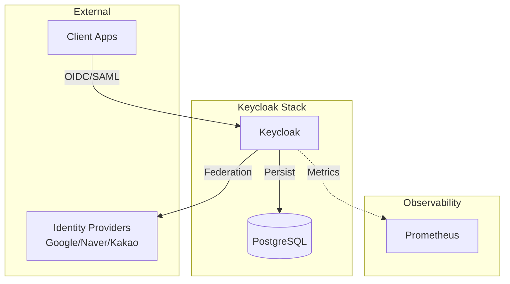
```mermaid
graph TB
    subgraph "External"
        Client[Client Apps]
        IdP[Identity Providers<br/>Google/Naver/Kakao]
    end

    subgraph "Keycloak Stack"
        KC[Keycloak]
        DB[(PostgreSQL)]
    end

    Client -->|OIDC/SAML| KC
    KC -->|Federation| IdP
    KC -->|Persist| DB

    subgraph "Observability"
        PROM[Prometheus]
    end

    KC -.->|Metrics| PROM
```

## Context: Communication (10-communication) (10-communication)

## Overview

Communication-related services. Currently this directory hosts **MailHog** for development/testing and an inactive Stalwart blueprint.

## Context: Mail Server Infrastructure (mail)

## Overview

This directory contains configurations for mail services. Currently, **MailHog** is the active service used for development and testing. A configuration for **Stalwart Mail Server** (an all-in-one production solution) is also present but currently inactive.

## Context: AI (08-ai) (08-ai)

## Overview

Local AI/LLM services. The stack is **optional** and enabled via the `ollama` profile. It provides model inference with **Ollama** and a web UI via **Open WebUI**.

## Context: Ollama & Open WebUI (open-webui)

## Overview

A private, local **LLM AI Stack** capable of running large language models like Llama 3, Mistral, and Gemma offline. It includes **Open WebUI** for a ChatGPT-like experience and **RAG (Retrieval-Augmented Generation)** capabilities using Qdrant as the vector store.

## Context: Ollama & Open WebUI (open-webui)

## Profile

This stack is **optional** and runs under the `ollama` profile.

```bash
docker compose --profile ollama up -d ollama open-webui
```

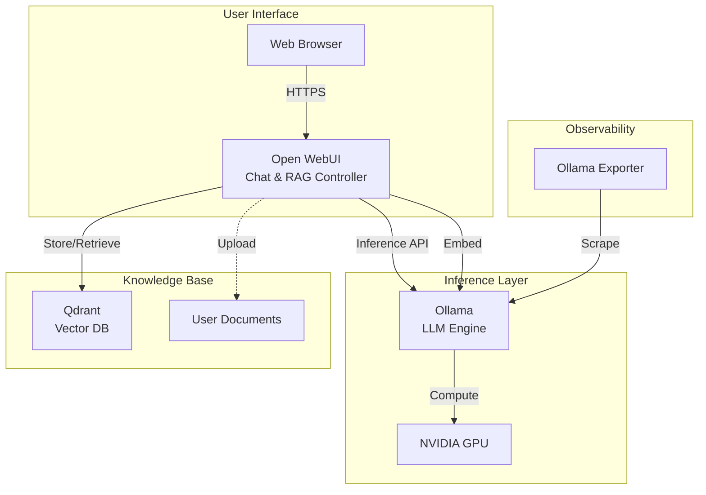
```mermaid
graph TB
    subgraph "User Interface"
        Browser[Web Browser]
        UI[Open WebUI<br/>Chat & RAG Controller]
    end

    subgraph "Inference Layer"
        Ollama[Ollama<br/>LLM Engine]
        GPU[NVIDIA GPU]
    end

    subgraph "Knowledge Base"
        Qdrant[Qdrant<br/>Vector DB]
        Docs[User Documents]
    end

    subgraph "Observability"
        Exp[Ollama Exporter]
    end

    Browser -->|HTTPS| UI
    UI -->|Inference API| Ollama
    Ollama -->|Compute| GPU

    UI -->|Embed| Ollama
    UI -->|Store/Retrieve| Qdrant
    UI -.->|Upload| Docs

    Exp -->|Scrape| Ollama
```

## Context: Ollama & Open WebUI (ollama)

## Overview

A private, local **LLM AI Stack** capable of running large language models like Llama 3, Mistral, and Gemma offline. It includes **Open WebUI** for a ChatGPT-like experience and **RAG (Retrieval-Augmented Generation)** capabilities using Qdrant as the vector store.

## Context: Ollama & Open WebUI (ollama)

## Profile

This stack is **optional** and runs under the `ollama` profile.

```bash
docker compose --profile ollama up -d ollama open-webui
```

```mermaid
graph TB
    subgraph "User Interface"
        Browser[Web Browser]
        UI[Open WebUI<br/>Chat & RAG Controller]
    end

    subgraph "Inference Layer"
        Ollama[Ollama<br/>LLM Engine]
        GPU[NVIDIA GPU]
    end

    subgraph "Knowledge Base"
        Qdrant[Qdrant<br/>Vector DB]
        Docs[User Documents]
    end

    subgraph "Observability"
        Exp[Ollama Exporter]
    end

    Browser -->|HTTPS| UI
    UI -->|Inference API| Ollama
    Ollama -->|Compute| GPU

    UI -->|Embed| Ollama
    UI -->|Store/Retrieve| Qdrant
    UI -.->|Upload| Docs

    Exp -->|Scrape| Ollama
```
