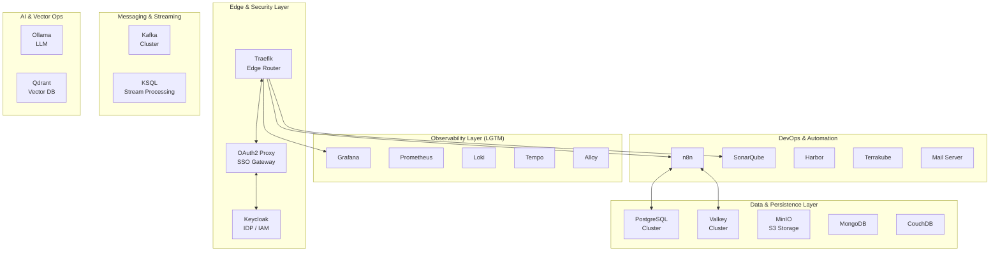

# System Architecture

## Overview

The infrastructure is built on a layered architecture pattern, organized into distinct functional layers to ensure scalability, security, and maintainability.

## Architecture Diagram

## Layer Descriptions

### 1. Edge & Security Layer

- **Traefik**: The entry point for all ingress traffic. It handles SSL termination and routing.
- **Keycloak**: The central Identity Provider (IdP) for SSO.
- **OAuth2 Proxy**: Acts as a middleware to protect services that lack native SSO support.

### 2. Observability Layer (LGTM)

- **Loki**: Aggregates logs from all containers.
- **Grafana**: Visualizes metrics, logs, and traces.
- **Tempo**: Handles distributed tracing.
- **Mimir/Prometheus**: Stores time-series metrics.
- **Alloy**: The OpenTelemetry collector agent.

### 3. Data & Persistence Layer

- **PostgreSQL**: Primary relational store, deployed as a HA cluster (Patroni).
- **Valkey**: Primary in-memory cache, replacing Redis.
- **MinIO**: Object storage for backups, artifacts, and large assets.

### 4. Messaging & Streaming

- **Kafka**: Robust event streaming backbone for asynchronous communication.
- **KSQL**: Real-time stream processing.

### 5. AI & Vector Ops

- **Ollama**: Hosting for local Large Language Models.
- **Qdrant**: Vector database for RAG (Retrieval-Augmented Generation) applications.

### 6. DevOps & Automation

- **n8n**: Low-code workflow automation.
- **SonarQube**: Continuous code quality inspection.
- **Harbor**: Private container registry.
- **Terrakube**: Infrastructure as Code management.
