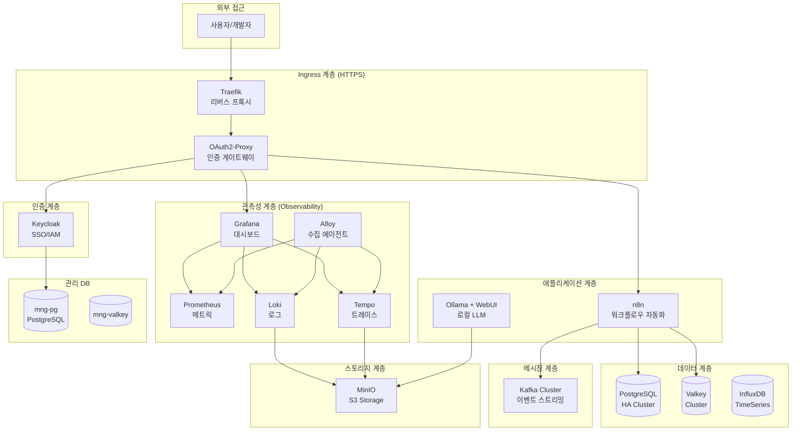

# System Architecture

## Overview

The infrastructure is built on a layered architecture pattern, with ~26 services organized into distinct functional layers.

## Architecture Diagram



## Layer Descriptions

### Ingress Layer (HTTPS)

**Purpose:** External traffic routing and TLS termination

- **Traefik**: Cloud-native reverse proxy handling all incoming HTTPS traffic
  - Automatic service discovery via Docker labels
  - Dynamic routing based on Host rules
  - TLS certificate management
- **OAuth2 Proxy**: Authentication gateway implementing forward auth pattern
  - Protects selective services (Grafana, RedisInsight, Kafka UI)
  - Integrates with Keycloak for SSO
  - Other services (n8n, Ollama, SonarQube) use built-in authentication

### Authentication Layer

**Purpose:** Centralized identity and access management

- **Keycloak**: Enterprise-grade IAM
  - Single Sign-On (SSO) across all services
  - User federation and identity brokering
  - OAuth2/OIDC provider

### Application Layer

**Purpose:** Business logic and user-facing applications

- **n8n**: Workflow automation platform for integrations and data pipelines
- **Ollama**: Local LLM inference with RAG capabilities via Qdrant

### Observability Layer

**Purpose:** Full-stack monitoring (LGTM stack)

- **Prometheus**: Time-series metrics database
- **Loki**: Log aggregation system
- **Tempo**: Distributed tracing backend
- **Grafana**: Unified visualization dashboard
- **Alloy**: OpenTelemetry collector for metrics, logs, and traces

### Data Layer

**Purpose:** Persistent data storage

- **PostgreSQL HA**: High-availability cluster (Patroni + etcd + HAProxy)
  - Automatic failover
  - Read/write separation
- **Valkey Cluster**: Distributed caching and session store (Redis-compatible)
- **InfluxDB**: Time-series data for IoT and metrics

### Messaging Layer

**Purpose:** Event-driven communication

- **Kafka**: Event streaming platform (KRaft mode)
  - Schema Registry for data governance
  - Kafka Connect for integrations

### Storage Layer

**Purpose:** Object storage for unstructured data

- **MinIO**: S3-compatible storage for logs, traces, and ML models

### Management Database Layer

**Purpose:** Infrastructure metadata and administrative data

- **mng-pg**: Dedicated PostgreSQL for Keycloak and system metadata
- **mng-valkey**: Dedicated cache for management services

## Service Dependencies

### Critical Path

```
User → Traefik → OAuth2 Proxy → Keycloak → Application
```

### Data Flow Examples

**Logging Pipeline:**

```
Application → Alloy → Loki → MinIO
                  ↓
              Grafana (Query)
```

**Metrics Pipeline:**

```
Application → Prometheus Exporter → Prometheus → Grafana
```

**Tracing Pipeline:**

```
Application → Alloy → Tempo → MinIO
                          ↓
                     Grafana (Query)
```

## Design Principles

1. **Service Isolation**: Each service runs in its own container with defined resource limits
2. **High Availability**: Critical services (PostgreSQL, Redis) deployed in cluster mode
3. **Security by Default**: All external access via Traefik with TLS, OAuth2 authentication for sensitive UIs
4. **Observability First**: Comprehensive monitoring, logging, and tracing built-in
5. **Infrastructure as Code**: All services defined in `docker-compose.yml` files
