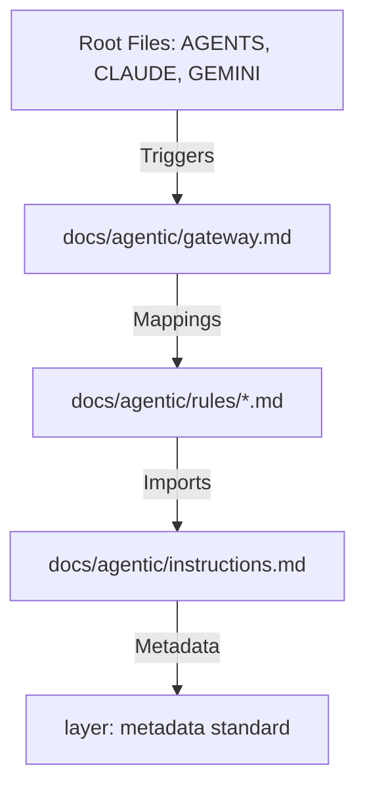

# 2026-03 Agentic Architecture Alignment

**Overview (KR):** 에이전트와 프로젝트 간의 상호작용 레이어를 정의합니다. 루트 지침 파일은 '신호(Signal)' 역할을 수행하고, `docs/agentic/`는 '구현(Implementation)' 역할을 수행합니다.

## Architecture

## Standards

- **Entrypoints**: Root files must remain < 50 lines, pointing to the gateway or rules.
- **Discovery**: Markers must be searchable using static tools (grep/rg).
- **Isolation**: Rules must not cross-pollinate behavioral instructions.

## Related

- [../adr/README.md]
- [../prd/README.md]
