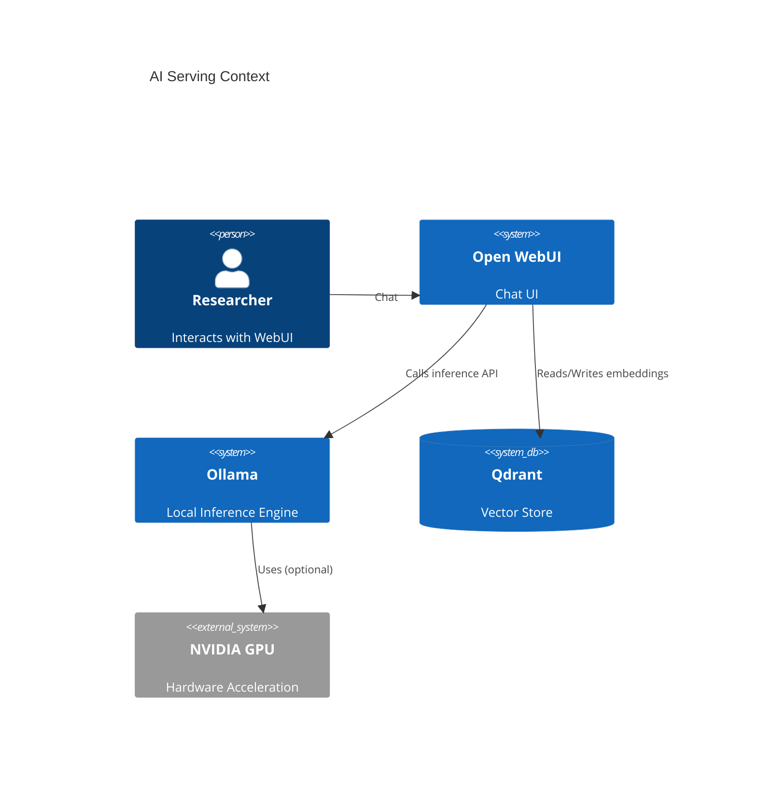

# Local AI Stack Architecture Reference Document (ARD)

- **Status**: Approved
- **Owner**: AI Infrastructure Engineer
- **PRD Reference**: [docs/prd/ai-prd.md](../prd/ai-prd.md)
- **ADR References**: [ADR-0001](../adr/adr-0001-root-orchestration-include.md), [ADR-0007](../adr/adr-0007-mandatory-resource-limits.md), [ADR-0008](../adr/adr-0008-removing-static-docker-ips.md), [ADR-0009](../adr/adr-0009-strict-docker-secrets.md)

---

## 1. Executive Summary

Architectural blueprint for the local AI stack. Uses Ollama for containerized inference, Open WebUI for user interaction, and Qdrant for local vector storage (RAG experiments).

## 2. Business Goals

- Provide a secure, air-gapped AI workspace for private data analysis.
- Standardize the inference API surface (OpenAI compatibility).
- Optimize local GPU utilization across multiple experimental models.

## 3. System Overview & Context

## 4. Architecture & Tech Stack Decisions (Checklist)

### 4.1 Component Architecture

- **Engine**: Ollama container with host-level persistence for models.
- **UI**: Open WebUI container pointing to the internal Ollama endpoint.
- **Vector Store**: Qdrant for local vector search (optional, enabled with `ai` profile).

### 4.2 Technology Stack

- **Core Engine**: Ollama (official Docker image)
- **Acceleration**: NVIDIA Container Toolkit (optional for GPU passthrough)
- **Storage**: Host-mapped volumes under `${DEFAULT_AI_MODEL_DIR}` and `${DEFAULT_DATA_DIR}`

## 5. Data Architecture

- **Model Persistence**: Ollama models are stored under `${DEFAULT_AI_MODEL_DIR}/ollama`.
- **Telemetry**: Inference logs are tagged with `hy-home.tier=ai` and pushed to Loki.

## 6. Security & Compliance

- **Network Boundary**: Services run inside `infra_net`.
- **Data Privacy**: 100% of data remains on the local host with zero telemetry to external model providers.

## 7. Infrastructure & Deployment

- **Profile**: Managed under the `ai` Docker Compose profile.
- **Dependency**: GPU passthrough requires NVIDIA Container Toolkit on the host.

## 8. Non-Functional Requirements (NFRs)

- **Resource Bounds**: AI services must declare CPU/memory bounds through shared templates.
- **Portability**: Internal connectivity must rely on Docker DNS (no static IP assumptions).

## 9. Architectural Principles, Constraints & Trade-offs

- **Constraints**: Limited by available VRAM on the host GPU.
- **What NOT to do**: Assume the UI is protected by SSO unless middleware is explicitly configured.
- **Trade-offs**: Ollama is chosen for containerized simplicity over heavier serving stacks.
