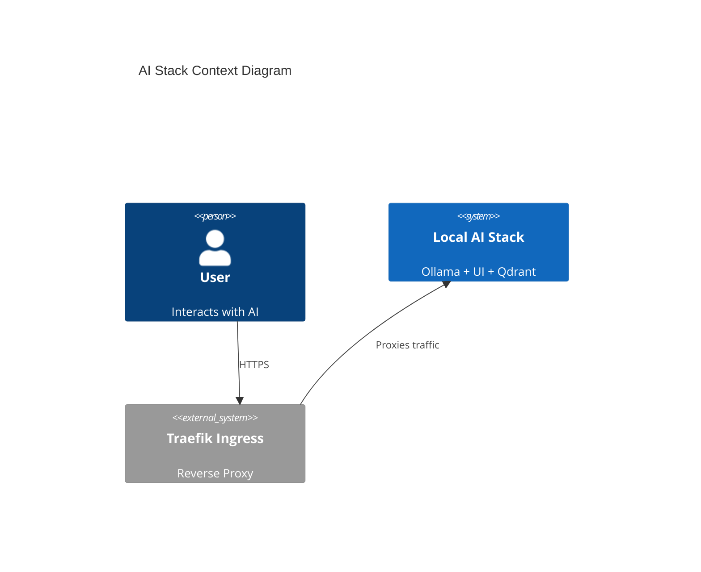
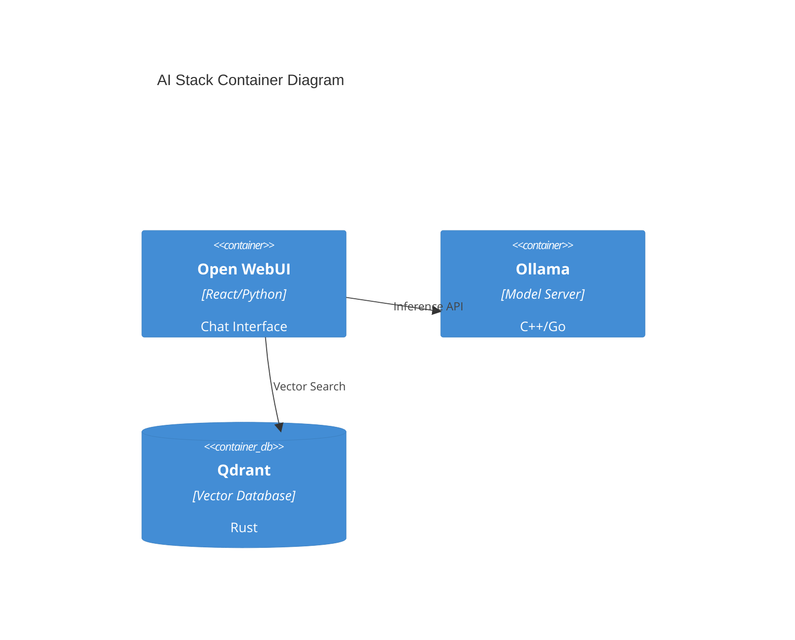

# [ARD-AI-01] Local AI Stack Architecture Reference

_Target Directory: `docs/ard/ai-ard.md`_

---

## 1. Executive Summary

This document defines the architecture for local AI inference and RAG capabilities within the Hy-Home infrastructure. It utilizes Ollama for model serving, Open WebUI for the user interface, and Qdrant for vector storage.

## 2. Business Goals

- **Privacy First**: All model inference and document embeddings remain strictly local.
- **Ease of Use**: Unified chat interface with RAG capabilities for local project documentation.
- **Resource Efficiency**: Optimized GPU utilization for inference on consumer hardware.

## 3. System Overview & Context

## 4. Architecture & Tech Stack Decisions

### 4.1 Component Architecture

### 4.2 Technology Stack

- **Server**: Ollama (supports Llama3, Mixtral, etc.) with Docker GPU Passthrough.
- **Vector DB**: Qdrant (high-performance vector similarity).
- **UI**: Open WebUI (integrated RAG support) via OAuth2 Proxy authentication.

### 4.3 GPU Isolation Strategy

Containerized GPUs are managed via the `nvidia-container-runtime`. Resource reservations in `docker-compose` ensure the primary inference engine (Ollama) has exclusive access to specified VRAM segments.

## 8. Non-Functional Requirements (NFRs)

- **Latency**: Token generation > 10 tokens/sec on modern GPUs.
- **Privacy**: No external API calls for inference (Zero-Leakage).

## 9. Architectural Principles & Trade-offs

- **GPU Passthrough**: Mandatory `nvidia-smi` capability for inference performance.
- **Chosen Path**: Qdrant over integrated PGVector to ensure isolation of vector search workloads.
