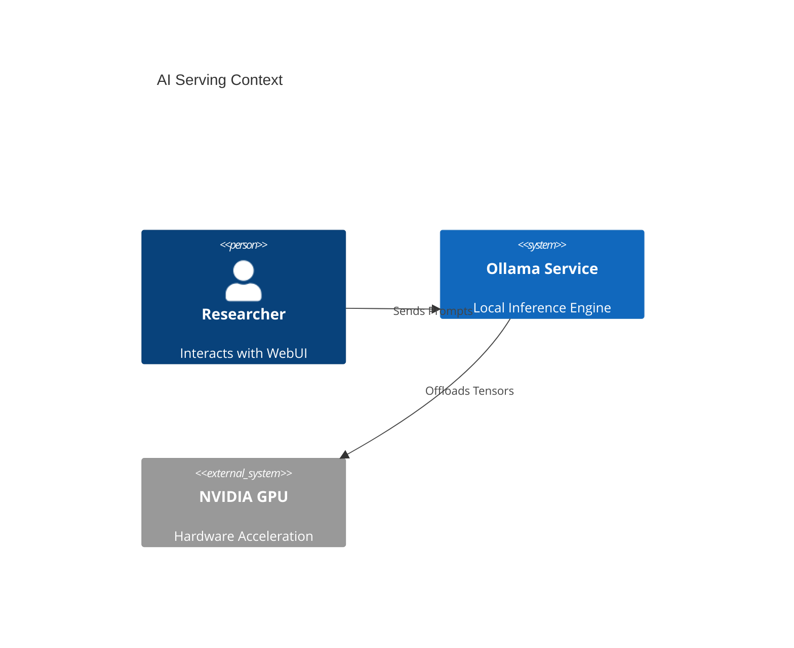

# Architecture Reference Document (ARD)

> **Status**: Approved
> **Owner**: AI Infrastructure Engineer
> **PRD Reference**: [[REQ-PRD-AI-01] Local AI Infrastructure PRD](../prd/ai-prd.md)
> **ADR References**: [ADR-0007](../adr/adr-0007-local-gpu-passthrough.md), [ADR-0005](../adr/adr-0005-sidecar-resource-initialization.md)

---

## 1. Executive Summary

Architectural blueprint for the local AI serving tier of the Hy-Home ecosystem. Leverages Ollama for containerized inference and Open-WebUI for user interaction, with dedicated GPU passthrough hooks for performance-critical LLM workloads.

## 2. Business Goals

- Provide a secure, air-gapped AI workspace for private data analysis.
- Standardize the inference API surface (OpenAI compatibility).
- Optimize local GPU utilization across multiple experimental models.

## 3. System Overview & Context

## 4. Component Architecture & Tech Stack Decisions

### 4.1 Component Architecture

- **Engine**: Ollama containerized with host-level volume mapping for model persistency.
- **Frontend**: Open-WebUI with internal OIDC integration for multi-user safety.

### 4.2 Technology Stack

- **Core Engine**: Ollama (official Docker image)
- **Acceleration**: NVIDIA CUDA / Container Toolkit
- **Storage**: Persistent Docker volumes for `/root/.ollama/models`

## 5. Data Architecture

- **Model Persistence**: Models are stored in local bind paths `${DEFAULT_MODEL_DIR}` to survive container restarts.
- **Telemetry**: Inference logs are tagged with `hy-home.tier=ai` and pushed to Loki.

## 6. Security & Compliance

- **Prominent Guard**: Isolation within `infra_net` to prevent unauthenticated external prompt ingestion.
- **Data Privacy**: 100% of data remains on the local host with zero telemetry to external model providers.

## 7. Infrastructure & Deployment

- **Profile**: Managed under the `ai` Docker Compose profile.
- **Dependency**: Requires `nvidia-docker2` or matching toolkit on the host.

## 8. Non-Functional Requirements (NFRs)

- **Performance**: LLM response latency SHALL be < 200ms per token for models < 7B parameters.
- **Efficiency**: Idle memory footprint for the serving engine MUST remain under 1GB.

## 9. Architectural Principles, Constraints & Trade-offs

- **Constraints**: Limited by available VRAM on the host GPU.
- **What NOT to do**: Use CPU execution for interactive chat workloads.
- **Trade-offs**: Ollama chosen for its ease of containerization over raw vLLM/TGI for local simplicity.
