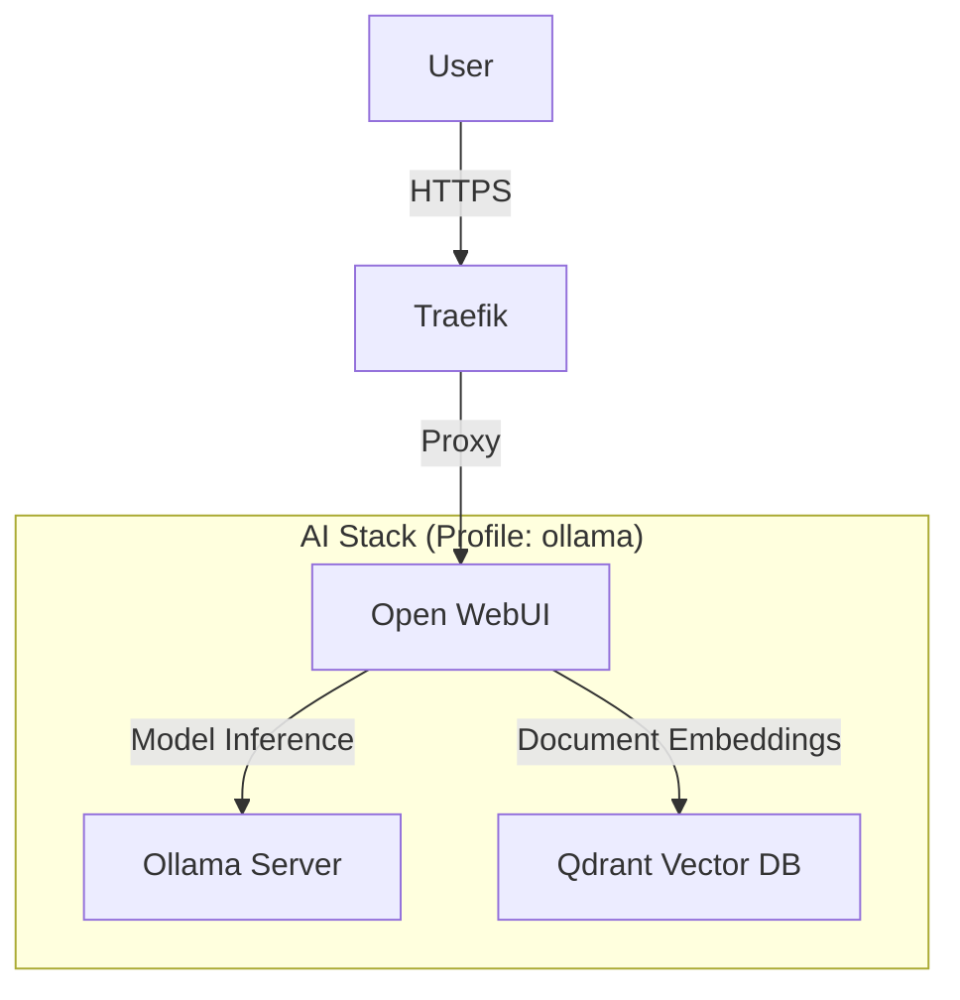

# Local AI Stack Architecture

## Overview

The AI layer allows running models locally via Ollama with full RAG (Retrieval Augmented Generation) capabilities provided by Open WebUI and Qdrant.



## Operations

### 1. Model Setup (Required First Time)

You must download models before chatting.

**Via CLI**:

```bash
# Chat Model
docker exec -it ollama ollama pull llama3

# Embedding Model (Required for RAG)
docker exec -it ollama ollama pull qwen3-embedding:0.6b
```

**Via Web UI**:
Go to **Admin Panel > Settings > Models** and pull `llama3` and associated embedding models from the interface.

### 2. GPU Verification

To confirm Ollama is using your GPU:

```bash
docker exec -it ollama nvidia-smi
```

## Troubleshooting

### "GPU Not Found"

- Ensure `nvidia-smi` works on the host.
- Verify `deploy.resources.reservations.devices` is enabled in `docker-compose.yml`.

### "RAG Not Working"

- Check if `qwen3-embedding:0.6b` (or your configured `RAG_EMBEDDING_MODEL`) is actually pulled inside Ollama.
- Verify connectivity to **Qdrant** (`http://qdrant:6333` from WebUI container logs).
