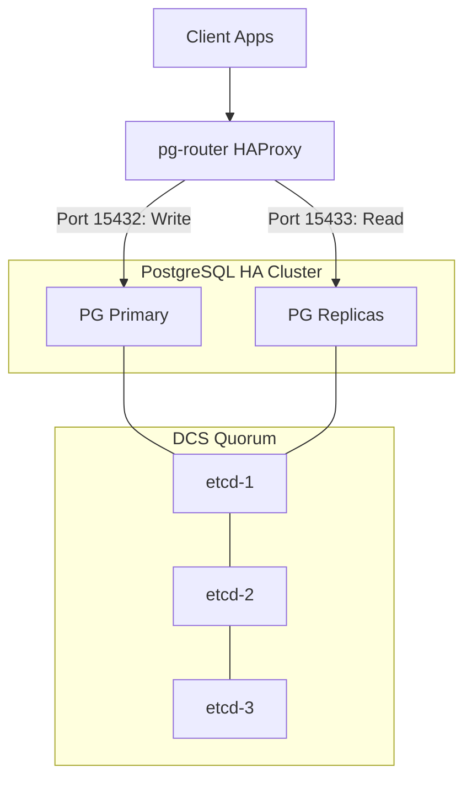

# [ARD-DATA-01] Data Platform Architecture

## 1. Overview

This platform provides a highly available, self-healing PostgreSQL environment using the Zalando Spilo image (Patroni + PostgreSQL 17), backed by an etcd Distributed Configuration Store (DCS).

## 2. Component Diagram

## 3. Technology Choice: Patroni

- **Choice**: Patroni (Python-based cluster manager).
- **Rationale**: Automates failover, simplifies replication setup, and integrates natively with etcd/Kubernetes environments.

## 4. Availability & Reliability

- **Clustering**: 3-node PostgreSQL cluster with 1 Primary and 2 synchronous/asynchronous standbys.
- **Failover**: Automated master election via Patroni Leader Election in etcd.
- **Routing**: HAProxy dynamically updates backend list based on REST API health checks (`/primary`, `/standby`).

## 5. Persistence Strategy

- **Volumes**: Persistent volumes mounted to `/home/postgres/pgdata`.
- **Backups**: Standard WAL-G or pgBackRest integration patterns (TBD).
