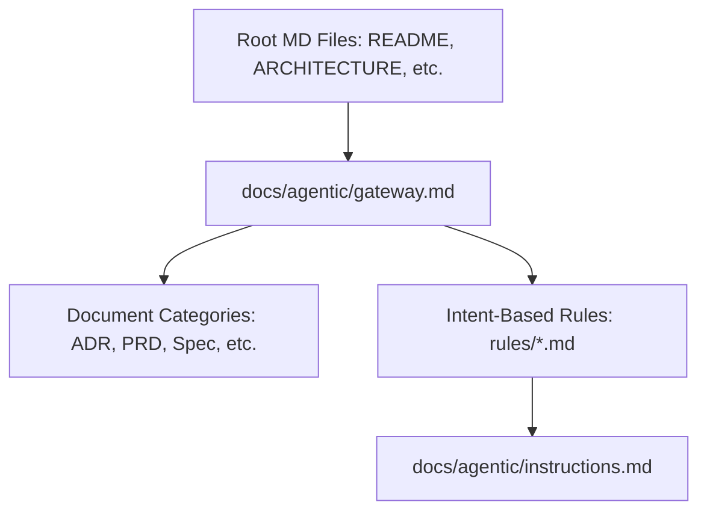

# Documentation and Agent Instruction Architecture Reference

- **Status**: Approved
- **Owner**: buenhyden
- **Scope**: master
- **layer:** architecture
- **PRD Reference**: `[../prd/doc-refactor-prd.md]`
- **ADR References**: `[../adr/0001-lazy-loading-protocol.md]`

**Overview (KR):** 본 문서는 `hy-home.docker` 저장소의 문서 체계와 AI Agent 지침의 구조적 설계를 정의합니다. 평면적인 문서 분류체계와 지능적인 지침 로딩 메커니즘을 통해 유지보수성과 효율성을 극대화합니다.

## Summary

The documentation system is organized into a flat taxonomy where each category has its own subdirectory under `docs/`. AI agent instructions are decoupled into a central gateway and specialized rule files to enable lazy loading.

## Boundaries

- **Owns**: Documentation organization, YAML metadata standards, agent instruction flow, discovery protocol.
- **Consumes**: Markdown content, agent provider capabilities.
- **Does Not Own**: Infrastructure code in `infra/`, business logic in companion projects.

## Ownership

- **Primary owner**: buenhyden
- **Primary artifacts**: `docs/`, `docs/agentic/`, `.agent/`

## Component Architecture

## Source-of-Truth Map

| Scope   | Canonical Document                            | Role                             |
| ------- | --------------------------------------------- | -------------------------------- |
| master  | `docs/ard/doc-refactor-ard.md`                | Top-level architecture authority |
| agentic | `docs/agentic/gateway.md`                     | Agent entrypoint                 |
| policy  | `docs/agentic/instructions.md`                | Core behavioral behavioral rules |
