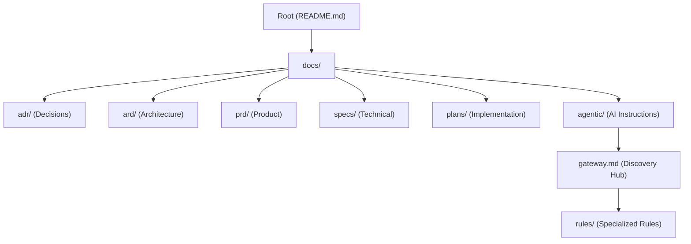

# Documentation and Agent Instruction System Architecture Reference Document (ARD)

- **Status**: Approved
- **Owner**: buenhyden
- **Scope**: master
- **layer:** architecture
- **PRD Reference**: `../prd/2026-03-16-documentation-standardization-prd.md`

**Overview (KR):** 이 문서는 저장소의 기술 문서 시스템과 AI 에이전트 지침의 계층화된 구조와 관리 원칙을 정의합니다. 특히 에이전트의 상황별 지침 로딩(Lazy Loading) 및 성능 최적화를 위한 아키텍처를 다룹니다.

## Summary

This ARD defines the structural and operational architecture for all documentation in the `hy-home.docker` repository, including the discovery mechanism for AI agent instructions.

## Boundaries

- **Owns**: Documentation taxonomy, template compliance, agent discovery gateway.
- **Consumes**: Markdown templates, repository metadata.
- **Does Not Own**: Actual service implementation logic, CI/CD runner configurations.

## Ownership

- **Primary owner**: buenhyden
- **Primary artifacts**: `docs/`, `templates/`, `docs/agentic/`
- **Operational evidence**: `docs/operations/incidents/`, `docs/runbooks/`

## Related

- `../prd/2026-03-16-documentation-standardization-prd.md`
- `../specs/2026-03-16-documentation-refactor-spec.md`
- `../plan/2026-03-16-documentation-refactor-plan.md`
- `../adr/0026-documentation-structure-and-lazy-loading.md`

## 3. System Overview & Context

## 4. Architecture & Tech Stack Decisions

### 4.1 Component Architecture

- **Gateway Pattern**: Agents MUST load `gateway.md` at session start.
- **Lazy Loading**: Specific rules are only loaded via intent markers (`[LOAD:RULES:...]`).
- **Layer Metadata**: Mandatory YAML frontmatter for all markdown files to enable classification.

### 4.2 Technology Stack

- **Format**: Markdown (GFM).
- **Metadata**: YAML Frontmatter.
- **Diagrams**: Mermaid.js.

## 9. Architectural Principles, Constraints & Trade-offs

- **Principle**: Documentation should be close to code but categorized by intent.
- **Constraint**: Total cumulative agent instructions must stay under the token threshold (15k tokens) for optimal performance.
- **Trade-off**: Modularizing instructions adds a small discovery overhead but significantly improves response quality and speed.
