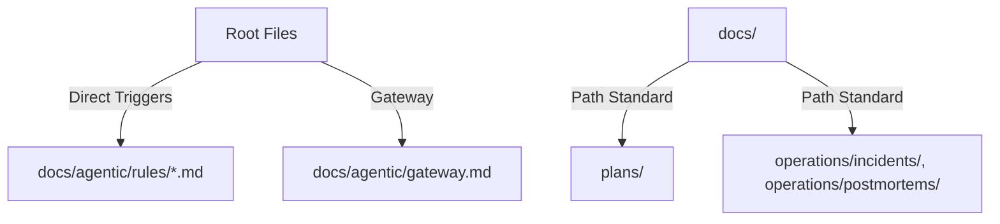

# ARD: Final Path and Agentic Architecture Alignment

**Overview (KR):** 최종 문서 계층 구조와 에이전트 상호작용 레이어를 확정합니다.

## Architecture

## Standards

- **Plurality**: Plans are stored in `plans/`.
- **Metadata**: `layer` key is mandatory in frontmatter.
- **Autonomy**: High-trust model for agent skill usage.
