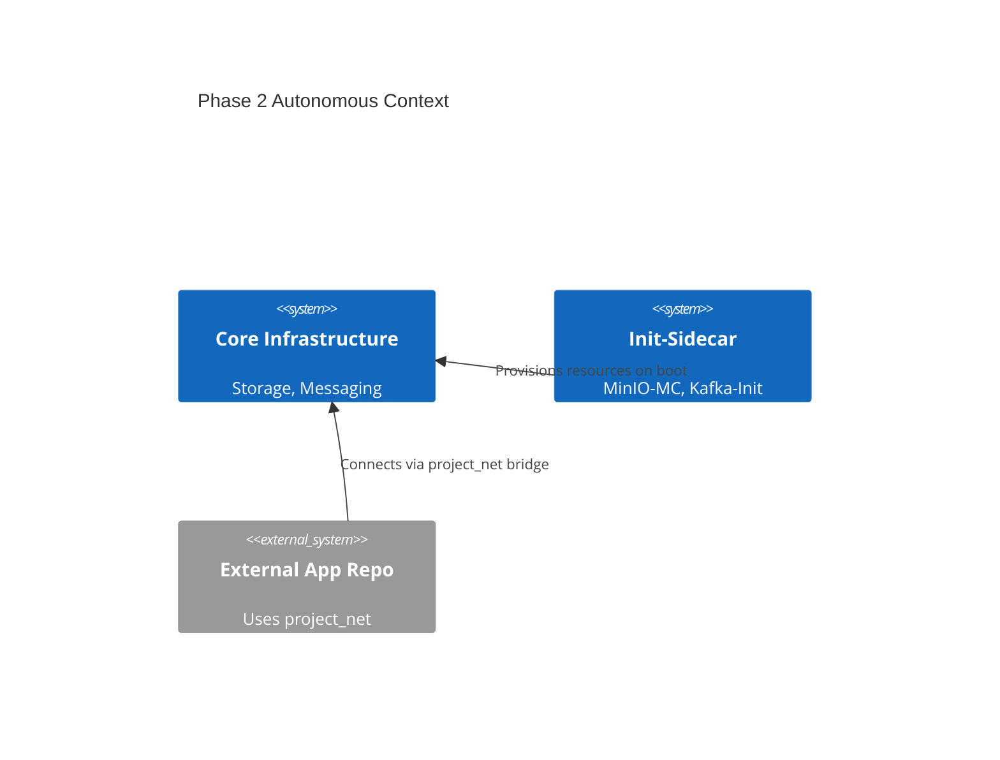

# Architecture Reference Document (ARD)

> **Status**: Approved
> **Owner**: Platform Architect
> **PRD Reference**: [[REQ-PRD-AUTO-01] Infrastructure Automation PRD](../prd/infra-automation-prd.md)
> **ADR References**: [ADR-0005](../adr/adr-0005-sidecar-resource-initialization.md)

---

## 1. Executive Summary

Expansion of the infrastructure baseline into an autonomous platform. This architecture implements self-provisioning via Docker sidecars and standardized external networking for seamless cross-repository application integration.

## 2. Business Goals

- Eliminate manual bootstrap effort for stateful services.
- Provide "service-ready" guarantees for application developers.
- Ensure unified networking standards for multi-repository projects.

## 3. System Overview & Context

## 4. Component Architecture & Tech Stack Decisions

### 4.1 Component Architecture

- **Initialization Layer**: Ephemeral containers (`os-init`, `k-init`) that exit with code 0 after task completion.
- **Bridge Network**: `project_net` external bridge serving as the primary integration point for external microservices.

### 4.2 Technology Stack

- **Provisioning Tools**: `mc` (MinIO Client), `psql` (Postgres CLI), custom Shell initialization scripts.
- **Networking**: Docker Bridge Driver (external).

## 5. Data Architecture

- **Schema Provisioning**: Sidecars run idempotent scripts on boot to ensure Day-0 readiness for buckets, topics, and users.
- **Metadata Flow**: Provisioning logs are pushed to Loki for operational auditing.

## 6. Security & Compliance

- **Access Controls**: Provisioning scripts use temporary tokens or dedicated service accounts with restrictive scopes.
- **Auditing**: All provisioning actions MUST generate a `Level=INFO` log event in Loki for compliance tracking.

## 7. Infrastructure & Deployment

- **Lifecycle**: sidecars are managed via Docker Compose `depends_on` with `service_healthy` conditions.
- **Isolation**: Apps on `project_net` cannot see `infra_net` internals unless explicitly aliased.

## 8. Non-Functional Requirements (NFRs)

- **Reliability**: Sidecars MUST handle transient service failures via exponential backoff (Max 5 retries).
- **Latency**: Provisioning SHALL complete within 60 seconds of core service health.
- **Idempotency**: Multiple runs of a sidecar SHALL produce identical system state without errors.

## 9. Architectural Principles, Constraints & Trade-offs

- **What NOT to do**: Use manual host-level shell scripts for resource provisioning.
- **Chosen Path Rationale**: Sidecars ensure consistency within the container lifecycle and require zero host-level dependencies.
- **Known Limitations**: sidecars increase initial cold startup time of the entire stack.
