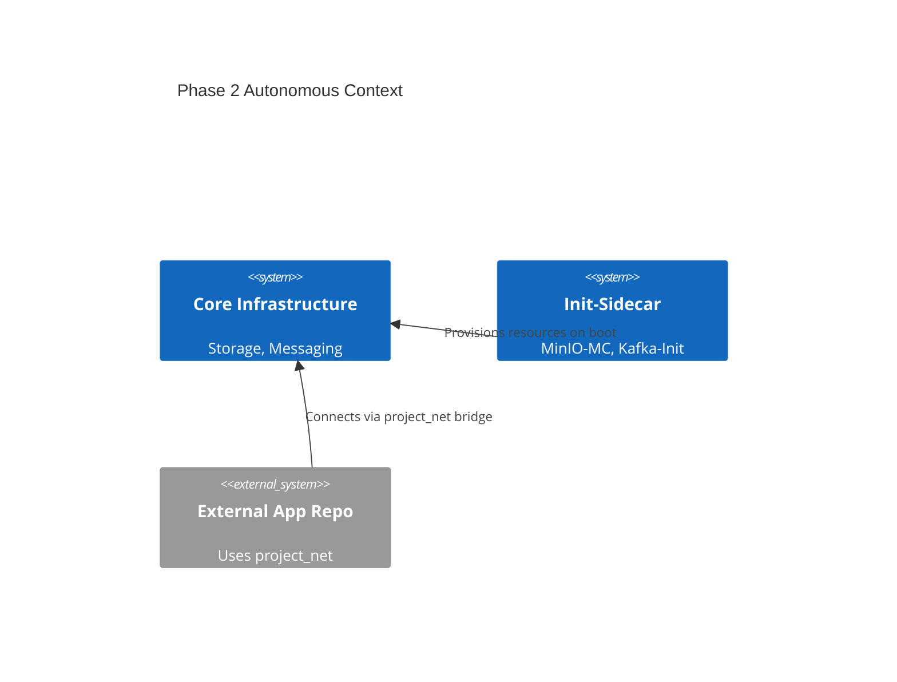

# Phase 2 ARD: Scaling & Autonomous Patterns

_Target Directory: `docs/ard/infra-automation-ard.md`_

- **Status**: Draft
- **Owner**: Platform Architect
- **PRD Reference**: [infra-automation-prd.md](../prd/infra-automation-prd.md)
- **ADR References**: [adr-0005](./adr/adr-0005-sidecar-resource-initialization.md) to [adr-0007](./adr/adr-0007-mandatory-resource-limits.md)

---

## 1. Executive Summary

Expansion of the infrastructure baseline into an autonomous platform. Implements self-provisioning via sidecars and standardized external networking for cross-repository application integration.

## 3. System Overview & Context

## 4. Architecture & Tech Stack

### 4.1 Component Architecture

- **Initialization Layer**: Ephemeral containers that exit after task completion.
- **Bridge Network**: `project_net` external bridge serving as the primary integration point.

## 5. Data Architecture

- **Schema Provisioning**: sidecars run psql/mc scripts to ensure Day-0 readiness.

## 8. Non-Functional Requirements (NFRs)

- **Reliability**: Sidecars MUST handle transient service failures (retries).
- **Isolation**: Apps on `project_net` cannot see `infra_net` internals unless explicitly aliased.

## 9. Architectural Principles & Trade-offs

- **Path Rationale**: Sidecars used instead of manual bootstrap scripts to ensure consistency within the container lifecycle.
