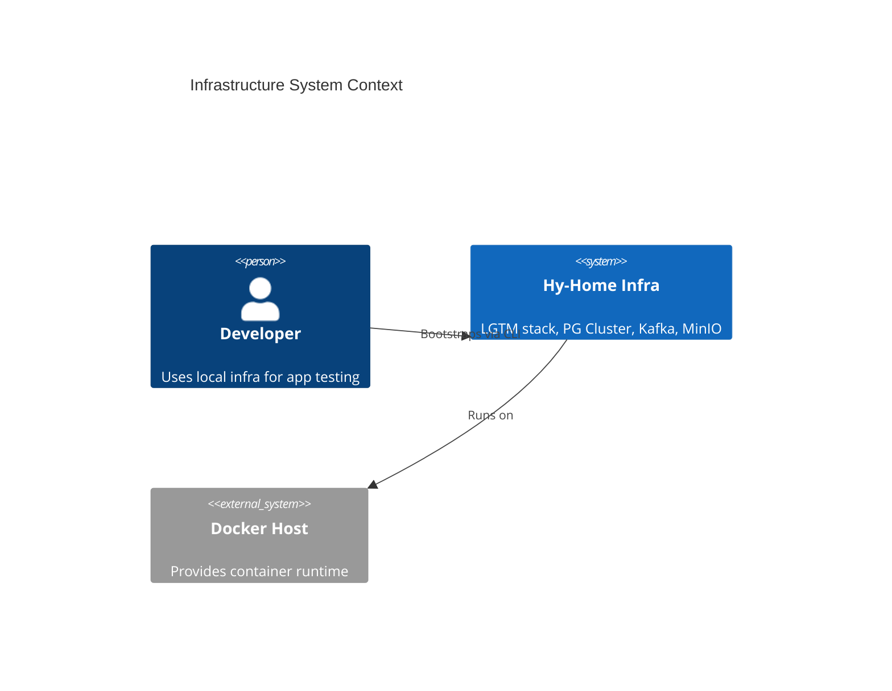
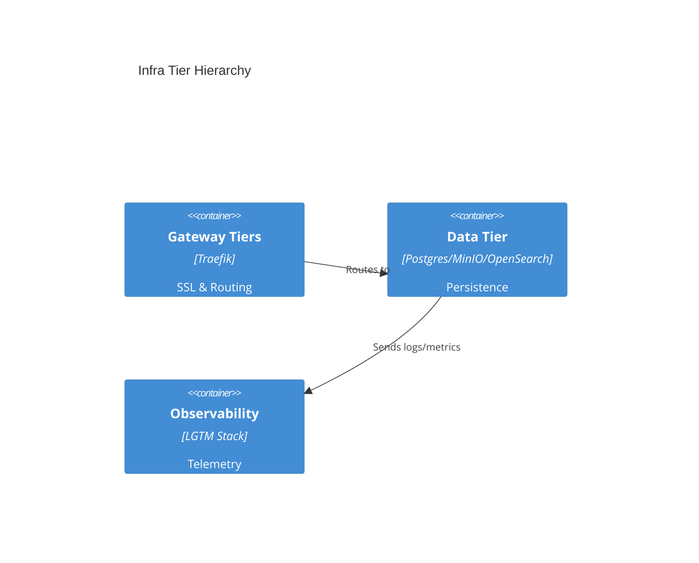

# Infrastructure Baseline Architecture Reference Document (ARD)

- **Status**: Approved
- **Owner**: Platform Architect
- **PRD Reference**: [Infrastructure Baseline PRD](../prd/infra-baseline-prd.md)
- **ADR References**: [ADR-0001](../adr/adr-0001-root-orchestration-include.md), [ADR-0002](../adr/adr-0002-secrets-first-management.md), [ADR-0004](../adr/adr-0004-tiered-directory-structure.md), [ADR-0007](../adr/adr-0007-mandatory-resource-limits.md), [ADR-0008](../adr/adr-0008-removing-static-docker-ips.md), [ADR-0009](../adr/adr-0009-strict-docker-secrets.md)

---

## 1. Executive Summary

A modular service orchestrator utilizing Docker Compose v2 `include` to manage a multi-tier infrastructure stack. This baseline focuses on security consistency, ease of bootstrap, and local environment stability for the Hy-Home ecosystem.

## 2. Business Goals

- Provide a reproducible local sandbox for DevOps pattern testing.
- Minimize "Day-0" installation time for new contributors.
- Enforce production-grade security standards in a local development context.

## 3. System Overview & Context

## 4. Architecture & Tech Stack Decisions (Checklist)

### 4.1 Component Architecture

### 4.2 Technology Stack

- **Orchestration**: Docker Compose v2.20+ (`include` / `extends`)
- **Gateway/Ingress**: Traefik
- **Identity**: Keycloak + OAuth2 Proxy (SSO middleware)
- **Core Data**: PostgreSQL cluster (Spilo/Patroni), Valkey cluster, MinIO (S3), OpenSearch, Qdrant
- **Messaging**: Kafka (KRaft mode) + Schema Registry (Confluent)
- **Init System**: Docker-integrated `init: true` (tini)

## 5. Data Architecture

- **Domain Model**: Tiered service folders (`01-gateway`, `04-data`, etc.)
- **Storage Strategy**: Bind mounts to `${DEFAULT_DATA_DIR}` for persistent data.
- **Data Flow**: Direct container push to Loki for logs; sidecar initialization for schema readiness.

## 6. Security & Compliance

- **Authentication**: Centralized OIDC via Keycloak.
- **Secrets**: File-based secrets in `secrets/**/*.txt` mounted via Docker secrets (`/run/secrets/*`).
- **Hardening**: Global enforcement of `cap_drop: [ALL]` and `no-new-privileges: true`.

## 7. Infrastructure & Deployment

- **Deployment Hub**: Local Linux/macOS host with Docker Engine.
- **Orchestration**: Root `docker-compose.yml` aggregating sub-stacks via `include`.
- **Default Boot**: `.env.example` sets `COMPOSE_PROFILES="core,data,obs"` so `docker compose up -d` starts a standard baseline stack.

## 8. Non-Functional Requirements (NFRs)

- **Availability**: 3-node HA clusters for critical data path (Kafka/Postgres).
- **Performance**: Bootstrap time target is < 10 mins on standard SSD hardware (see PRD metrics).
- **Scalability**: Config inheritance allows adding tiers without modifying root logic.

## 9. Architectural Principles, Constraints & Trade-offs

- **What NOT to do**: Use static IP addresses for inter-service communication.
- **Constraints**: Limited by host RAM (target < 4GB idle footprint).
- **Chosen Path Rationale**: Docker Compose chosen for low overhead and developer familiarity over local K8s.
- **Known Limitations**: Lacks the native service discovery features of a full mesh.
