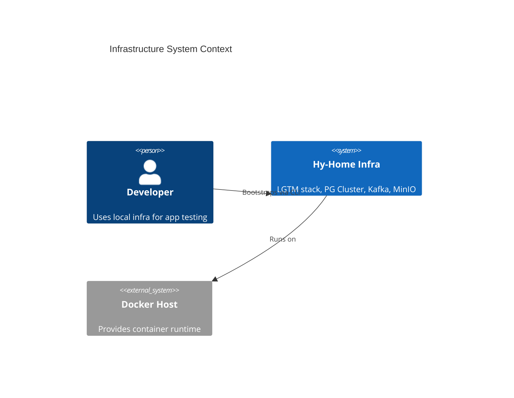
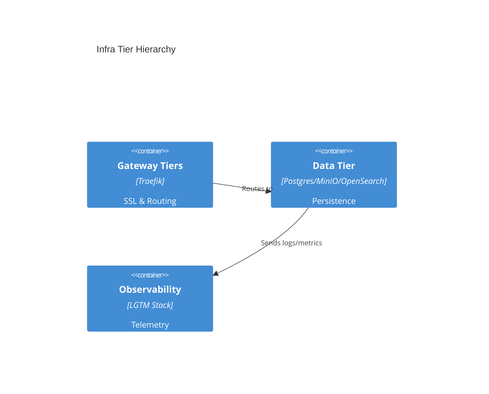

# [ARD-BASE-01] Infrastructure Baseline Reference Document

_Target Directory: `docs/ard/infra-baseline-ard.md`_

- **Status**: Approved
- **Owner**: Platform Architect
- **PRD Reference**: [infra-baseline-prd.md](../prd/infra-baseline-prd.md)
- **ADR References**: [adr-0001](./adr/adr-0001-root-orchestration-include.md) to [adr-0004](./adr/adr-0004-tiered-directory-structure.md)

---

## 1. Executive Summary

A modular service orchestrator utilizing Docker Compose v2 `include` to manage a multi-tier infrastructure stack. Focused on security consistency, ease of bootstrap, and local environment stability.

## 3. System Overview & Context

## 4. Architecture & Tech Stack

### 4.1 Component Architecture

### 4.2 Technology Stack

- **Orchestration**: Docker Compose v2 (`include`)
- **Gateway**: Traefik 3+
- **Data**: PostgreSQL 17 (Patroni), Kafka (KRaft), MinIO

## 5. Data Architecture

- **Storage Strategy**: Bind mounts to `${DEFAULT_DATA_DIR}` for persistence; Docker volumes for internal cache.
- **HA Strategy**: Multi-node clusters for Tier-1 services (PG, Kafka).

## 6. Security & Compliance

- **Authentication**: Managed via Keycloak (Auth Tier).
- **Secrets**: 100% Docker Secrets (`secrets/*.txt`).
- **Hardening**: `cap_drop: [ALL]`, `no-new-privileges: true`.

## 8. Non-Functional Requirements (NFRs)

- **Availability**: Standard HA (3-node clusters) for data.
- **Performance**: Standardized resource limits to prevent host thrashing.

## 9. Architectural Principles & Trade-offs

- **What NOT to do**: Manual port mapping in sub-compose files (Use labels).
- **Trade-offs**: Docker Compose over Kubernetes for lower local overhead.
