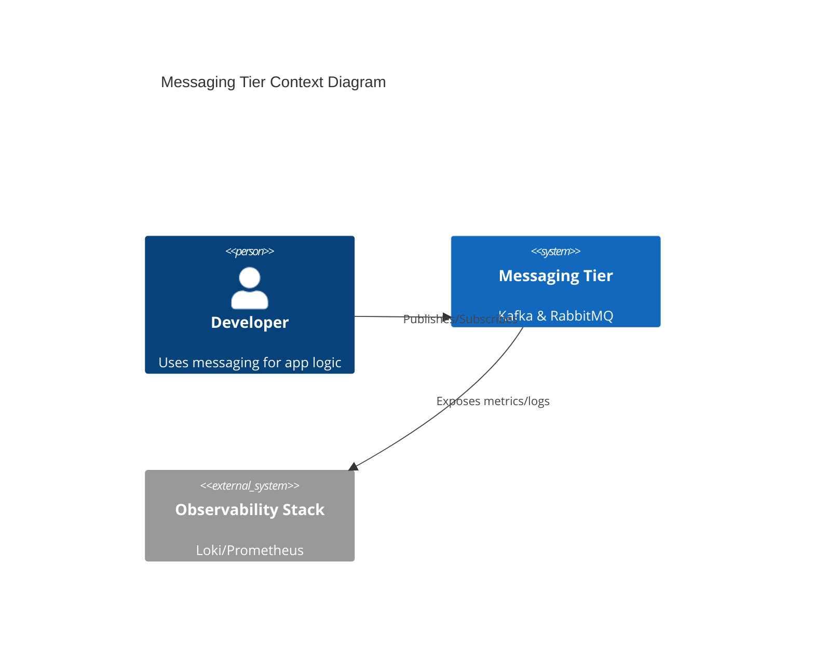
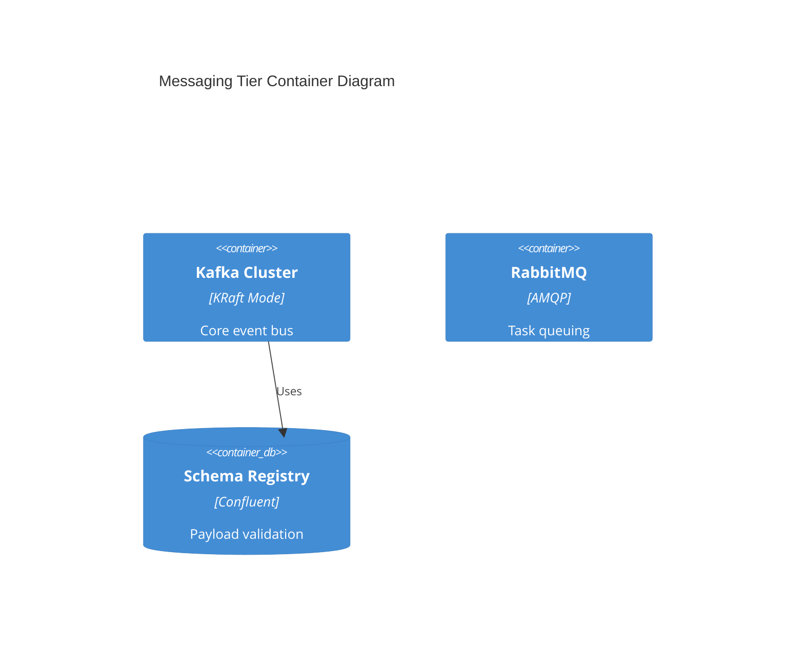

# Messaging Infrastructure Architecture Reference Document (ARD)

_Target Directory: `docs/ard/messaging-ard.md`_

---

## 1. Executive Summary

This document defines the architectural patterns for the Hy-Home messaging tier, providing high-throughput event streaming via Kafka and flexible task queuing via RabbitMQ. It enables decoupled communication between infrastructure and application services.

## 2. Business Goals

- **High Throughput**: Support thousands of events per second for log ingestion and telemetry.
- **Reliability**: Ensure zero data loss for critical state events.
- **Interoperability**: Provide standard AMQP and Kafka interfaces for diverse application stacks.

## 3. System Overview & Context

## 4. Architecture & Tech Stack Decisions

### 4.1 Component Architecture

### 4.2 Technology Stack

- **Streaming**: Kafka 3.x (KRaft mode).
- **Queuing**: RabbitMQ (AMQP 0-9-1).
- **Processing**: ksqlDB for stream-SQL.

## 5. Data Architecture

- **Storage Strategy**: Persistent volumes for Kafka brokers (`/var/lib/kafka/data`).
- **Data Flow**: Async publisher-subscriber model with Schema Registry enforcing Avro/JSON schemas.

## 8. Non-Functional Requirements (NFRs)

- **Availability**: 99.9% (3-node minimum for production-like durability).
- **Latency**: < 10ms for producer acknowledgement.
- **Durability**: `min.insync.replicas=2` enforced via Sidecars (see [automation spec](../../specs/infra/automation/spec.md)).

## 9. Architectural Principles & Trade-offs

- **What NOT to do**: Use RabbitMQ for long-term event retention.
- **Chosen Path**: KRaft over Zookeeper to reduce operational complexity and initialization time.
