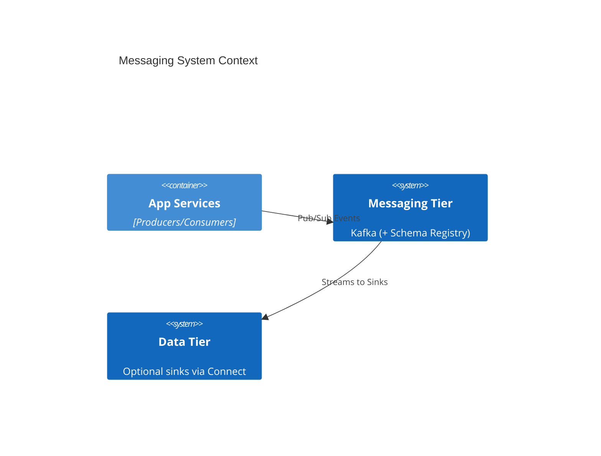

# Messaging & Eventing Architecture Reference Document (ARD)

- **Status**: Approved
- **Owner**: Infrastructure Architect
- **PRD Reference**: [Messaging & Eventing PRD](../prd/messaging-prd.md)
- **ADR References**: [ADR-0005](../adr/adr-0005-sidecar-resource-initialization.md), [ADR-0007](../adr/adr-0007-mandatory-resource-limits.md)

---

## 1. Executive Summary

Blueprint for the decoupled communication backbone of the Hy-Home ecosystem. The current root-managed stack provides high-availability event streaming via a multi-node Kafka cluster (KRaft mode), with Schema Registry and optional integration services (Connect, REST Proxy) for developer ergonomics.

## 2. Business Goals

- Enable reliable asynchronous integration between microservices.
- Ensure zero-data-loss for critical infrastructure events.
- Standardize message formats across heterogeneous service tiers.

## 3. System Overview & Context

## 4. Architecture & Tech Stack Decisions (Checklist)

### 4.1 Component Architecture

- **Kafka Cluster**: 3 brokers in KRaft mode (`kafka-1..3`) for local HA semantics.
- **Contract Guard**: Schema Registry (`schema-registry`) for schema-based contracts (optional per producer/consumer).
- **Integration Layer (Optional)**: Kafka Connect (`kafka-connect`) and Kafka REST Proxy (`kafka-rest-proxy`) exposed via Traefik hostnames for local tooling.
- **Bootstrap Init (One-shot)**: `kafka-init` creates baseline topics using `--create --if-not-exists`.

### 4.2 Technology Stack

- **Streaming**: Kafka (Confluent images)
- **Schema**: Confluent Schema Registry
- **Integration**: Kafka Connect, Kafka REST Proxy

## 5. Data Architecture

- **Replication Strategy**: Cluster-level defaults target replication factor 3 with `min.insync.replicas=2` for durability semantics in the local cluster.
- **Retention Policy**: Topic-level retention is intentionally configurable per use-case; avoid hardcoding retention assumptions in docs.

## 6. Security & Compliance

- **Current Default (Local Dev)**: PLAINTEXT listeners for simplicity. This is suitable for local-only use inside `infra_net`.
- **Hardening Roadmap**: TLS and ACLs are future hardening items and must be documented as explicit follow-up work before treating the messaging tier as production-grade.

## 7. Infrastructure & Deployment

- **Profile**: Managed under the `messaging` Docker Compose profile.
- **High Availability (Local Semantics)**: 3-node Kafka cluster with internal DNS-based discovery (no static IP assumptions).

## 8. Non-Functional Requirements (NFRs)

- **Durability**: Target zero-data-loss semantics for critical topics (see PRD success metrics).
- **Latency**: End-to-end messaging latency target < 100ms (p95) under local load tests.

## 9. Architectural Principles, Constraints & Trade-offs

- **What NOT to do**: Use messaging as a database (do not treat Kafka topics as the primary long-term system of record).
- **Chosen Path**: KRaft mode reduces operational complexity (no Zookeeper) and aligns with the current compose implementation.
