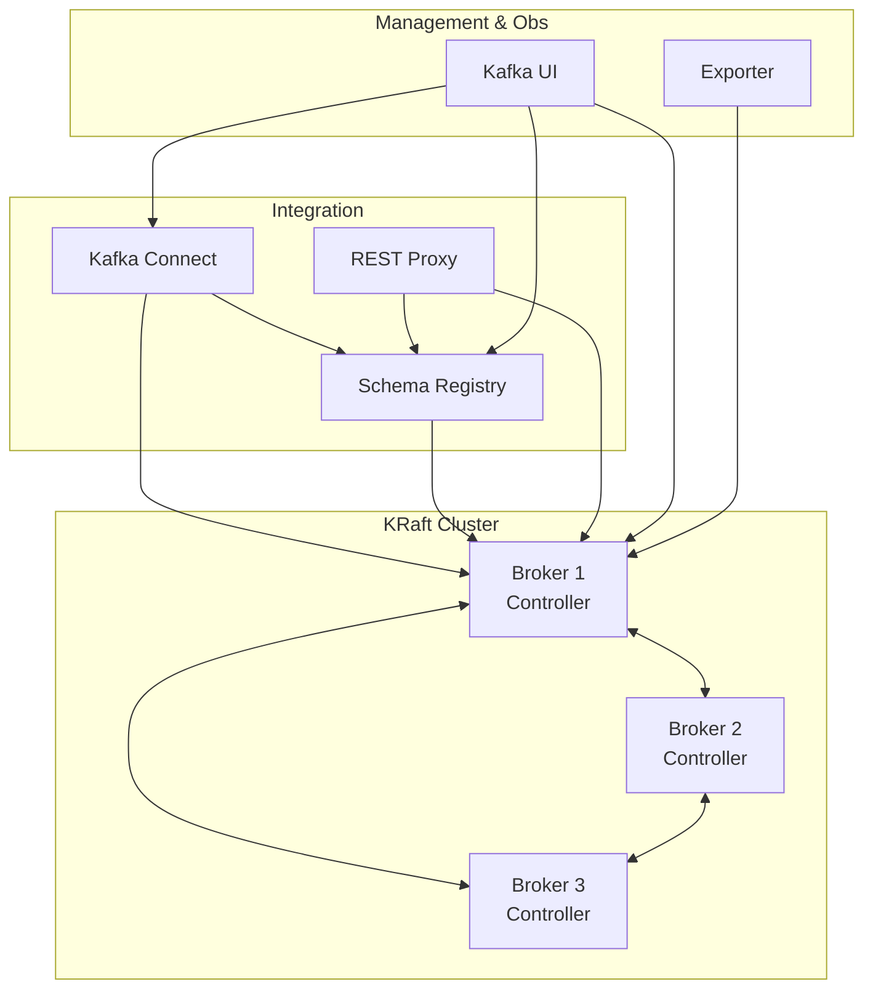

# Messaging Infrastructure Architecture

## Overview

Event streaming and messaging services mapped under `infra/05-messaging`. **Kafka** provides the core streaming platform for high-throughput event processing (see [Kafka KRaft Guide](../context/05-messaging/kafka-kraft-guide.md)). **ksqlDB** is available for real-time stream SQL processing. **RabbitMQ** provides a robust AMQP-based message broker (see [RabbitMQ Guide](../context/05-messaging/rabbitmq-guide.md)).

### RabbitMQ

RabbitMQ는 AMQP(Advanced Message Queuing Protocol)를 지원하는 오픈 소스 메시지 브로커입니다. 이 구성에는 웹 기반 관리 인터페이스(Management UI)가 포함되어 있어 큐, 교환기(Exchanges), 바인딩 등을 쉽게 모니터링하고 관리할 수 있습니다.

### Kafka Cluster (KRaft Mode)

A robust, production-grade **3-node Kafka Cluster** running in **KRaft mode** (ZooKeeper-less). This deployment integrates the full Confluent Platform ecosystem, including Schema Registry, Connect, REST Proxy, and advanced monitoring.

### ksqlDB

ksqlDB is a database purpose-built for stream processing applications. It allows you to build event streaming applications using a familiar SQL syntax.
