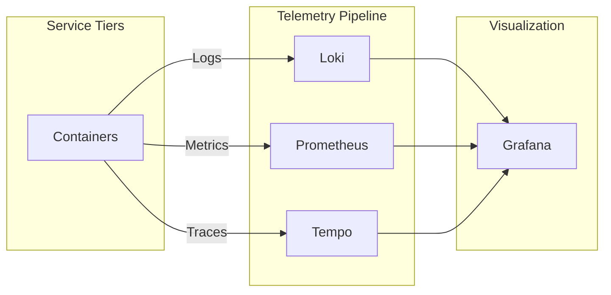

# Observability Stack Architecture Reference Document (ARD)

- **Status**: Approved
- **Owner**: Platform Architect
- **PRD Reference**: [Unified Observability PRD](../prd/observability-prd.md)
- **ADR References**: [ADR-0005](../adr/adr-0005-sidecar-resource-initialization.md), [ADR-0007](../adr/adr-0007-mandatory-resource-limits.md)

---

## 1. Executive Summary

The Hy-Home Observability stack implements the **LGTM** pattern, providing a unified platform for metrics, logs, and traces. It leverages Grafana Alloy as a single telemetry agent to minimize host overhead and simplify discovery.

## 2. Business Goals

- **Unified Visibility**: Single pane of glass for all infrastructure tiers.
- **Operational Intelligence**: Fast root-cause analysis via trace-to-log correlation.
- **Resilience**: Enforce structured telemetry standards across all containerized services.

## 3. System Overview & Context

## 4. Architecture & Tech Stack Decisions (Checklist)

### 4.1 Component Architecture

- **Logs**: Loki stores logs and is configured to use MinIO (S3) as an object store. Log ingestion is supported via Docker integrations.
- **Metrics**: Prometheus stores metrics. Grafana Alloy can accept OTLP and forward telemetry into the local stack.
- **Traces**: Tempo stores traces and is configured to use MinIO (S3) backend.
- **UI**: Grafana provides dashboards and integrates with Keycloak (OIDC via generic OAuth) behind Traefik SSO middleware.

### 4.2 Technology Stack

- **Logs**: Grafana Loki (Storage) with Docker-integrated ingestion (Docker Loki driver and/or Alloy Docker log tailing)
- **Metrics**: Prometheus (Storage) with Grafana Alloy as a collector/OTLP endpoint
- **Traces**: Grafana Tempo
- **Visualization**: Grafana 12.x

## 5. Data Architecture

- **Storage Locations**: Persistence uses bind-mounted volumes under `${DEFAULT_OBSERVABILITY_DIR}`.
- **Retention Defaults (Current Config)**:
  - Loki: `retention_period: 168h` (see `infra/06-observability/loki/config/loki-config.yaml`).
  - Tempo: `block_retention: 24h` (see `infra/06-observability/tempo/config/tempo.yaml`).
  - Prometheus: Uses Prometheus defaults unless explicitly overridden in compose/config.

## 6. Security & Compliance

- **Secrets**: Credentials are injected via Docker secrets (`/run/secrets/*`), including Grafana admin password and OAuth client secret.
- **Access Control**: Grafana is routed via Traefik with SSO middleware and uses Keycloak for authentication/role mapping.
- **Host Privileges (Exception)**: Alloy requires read access to `/var/run/docker.sock` and container logs paths to discover/collect telemetry. This exception must remain documented and intentionally scoped.

## 7. Infrastructure & Deployment

- **Profile**: Managed under the `obs` Docker Compose profile.
- **Provisioning**: Grafana uses provisioning files under `infra/06-observability/grafana/provisioning` for dashboards/datasources.

## 8. Non-Functional Requirements (NFRs)

- **Ingestion Latency (Target)**: Logs SHOULD be queryable quickly after generation (local dev target).
- **Query Performance (Target)**: Standard dashboard panels SHOULD load quickly on the local network (hardware-dependent).

## 9. Architectural Principles, Constraints & Trade-offs

- **Constraints**: Relies on specific Docker plugins (Loki) being installed on the host.
- **What NOT to do**: Use local file logging inside containers.
- **Chosen Path Rationale**: LGTM stack chosen for its deep integration and single Alloy agent over fragmented exporters to minimize footprint.
- **Configuration Standard**: All services SHALL inherit from `infra/common-optimizations.yml` for unified observability labels.
