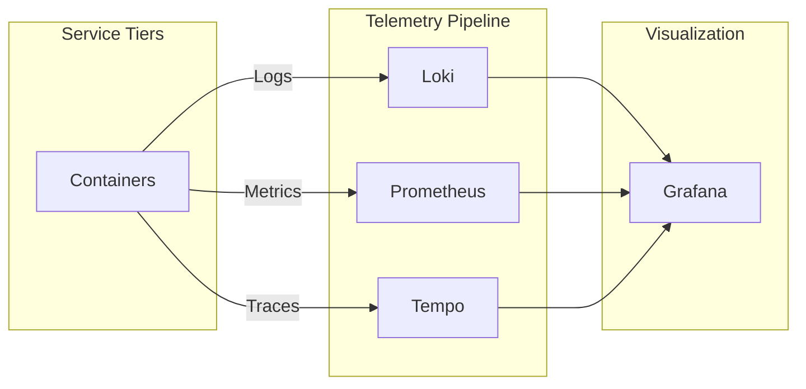

# Architecture Reference Document (ARD)

> **Status**: Approved
> **Owner**: Platform Architect
> **PRD Reference**: [[REQ-PRD-OBS-01] Unified Observability PRD](../prd/observability-prd.md)
> **ADR References**: [ADR-0005](../adr/adr-0005-sidecar-resource-initialization.md)

---

## 1. Executive Summary

The Hy-Home Observability stack implements the **LGTM** pattern, providing a unified platform for metrics, logs, and traces. It leverages Grafana Alloy as a single telemetry agent to minimize host overhead and simplify discovery.

## 2. Business Goals

- **Unified Visibility**: Single pane of glass for all infrastructure tiers.
- **Operational Intelligence**: Fast root-cause analysis via trace-to-log correlation.
- **Resilience**: Enforce structured telemetry standards across all containerized services.

## 3. System Overview & Context

## 4. Component Architecture & Tech Stack Decisions

### 4.1 Component Architecture

- **Logging**: Docker natively pushes to Loki via the `loki` driver.
- **Metrics**: Grafana Alloy scrapes Prometheus endpoints via `infra_net`.
- **Tracing**: OTLP-compatible libraries export traces to Tempo.

### 4.2 Technology Stack

- **Logs**: Grafana Loki (Storage) & Docker Driver (Shipper)
- **Metrics**: Prometheus (Storage) & Grafana Alloy (Collector)
- **Traces**: Grafana Tempo
- **Visualization**: Grafana 11.x

## 5. Data Architecture

- **Retention Strategy**:
  - Logs: 14 days (local disk).
  - Metrics: 30 days (Prometheus TSDB).
  - Traces: 7 days.
- **Schema**: Structured logs in JSON format are primary for high-cardinality analysis.

## 6. Security & Compliance

- **Storage Security**: Local filesystem encryption for telemetry data.
- **Access Control**: RBAC enforced via Grafana integration with Keycloak.

## 7. Infrastructure & Deployment

- **Profile**: Managed under the `obs` Docker Compose profile.
- **Sidecars**: Uses initialization sidecars for dashboard and data source injection.

## 8. Non-Functional Requirements (NFRs)

- **Ingestion Latency**: Logs MUST be queryable in Grafana within 2 seconds of generation.
- **Query Performance**: Standard dashboard panels SHALL load in < 500ms.

## 9. Architectural Principles, Constraints & Trade-offs

- **Constraints**: Relies on specific Docker plugins (Loki) being installed on the host.
- **What NOT to do**: Use local file logging inside containers.
- **Chosen Path Rationale**: LGTM stack chosen for its deep integration and single Alloy agent over fragmented exporters to minimize footprint.
- **Configuration Standard**: All services SHALL inherit from `infra/common-optimizations.yml` for unified observability labels.
