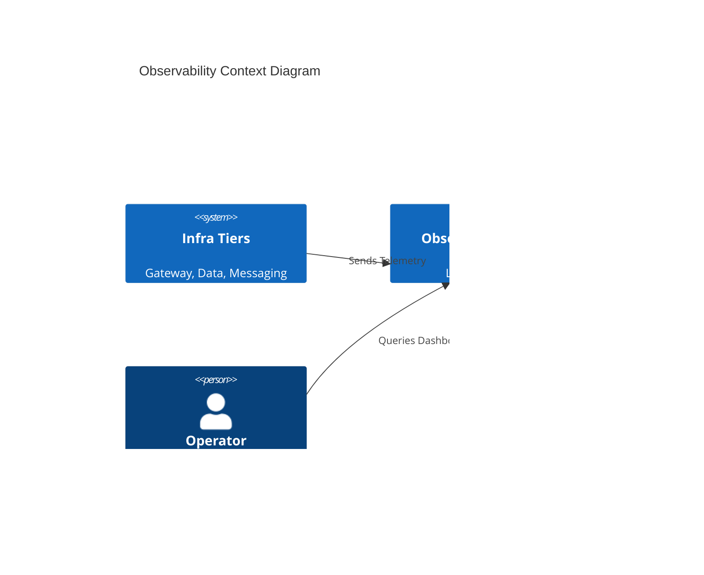

# [ARD-OBS-01] Observability Stack Architecture Reference

_Target Directory: `docs/ard/observability-ard.md`_

---

## 1. Executive Summary

The Hy-Home Observability stack implements the **LGTM** pattern, providing a unified platform for metrics, logs, and traces. It leverages Grafana Alloy as a single telemetry agent to minimize host overhead and simplify discovery.

## 2. Business Goals

- **Unified Visibility**: Single pane of glass for all infrastructure tiers.
- **Operational Intelligence**: Fast root-cause analysis via trace-to-log correlation.
- **Scale-on-Demand**: Local-first storage with remote-write capabilities.

## 3. System Overview & Context

## 4. Architecture & Tech Stack Decisions

### 4.1 Component Architecture

### 4.2 Technology Stack

- **Collector**: Grafana Alloy (OTLP compliant).
- **Backend**: Loki, Prometheus, Tempo.
- **Visualization**: Grafana with SSO integration.

## 8. Non-Functional Requirements (NFRs)

- **Retention**: 7 days localized storage for metrics/logs.
- **Latency**: Dashboard query response < 1s for 24h range.

## 9. Architectural Principles & Trade-offs

- **Logging Strategy**: Transitioned from file-based scraping (Promtail style) to direct `loki` driver pushing via centralized collector to reduce host I/O.
- **Chosen Path**: Single Alloy agent over fragmented exporters to minimize total system resource footprint.
- **Configuration Standard**: All services SHALL inherit from `infra/common-optimizations.yml` for unified observability labels and security settings.
