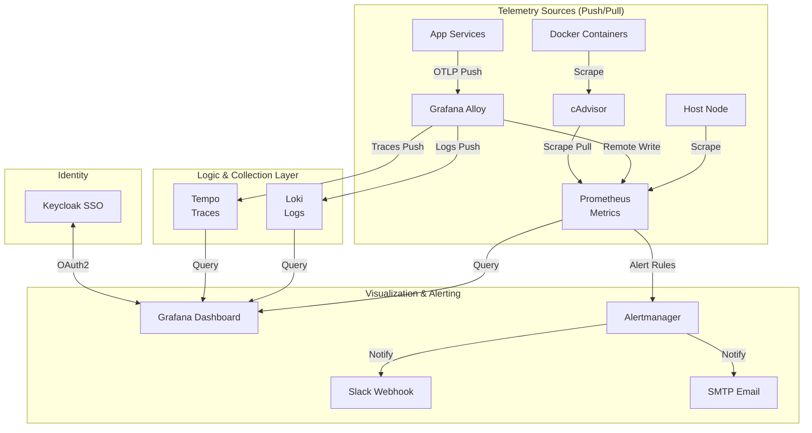

# Observability Stack (LGTM + Alloy) Architecture

## Overview

A comprehensive, enterprise-grade observability stack based on the **LGTM** pattern (Loki, Grafana, Tempo, Mimir/Prometheus). This stack provides full-spectrum visibility into infrastructure and application health, utilizing **Grafana Alloy** as a unified telemetry collector for metrics, logs, and distributed traces.

