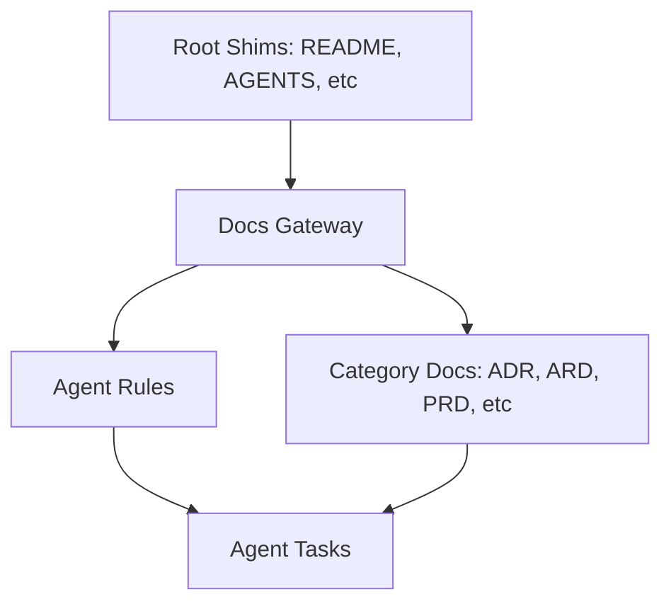

# Agent Documentation Refactoring Architecture Reference Document

- **Status**: Approved
- **Owner**: buenhyden
- **Scope**: master
- **layer:** architecture
- **PRD Reference**: `[../prd/documentation-framework-prd.md]`
- **ADR References**: `[../adr/0016-intent-based-lazy-loading.md]`

**Overview (KR):** 에이전트 지침 및 리포지토리 문서 구조를 체계화하여, 관련성 높은 정보를 동적으로 로드하고 일관된 메타데이터 관리를 보장하는 아키텍처 가이드라인입니다.

## Summary

This ARD defines the structural and logical framework for the repository's documentation and AI agent instruction set. It emphasizes a flat taxonomy, strict metadata requirements (`layer:`), and an intent-based lazy-loading mechanism for agent instructions.

## Boundaries

- **Owns**: Structure of `docs/` categories, Agent gateway logic in `docs/agentic/`, and Metadata standards.
- **Consumes**: Root pointer files (`AGENTS.md`, `ARCHITECTURE.md`), templates in `templates/`.
- **Does Not Own**: Service-specific code logic, infra-specific Compose file contents (those are referenced but not defined here).

## Ownership

- **Primary owner**: buenhyden
- **Primary artifacts**: `docs/`, `docs/agentic/`
- **Operational evidence**: N/A

## Related

- `[../prd/documentation-framework-prd.md]`
- `[../specs/agent-rule-lazy-loading-spec.md]`
- `[../plan/docs-refactor-plan.md]`
- `[../adr/0016-intent-based-lazy-loading.md]`

## 1. Executive Summary

This architecture solves the "Context Bloat" and "Information Fragmentation" problems by moving from a monolithic documentation style to a modular, intent-driven lazy-loading model. It ensures agents only load what they need for a specific task.

## 2. Business Goals

- Reduce cost (tokens) and latency by minimizing initial context volume.
- Improve agent reliability by providing surgical instructions.
- Ensure repository-wide traceability through mandatory `layer:` metadata.

## 3. System Overview & Context

The documentation system consists of the Global Entry Layer (Root Docs), the Discovery Layer (`docs/agentic/gateway.md`), and the Execution Layer (Category-based docs).

## 4. Architecture & Tech Stack Decisions

### 4.1 Component Architecture

1. **Gateway-First Discovery**: All agent workflows must pass through `docs/agentic/gateway.md`.
2. **Flat Taxonomy**: Avoid deep nesting; use folder categories (`docs/specs/`, `docs/plans/`).
3. **Strict Metadata Enforcement**: Every markdown file Must have a `layer:` YAML frontmatter key.

### 4.2 Technology Stack

- **Content**: Markdown (GFM).
- **Metadata**: YAML frontmatter.
- **Diagrams**: Mermaid.
- **Protocol**: Intent-based lazy loading via specific markers (e.g., `[LOAD:ADR]`).

## 9. Architectural Principles, Constraints & Trade-offs

- **What NOT to do**:
  - Do not put extensive behavioral rules in the root `AGENTS.md`.
  - Do not use absolute paths for documentation links.
- **Chosen Path Rationale**: A flat structure with a central gateway provides the best balance between human readability and AI context management.
