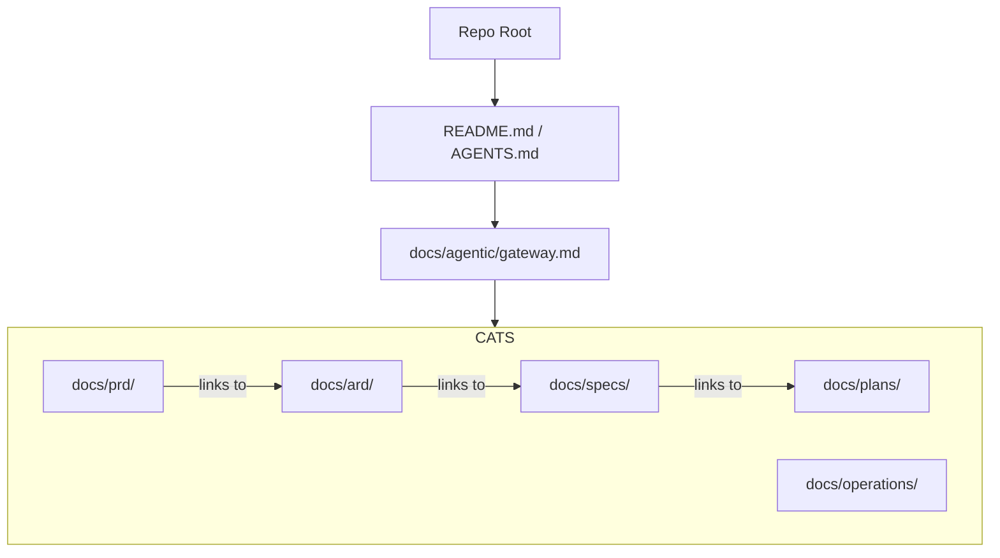

# Documentation Refactoring Architecture Reference Document (ARD)

- **Status**: Approved
- **Owner**: Antigravity
- **Scope**: master
- **layer:** architecture
- **PRD Reference**: `[../prd/refactor-docs-prd.md]`
- **ADR References**: `[../adr/0001-flat-documentation-taxonomy.md]`

**Overview (KR):** 이 문서는 저장소 문서 시스템의 물리적 구조와 메타데이터 계층을 정의합니다. 평탄화된 폴더 구조와 '지연 로딩'을 지원하는 에이전트 탐색 경로를 아키텍처적 관점에서 기술합니다.

## Summary

The documentation system is designed as a "Flat Taxonomy with Metadata Context". Instead of deeply nested functional folders, it groups artifacts by their lifecycle role (Decision, Requirement, Spec, etc.) and uses metadata to associate them with system layers.

## Boundaries

- **Owns**: Physical file organization under `docs/`, frontmatter metadata standards, and agent discovery entrypoints.
- **Consumes**: Human requirements, repository structure context, and individual service context.
- **Does Not Own**: Actual service implementation code (infrastructure YAMLs) or business logic.

## 4. Architecture & Tech Stack Decisions

### 4.1 Component Architecture

### 4.2 Technology Stack

- **Runtime**: Model-based interaction (LLM).
- **Content**: GFM Markdown with YAML frontmatter.
- **Verification**: `grep` for metadata, `rg` for link integrity.

## 10. Source-of-Truth Map

| Scope   | Canonical Document                            | Role                             |
| ------- | --------------------------------------------- | -------------------------------- |
| master  | `docs/agentic/gateway.md`                     | Top-level discovery authority     |
| domain  | `docs/ard/refactor-docs-ard.md`               | This document                    |
| feature | `docs/specs/refactor-docs-spec.md`            | Implementation detail            |

## Related

- `[../prd/refactor-docs-prd.md]`
- `[../specs/refactor-docs-spec.md]`
- `[../plans/refactor-docs-plan.md]`
- `[../adr/0001-flat-documentation-taxonomy.md]`
