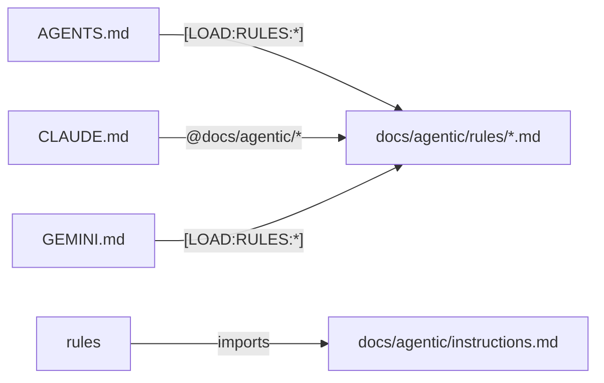

# Agent Rule Implementation and Refactoring Architecture Reference

- **Status**: Approved
- **Owner**: buenhyden
- **Scope**: master
- **layer:** architecture
- **PRD Reference**: `[../prd/rule-implementation-prd.md]`
- **ADR References**: `[../adr/0002-intent-based-triggers.md]`

**Overview (KR):** 본 문서는 저장소의 지침 체계를 '의도 기반 트리거(Intent-based triggers)' 중심으로 재설계하는 아키텍처 방안을 정의합니다. 루트 파일과 `docs/agentic/` 간의 상호작용 지점을 명확히 하여 지능적인 컨텍스트 로딩을 실현합니다.

## Summary

The architecture shifts from a "Gateway-only" discovery model to a "Primary Trigger" model. Root files (`AGENTS.md`, etc.) now directly offer context-specific rule markers, reducing the number of hops an agent must take to get the right instructions.

## Boundaries

- **Owns**: Rule trigger naming convention, root-to-rule mapping, lazy loading logic.
- **Consumes**: Metadata standards, repository directory structure.

## Ownership

- **Primary owner**: buenhyden
- **Primary artifacts**: `AGENTS.md`, `CLAUDE.md`, `GEMINI.md`, `docs/agentic/rules/`

## Component Architecture

## Source-of-Truth Map

| Scope   | Canonical Document                            | Role                             |
| ------- | --------------------------------------------- | -------------------------------- |
| master  | `docs/ard/rule-refactor-ard.md`               | Architecture authority           |
| gateway | `docs/agentic/gateway.md`                     | Secondary index                  |
| rules   | `docs/agentic/rules/`                         | Domain-specific implementations  |
