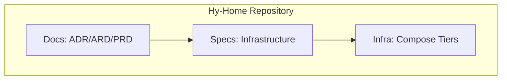

# [ARD-ARCH-01] Global System Architecture Reference Document

> **Status**: Approved
> **Owner**: Platform Architect
> **PRD Reference**: [system-architecture-prd.md](../prd/system-architecture-prd.md)
> **ADR References**: [adr-0003](../adr/adr-0003-spec-driven-development.md), [adr-0004](../adr/adr-0004-tiered-directory-structure.md)

---

## 1. Executive Summary

The master architectural blueprint defining the structural and procedural invariants of the Hy-Home repository. This document governs tiered isolation, documentation-first workflows, and the integration model for heterogeneous service stacks.

## 2. Business Goals

- Maintain a clean, understandable, and scalable repository structure.
- Enforce 100% adherence to technical standards through automation.
- Facilitate rapid onboarding of new infrastructure components.

## 3. System Overview & Context

## 4. Architecture & Tech Stack Decisions

### 4.1 Component Architecture

The target architecture follows a modular, tier-based design using Docker Compose `include`. It prioritizes the **LGTM (Loki, Grafana, Tempo, Prometheus)** observability stack and hardened container boundaries.

- **Tiered Directory structure**: numeric prefixing (e.g., `01-gateway`) to enforce bootstrap order.
- **Documentation Hierarchy**: PRD (What) -> ARD (How) -> Spec (Detail) -> Code (Implementation).

### 4.2 Technology Stack

- **Standardization Tooling**: `markdownlint`, `yamllint`, `docker compose config`.

### 4.3 Storage Strategy

- **Volumes**: Local bind mounts for data persistence (e.g., `/infra-data/prometheus`).
- **Secrets**: Docker Secrets (file-based) mounted at `/run/secrets/`.

### 4.4 Networking [REQ-SPT-05]

- **infra_net**: Dedicated bridge network for core infrastructure services.
- **project_net**: External network for application-level services.
- **Gateway**: Traefik (Edge) handles TLS termination and routing.

### 4.5 Security Architecture

- **Rootless Operation**: Services MUST run as non-root (UID 1000:1000) where possible.
- **Isolation**: `security_opt: [no-new-privileges:true]`, `cap_drop: [ALL]`.
- **Secrets Management**: No environment variable injection for sensitive data; use Docker Secrets.

## 6. Observability Path

1. **Collector**: Grafana Alloy collects logs (Docker containers) and metrics (cAdvisor, service endpoints).
2. **Storage**: Loki (Logs), Prometheus (Metrics), Tempo (Traces).
3. **Visualization**: Grafana serves as the unified dashboard.
