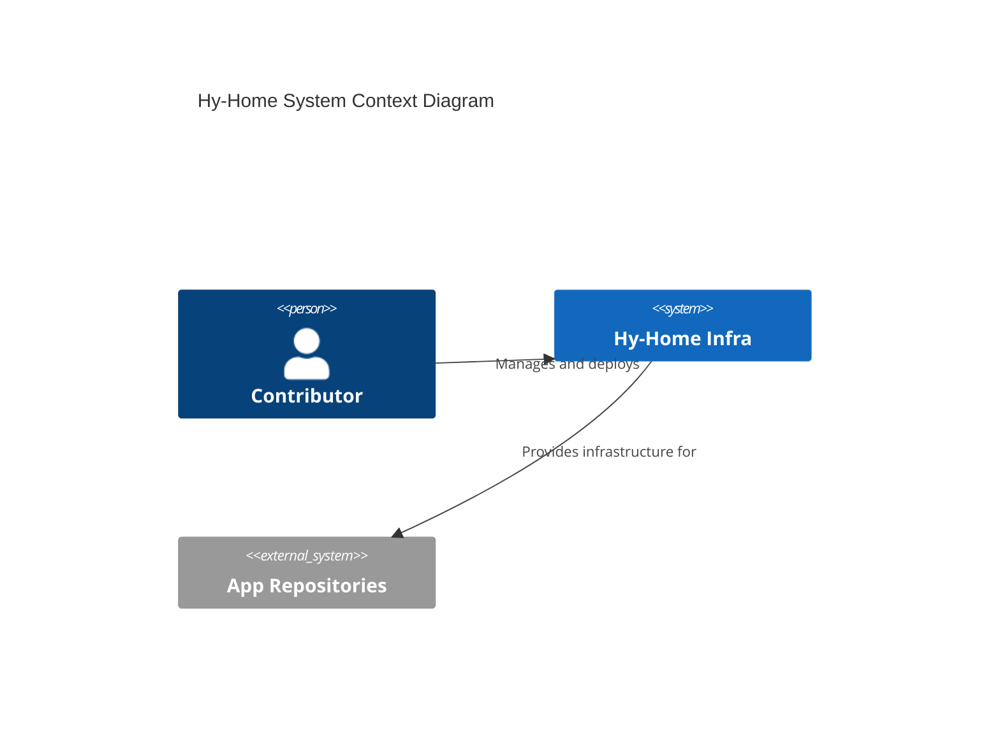
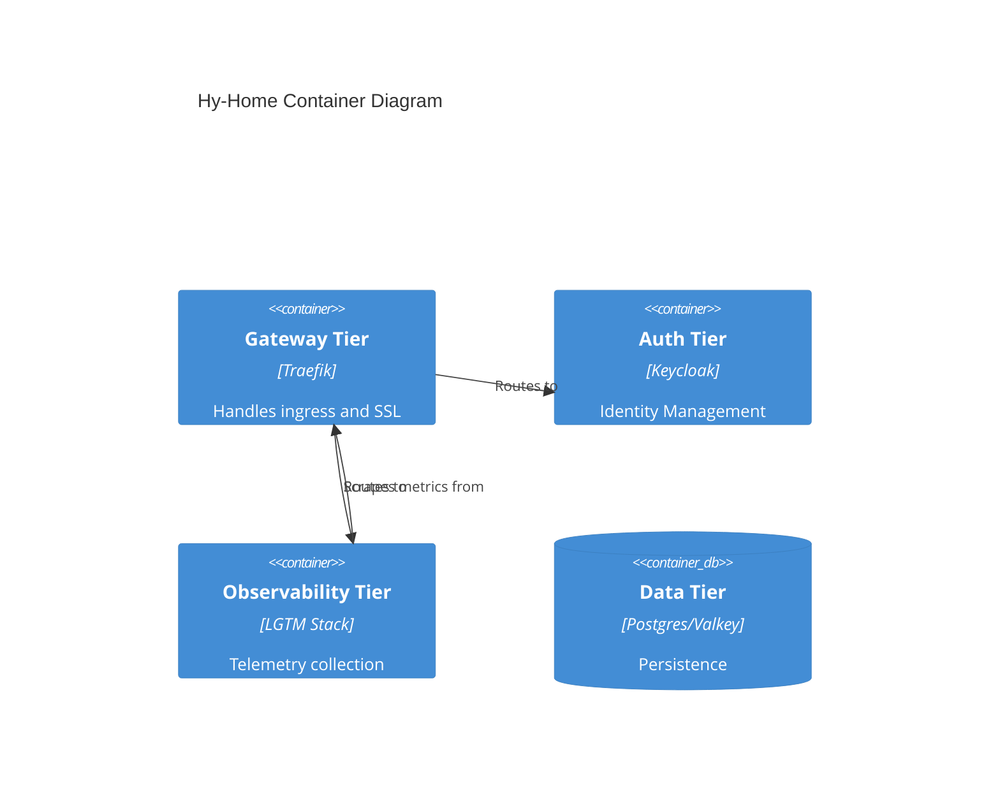

# [ARD-ARCH-01] Global System Architecture Reference Document

> **Status**: Approved
> **Owner**: Platform Architect
> **PRD Reference**: [system-architecture-prd.md](../prd/system-architecture-prd.md)
> **ADR References**: [adr-0003](../adr/adr-0003-spec-driven-development.md), [adr-0004](../adr/adr-0004-tiered-directory-structure.md)

---

## 1. Executive Summary

The master architectural blueprint defining the structural and procedural invariants of the Hy-Home repository. This document governs tiered isolation, documentation-first workflows, and the integration model for heterogeneous service stacks.

## 2. Business Goals

- Maintain a clean, understandable, and scalable repository structure.
- Enforce 100% adherence to technical standards through automation.
- Facilitate rapid onboarding of new infrastructure components.

## 3. System Overview & Context

## 4. Architecture & Tech Stack Decisions (Checklist)

### 4.1 Component Architecture

The target architecture follows a modular, tier-based design using Docker Compose `include`. It prioritizes the **LGTM (Loki, Grafana, Tempo, Prometheus)** observability stack and hardened container boundaries.

### 4.2 Technology Stack

- **Standardization Tooling**: `markdownlint`, `yamllint`, `docker compose config`.
- **Infrastructure**: Docker, Docker Compose, Alpine Linux.

## 5. Data Architecture

- **Domain Model**: Tiered service configuration data and volumes.
- **Storage Strategy**: Local bind mounts for data persistence (e.g., `/infra-data/prometheus`). Mandatory use of `DEFAULT_DATA_DIR` abstraction.
- **Data Flow**: Async log streaming via Loki driver; metric collection via Alloy.

## 6. Security & Compliance

- **Authentication/Authorization**: Centralized Keycloak OIDC for infrastructure dashboards.
- **Data Protection**: Docker Secrets (file-based) mounted at `/run/secrets/`. No environment variable injection for sensitive data.
- **Rootless Operation**: Services MUST run as non-root (UID 1000:1000) where possible.
- **Isolation**: `security_opt: [no-new-privileges:true]`, `cap_drop: [ALL]`.

## 7. Infrastructure & Deployment

- **Deployment Hub**: On-Prem / Edge computing environment.
- **Orchestration**: Docker Compose (Root level orchestrator using `include`).
- **CI/CD Pipeline**: GitHub Actions for linting and syntactical verification.

## 8. Non-Functional Requirements (NFRs)

- **Availability**: 99.0% uptime for core services (Gateway, Data).
- **Performance (Latency)**: Dashboard load times < 2s on local network.
- **Throughput**: Support 100+ concurrent telemetry streams.
- **Scalability Strategy**: Vertical scaling of compute resources; modular service tiers for horizontal isolation.

## 9. Architectural Principles, Constraints & Trade-offs

- **What NOT to do**: No direct DB access between tiers; use defined APIs.
- **Constraints**: Limited by local hardware resources in home lab environment.
- **Considered Alternatives**: Kubernetes (rejected for complexity), Nomad (rejected for smaller community).
- **Chosen Path Rationale**: Docker Compose provides ideal balance of portability and operational simplicity for edge stacks.
- **Known Limitations**: Manual node failover; limited cross-node scheduling without Swarm/K8s.
