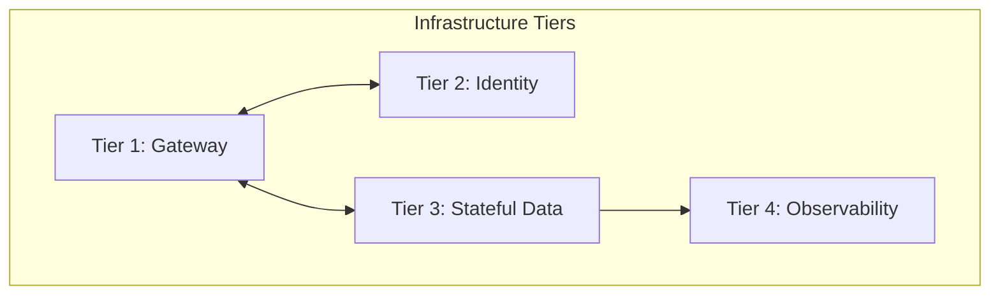
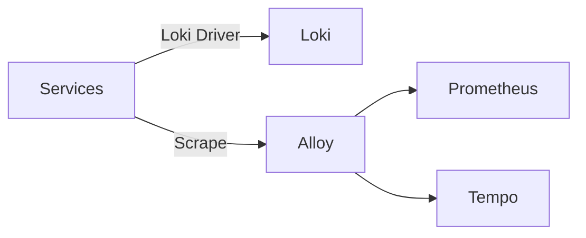

# System Optimization & Hardening Architecture Reference Document (ARD)

- **Status**: Approved
- **Owner**: Reliability Engineer
- **PRD Reference**: [Hy-Home System Optimization PRD](../prd/system-optimization-prd.md)
- **ADR References**: [ADR-0007](../adr/adr-0007-mandatory-resource-limits.md), [ADR-0008](../adr/adr-0008-removing-static-docker-ips.md), [ADR-0012](../adr/adr-0012-standardized-init-process.md), [ADR-0013](../adr/adr-0013-configuration-deduplication.md), [ADR-0014](../adr/adr-0014-optimization-strategies.md)

---

## 1. Executive Summary

A hardened configuration model for the Hy-Home ecosystem focusing on resource density, kernel-level security options, and unified observability. Extends the baseline with surgical technical invariants for high-reliability hosting.

## 2. Business Goals

- Ensure 100% auditable security posture across all tiers.
- Achieve sub-4GB host RAM utilization for standard local operation.
- Provide zero-portability-risk configurations for developers.

## 3. System Overview & Context

## 4. Architecture & Tech Stack Decisions (Checklist)

### 4.1 Standardization Patterns

Implementation utilizes global service templates in `infra/common-optimizations.yml` via the `extends` keyword:

- **`template-infra-low/med/high`**: Standardizing resource quotas and security base.
- **`base-security-hardened`**: Optional `read_only: true` baseline with `tmpfs` support for services that can run on immutable rootfs.

### 4.2 Technology Stack

- **Hardening**: `security_opt` (no-new-privileges), `cap_drop` (ALL).
- **Engine Directives**: `init: true`, driver-level `logging`.
- **Naming**: Prefer stable `container_name` / `hostname` where it improves operability (without forcing it everywhere).

## 5. Data Architecture

- **Path Abstraction**: 100% of host volumes SHALL use `${DEFAULT_*_DIR}` variables.
- **Telemetry Architecture**:

## 6. Security & Compliance

- **Network Isolation**: `infra_net` is the default internal network; external connectivity is mediated via Traefik and, for cross-repo integration, the external `project_net` convention.
- **Credential Lifecycle**: 100% runtime injection via Docker Secrets.
- **Runtime Integrity**: Immutable root filesystems and disabled binary execution escalation.

## 7. Infrastructure & Deployment

- **Orchestration**: Aggregated via root `docker-compose.yml` using the `include` directive.
- **Profiles**: Implements `core`, `data`, `obs`, `messaging`, `ai` profiles for selective startup.

## 8. Non-Functional Requirements (NFRs)

- **Resource Efficiency**: Target aggregate idle RAM utilization under 4GB for the default baseline stack (see PRD metrics).
- **Observability Stability**: Telemetry MUST be queryable end-to-end (logs in Loki, metrics in Prometheus, traces in Tempo) with tier labels (e.g., `hy-home.tier`).
- **Portability**: `docker compose config -q` MUST pass under `.env.example` defaults.

## 9. Architectural Principles, Constraints & Trade-offs

- **What NOT to do**: Use absolute host paths in compose files.
- **Trade-offs**: template inheritance increases configuration resolution complexity but ensures global standard enforcement.
- **Known Limitations**: `read_only` filesystems require manual identification of all writeable directories for `tmpfs` mapping.
