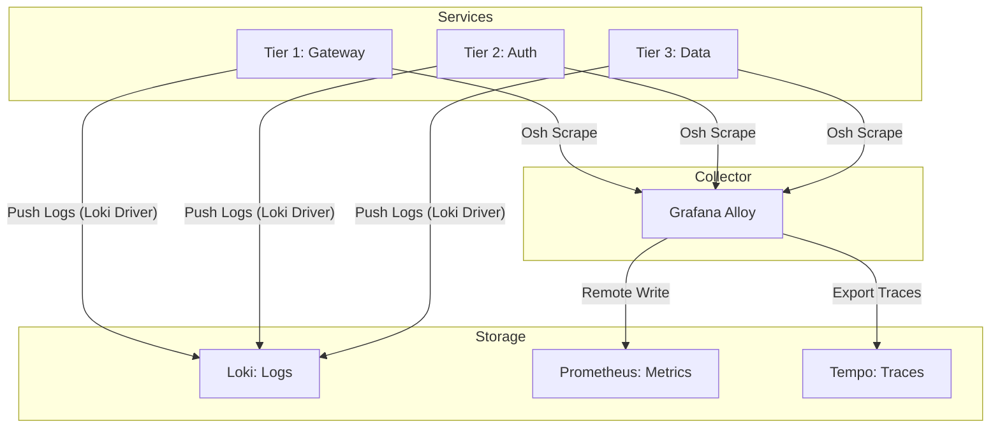

# [ARD-SYS-01] Optimized Infrastructure Architecture Reference

## 1. System Topology

The Hy-Home infrastructure utilizes a multi-tier, isolated container topology to minimize blast radius and ensure operational stability.

### 1.1 Infrastructure Tiers

- **Tier 1 (Gateway)**: Core ingress tier (Traefik/NGINX) handling TLS termination and internal routing.
- **Tier 2 (Identity & Auth)**: Keycloak and OAuth2 Proxy managing centralized OIDC authentication.
- **Tier 3 (Stateful Data)**: Dedicated clusters for PostgreSQL, Valkey, and MinIO with isolated network segments.
- **Tier 4 (Observability Stack)**: Unified LGTM pipeline (Loki, Grafana, Tempo, Alloyl) collecting cross-tier telemetry.

## 2. Standardization Patterns [SPEC-SYS-01]

To ensure consistency across heterogeneous service stacks, the following architectural patterns are enforced:

### 2.1 Configuration Inheritance (YAML Anchors)

Implementation SHALL utilize root-level configuration blocks (`x-optimizations`) in the main `docker-compose.yml` to provide reusable architectural invariants across all service tiers:

- **`&security-baseline`**: Universal cap-drop and privilege escalation protection.
- **`&logging-loki`**: Standardized push-based log collection using the Loki driver.
- **`&labels-base`**: Automated schema-compliant metadata injection for system-wide filtering.
- **`&resource-low/med/high`**: Standardized quota presets to prevent resource contention.

### 2.2 Telemetry Architecture

## 3. Security Boundaries

- **Network Strategy**: Direct container-to-container access is restricted via tier-specific user-defined networks.
- **Credential Lifecycle**: 100% of sensitive material MUST be managed via Docker Secrets mounted at runtime, as per **[ADR-009]**.
