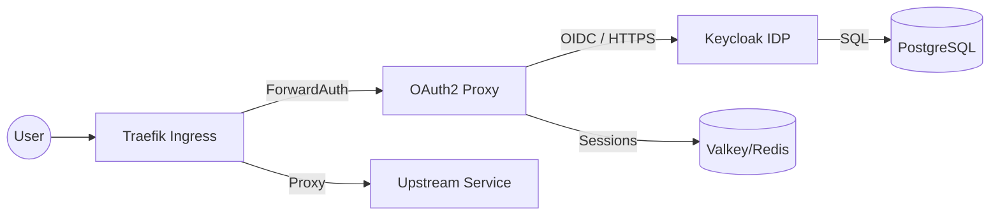
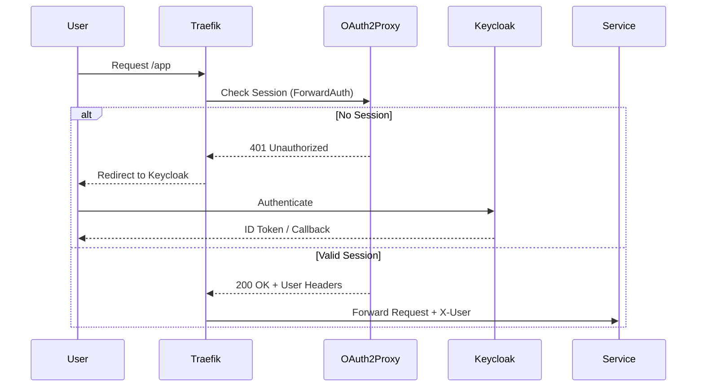

# Authentication System Context (02-auth)

This document describes the high-level architecture, data flow, and network boundaries of the identity tier.

## Logical Architecture

The system uses a two-stage "Gatekeeper" pattern. OAuth2 Proxy acts as the entry point (the gate), while Keycloak provides the identity logic (the brain).
The authentication tier operates as a two-stage gatekeeper:

1. **Identity Provider (Keycloak)**: The source of truth for users, roles, and OIDC tokens.
2. **Service Gateway (OAuth2 Proxy)**: A lightweight daemon that validates tokens and manages session cookies for upstream services.

## Data Persistence

- **Keycloak State**: Persisted in PostgreSQL (`mng-pg`).
- **OAuth2 Proxy Sessions**: Stored in Valkey/Redis (`mng-valkey`) to support multi-replica scaling and zero-downtime restarts.

## Keycloak Identity Provider (IdP)

Keycloak serves as the primary OIDC/SAML provider for the platform. It handles:

- **User Discovery**: LDAP/AD integration (if enabled) or local DB.
- **Protocol Support**: OIDC, SAML 2.0, OAuth 2.0.
- **Security**: MFA/2FA support, brute-force protection.

## SSO & OAuth2 Proxy Flow

The infrastructure uses a "Sidecar-less" authentication pattern. Traefik intercepts requests and verifies identity via the proxy.

1. **Gatekeeper (OAuth2 Proxy)**: Validates session cookies and triggers OIDC flows.
2. **Identity (Keycloak)**: Provides the login UI and issues signed JWT tokens.

---
*Refer to [SETUP.md](./SETUP.md) for initial realm provisioning.*
