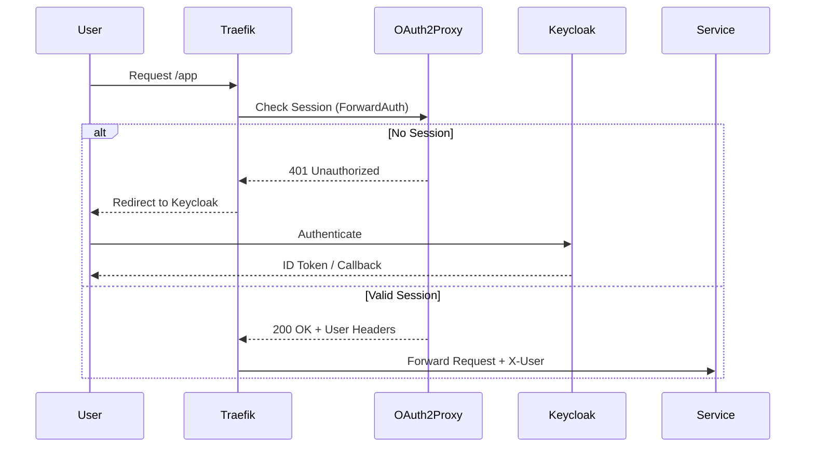

# Authentication System Context (02-auth)

This document describes the high-level architecture, data flow, and network boundaries of the identity tier.

## Logical Architecture

The authentication tier operates as a two-stage gatekeeper:

1. **Identity Provider (Keycloak)**: The source of truth for users, roles, and OIDC tokens.
2. **Service Gateway (OAuth2 Proxy)**: A lightweight daemon that validates tokens and manages session cookies for upstream services.

## Identity Flow (ForwardAuth)

## Data Persistence

- **Keycloak State**: Persisted in PostgreSQL (`mng-pg`).
- **OAuth2 Proxy Sessions**: Stored in Valkey/Redis (`mng-valkey`) to support multi-replica scaling and zero-downtime restarts.

## Network Boundaries

- **Public**: `auth.${DEFAULT_URL}` (Keycloak) and `auth-proxy.${DEFAULT_URL}` (OAuth2 Proxy).
- **Private**: No internal services bypass the gateway; all inter-service traffic requires valid headers or mTLS (if implemented).
