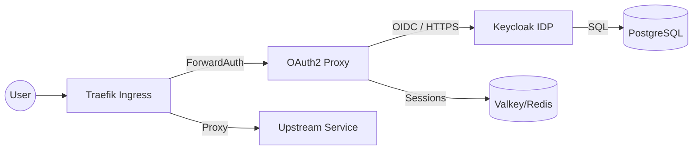
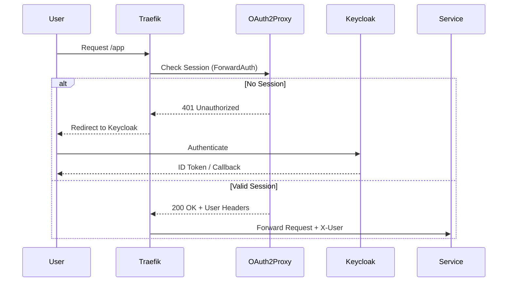

# Authentication System Context (02-auth)

This document describes the high-level architecture, data flow, and network boundaries of the identity tier.

## Logical Architecture

The system uses a two-stage "Gatekeeper" pattern. OAuth2 Proxy acts as the entry point (the gate), while Keycloak provides the identity logic (the brain).
The authentication tier operates as a two-stage gatekeeper:

1. **Identity Provider (Keycloak)**: The source of truth for users, roles, and OIDC tokens.
2. **Service Gateway (OAuth2 Proxy)**: A lightweight daemon that validates tokens and manages session cookies for upstream services.

## Data Persistence

- **Keycloak State**: Persisted in PostgreSQL (`mng-pg`).
- **OAuth2 Proxy Sessions**: Stored in Valkey/Redis (`mng-valkey`) to support multi-replica scaling and zero-downtime restarts.

## External Dependencies

The identity tier relies on several external components for full functionality:

- **Management DB (`mng-db`)**: Provides PostgreSQL for Keycloak state and Valkey for session storage.
- **Ingress (`traefik`)**: Handles SSL termination and ForwardAuth routing.
- **Communication (`mailhog`)**: Used for local SMTP testing (e.g., email verification, password resets).

## Network Boundaries

- **Public**: `auth.${DEFAULT_URL}` (Keycloak) and `auth-proxy.${DEFAULT_URL}` (OAuth2 Proxy).
- **Private**: All inter-service traffic within `infra_net` is isolated. Services like `mailhog` are accessible via internal DNS.
